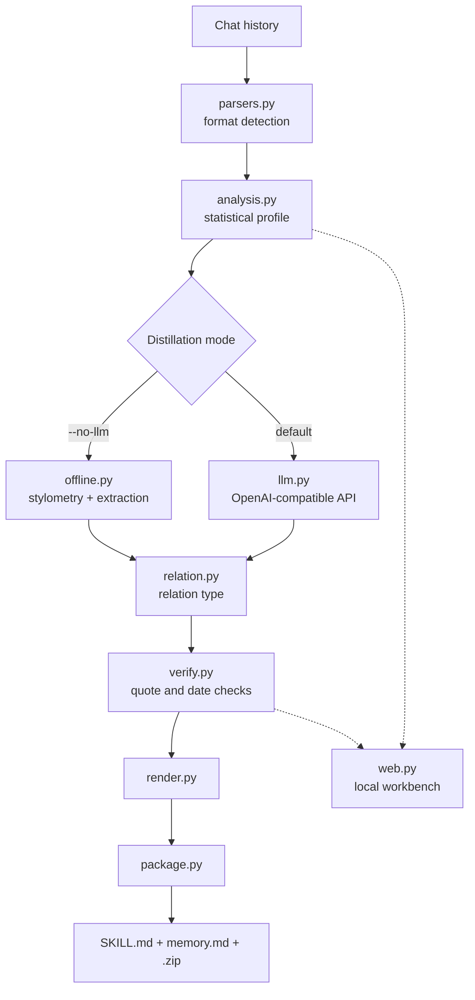

# xpskill

<div align="center"></div>
<p align="center">🇺🇸 <a href="./README.en.md">English</a> | 🇨🇳 <a href="./README.md">简体中文</a></p>

<p align="center">

</p>

A chat-persona Skill package generator. It distills chat history from sources such as QQ into lightweight, portable `SKILL.md` files, relationship-memory files, and `.zip` packages. The output works with tools that support the Skill format or a similar skill-package mechanism; xinpai-bot is the current primary target (project forthcoming).

Everything runs on the Python standard library. No `pip install`, no model download, no network access unless you explicitly opt into LLM distillation.

> [!NOTE]
> Names, paths, and API keys in this document are placeholders. Replace them with your own values, and review the generated files for personal information before uploading them anywhere.

## Contents

- [Features](#features)
- [How It Works](#how-it-works)
- [Installation](#installation)
- [Tutorial](#tutorial)
- [Web Workbench](#web-workbench)
- [Supported Inputs](#supported-inputs)
- [CLI Reference](#cli-reference)
- [LLM Configuration](#llm-configuration)
- [Outputs](#outputs)
- [Relation Types](#relation-types)
- [Conclusion Verification](#conclusion-verification)
- [Privacy and Security](#privacy-and-security)
- [Development and Validation](#development-and-validation)
- [Contributing](#contributing)
- [Acknowledgments](#acknowledgments)
- [License](#license)

## Features

Six steps stand between one chat log and a device-ready skill package, and every step can be inspected on its own.

| Stage | Capability | Offline | LLM |
| --- | --- | --- | --- |
| Parsing | Eight source kinds: QQ exports / WeChat SQLite / generic `name: message` text / CSV / JSON / HTML·MHT / Twitter archives / mbox. Directories are read recursively. Encodings fall back in order: utf-8-sig → utf-8 → gb18030 → utf-16 | ✅ | ✅ |
| Diagnostics | Reports which parser claimed the file, how many messages it extracted, who is speaking, the time span, and **how many messages each candidate parser could have extracted** | ✅ | ✅ |
| Profiling | Message counts, time span, late-night ratio, who opens conversations, mean and median length, particles, emoji, burst habit, reply latency, conflict hints | ✅ | ✅ |
| Sampling | Splits records into sessions and prioritizes late-night, conflict-heavy, and longer conversations until the character budget is met | — | ✅ |
| Distillation | Two engines with an identical field structure: **offline extractive** (stylometry plus verbatim extraction, every line carrying a statistical basis) or **LLM** (OpenAI-compatible API, richer narration) | ✅ | ✅ |
| Relation type | Lover / friend / colleague / family. Auto-detected (with its reasoning printed) or set by `--relation`; drives section headings and wording | ✅ | ✅ |
| Verification | Checks every "this is a verbatim quote" claim and every date against the chat log; failures are flagged or dropped with `--strict`, and the **closest real line** is shown | ✅ | ✅ |
| Packaging | `SKILL.md` + `references/memory.md` + `<name>.zip`, uploadable straight to the board with `--device` | ✅ | ✅ |
| Workbench | A local-only web UI: parse diagnostics, live log, verification panel, artifact preview — running the very same `cli.main` | ✅ | ✅ |
| Privacy | Samples sent out are redacted by default (phone / ID / card / email / detailed address). Offline mode neither samples, redacts, nor touches the network | ✅ | ✅ |

**Resilience** — the column most people skip, and the one that decides whether you have anything usable at 2 a.m.:

- **A failed LLM still yields a complete artifact.** If every call fails, the run falls back to offline extractive distillation. If only half fails (persona succeeded, relationship memory timed out), **the successful half is kept** and only the missing half is filled offline, with the provenance noted in the file.
- **A misbehaving gateway is recoverable.** A response body with a BOM, wrapped in SSE, with extra JSON stuck on the end, or with the raw completion returned verbatim — all four are salvaged. Only a genuinely truncated body is an error.
- **Errors point somewhere.** Truncation reports `finish_reason=length` and suggests `--max-tokens`. A timeout reports how many seconds it waited (600 s by default, adjustable with `--timeout`). Broken JSON reports the failure reason, the offset, and the surrounding text.

**Deliberate trade-offs:**

- **Catchphrases are picked by "this person uses it visibly more than the other side"**, not by raw frequency — otherwise you only ever get words everyone uses.
- **Offline mode omits what it cannot verify.** A section without evidence is left empty with an explanation rather than filled with something plausible.
- **Verification checks whether a quote is real, not whether the semantics hold.** Rewriting "I didn't say that" into "I said that" keeps the string check blind; catching that needs a semantic model worth hundreds of megabytes, which conflicts with the zero-dependency stance. Wholesale invention is far more common than subtle reversal, and this catches the former.
- **Standard library only.** No `pip install`, no model download, no CDN. `jieba` is an optional enhancement; the pipeline completes either way.

## How It Works

<!-- Experimental: if rendering fails, preview on GitHub -->



Two engines, deliberately separated:

| | Offline (`--no-llm`) | LLM (default) |
| --- | --- | --- |
| Speaking style, relationship behavior | Derived from stylometry, with percentages and counts | Summarized by the model, may over-generalize |
| Phrases, examples, pet names, places | Extracted verbatim from the record, auditable line by line | Restated by the model, may paraphrase or invent |
| Narrative events in the timeline | Only objective anchors: months and silent gaps | Narrated by the model, needs human review |
| Network access | None | Required |
| Dependencies | None | None (plain `urllib`) |

Offline mode deliberately omits what it cannot verify: a section with no evidence is left empty with an explanation, rather than filled with something plausible. Both modes produce an identical field structure, so you can switch at any time.

## Installation

The runtime is Python 3.9+ with the standard library only. No `pip install` or third-party dependencies are required.

```bash
git clone https://github.com/<YOUR_ACCOUNT>/xpskill.git
cd xpskill
python3 -m py_compile ex_distill.py
python3 ex_distill.py --help   # confirms the whole package imports
```

<details>
<summary>Optional: install <code>jieba</code> for better phrase accuracy</summary>

```bash
pip install jieba    # optional
```

Without it, phrase mining falls back to built-in character n-grams. With it, mining filters by part of speech, which matters because the highest-frequency strings in a single conversation are usually topic nouns (`power supply`, `lab`, `led`) rather than speech habits. It also combines adjacent words along word boundaries instead of cutting across them — character n-grams otherwise emit fragments like `么不` and `个吗`, which are frequent enough to look like real verbal tics.

Either way the pipeline completes; this only changes phrase quality.
</details>

## Tutorial

Goal: turn one chat log into `SKILL.md` + `references/memory.md` + `<name>.zip`. Both routes produce exactly the same output — **pick one and follow it to the end**: route A if you would rather not touch a terminal, route B if you want to run it in a shell or script it.

### 0. Prepare a chat log

Supported sources are listed under [Supported Inputs](#supported-inputs). Export QQ with the message manager or [qq-chat-exporter](https://github.com/shuakami/qq-chat-exporter); WeChat requires decrypting `EnMicroMsg.db` locally; plain text works too — `name: message`, one line each, parses fine.

> [!TIP]
> On your first run, take the offline route: no network, no API key, results in seconds, and you immediately see whether parsing worked. Switch to the LLM route once that looks right.

### Route A: the web workbench (no terminal)

The interface has two columns, in the same order as the work: **three cards on the left** — feed → config → run; **four tabs on the right** — log / verification / `SKILL.md` / memory (the last three unlock once a run finishes). The empty state spells out the same three steps.

> [!NOTE]
> The workbench UI is in Chinese; button and field labels below are quoted as they appear on screen.

**A1 · Start it**

```bash
python -m src.web            # http://127.0.0.1:8765/, opens a browser for you
python -m src.web --no-open  # server only, no browser popup
python -m src.web --port 9000
```

> [!IMPORTANT]
> The workbench is a long-running process: it runs the code as loaded at startup, so **editing anything under `src/` requires a restart**. If another workbench already holds the port it **refuses to start** rather than running side by side. Both are covered in [the troubleshooting table](#if-something-goes-wrong).

**A2 · Drop the log in** (left rail, 「进料」)

Click the drop zone to pick a file, or drag the file straight in. A successful parse gives you three things to look at:

- the top bar lights up with the file name and message count;
- a **diagnostic panel** unfolds below the drop zone: parser, message count, time span, working encodings, and how many messages each candidate parser could have extracted — the one marked 「实际采用」 (actually used) is the parser that claimed the file;
- only then does 「开始蒸馏」 (start) turn from grey to active. **It stays disabled while nothing has been parsed**, so the order is not optional.

If the count looks wrong, switch files or re-save as UTF-8 and drop it again: a mismatched format degrades silently, so "only 3 messages extracted" is visible here and nowhere else.

**A3 · Fill in the config** (left rail, 「配置」)

The two dropdowns 「我是谁」 and 「蒸馏谁」 are **filled with the speakers parsed from your file**, so they have nothing in them until a file has been parsed. Clicking a speaker chip in the diagnostic panel sets 「蒸馏谁」 to that person in one click.

| Field | What to put there |
| --- | --- |
| 技能名 (skill name) | ASCII; it becomes the directory and zip name (default `persona`) |
| 我是谁 (who am I) | Your own name in the record; if you are not in it, keep the default 「我」 |
| 蒸馏谁 (distill whom) | Leave it on auto — the most frequent speaker other than you |
| 关系类型 (relation type) | Auto is fine; it only changes headings and wording, never facts |
| 补充描述 (description) | Optional, e.g. `ENFP, Gemini` |
| 蒸馏方式 (mode) | 「本地抽取」 runs offline in seconds; 「LLM 蒸馏」 reveals base URL, model, and API key |
| 严格模式 (strict) | On = drop entries that fail verification instead of flagging them |

**A4 · Hit 「开始蒸馏」** (left rail, 「执行」)

The right pane streams the live log. Step 4 (LLM distillation) takes minutes, so it reports three things: **the total scale** (batches, total requests), **which call is running** (batch N/M, persona or relationship memory), and **how long each call actually took** — enough to estimate the wait.

**A5 · Read the results** (three tabs on the right + 「执行」 on the left)

- **校验 (verification)**: the stamp counts the conclusions awaiting review; underneath, the totals break down into original-match / paraphrase-match / not-found / date-mismatch, and every flagged entry carries the closest real line from the record.
- **SKILL.md / 关系记忆 (memory)**: the rendered artifacts, with suspect entries marked in red.
- **下载技能包 (download)** in the left rail gives you the zip. Put it into the device console and mark it as the main skill; it takes effect on the next wake-up.

### Route B: from the terminal

**B1 · Run the offline pass first** (no network, no API key)

```bash
python3 ex_distill.py \
  --input /path/to/chat.json \
  --me 'your nickname' \
  --target 'contact nickname' \
  --name chat-persona \
  --out ./dist \
  --no-llm
```

When `--target` is omitted, the script picks the most frequent speaker who is not listed in `--me`.

**B2 · Switch to LLM distillation**

```bash
export MODELSCOPE_API_KEY="<YOUR_API_KEY>"     # or pass --api-key directly

python3 ex_distill.py \
  --input /path/to/chat.json \
  --me 'your nickname' \
  --target 'contact nickname' \
  --name chat-persona \
  --desc 'Additional relationship and speaking-style context' \
  --base-url 'https://api-inference.modelscope.cn/v1' \
  --model 'Qwen/Qwen3-235B-A22B' \
  --out ./dist
```

> [!TIP]
> Add `--dry-run-llm` to print the outgoing request (URL and sample length) without sending any chat content.

**B3 · (Optional) upload straight to a device**

```bash
python3 ex_distill.py ... --device '<DEVICE_IP>:8080'
```

### Where the two routes meet

- **Artifacts**: `<out>/<name>/SKILL.md`, `<out>/<name>/references/memory.md`, `<out>/<name>.zip`.
- **Verification**: the column worth reading is "closest original line". If it is **the same sentence** as your quote, it is a match — models often follow the prompt's format request and write `[time] speaker:` into the quote, and the checker strips that prefix before comparing. **Two lines that do not match** are what deserves human review; the way to review is to search for that sentence in the source file. See [Conclusion Verification](#conclusion-verification).
- **Upload**: put the zip into the device console (board → Settings → Assistant → scan the code, or open `http://<device-ip>:8080` directly) and mark it as the main skill; it takes effect on the next wake-up.

### If something goes wrong

| Symptom | Most likely cause | What to do |
| --- | --- | --- |
| No messages parsed at all | Format or encoding mismatch | Open the workbench diagnostics (messages extractable per candidate parser); for text files, re-save as UTF-8 and retry |
| Very few messages parsed | Another parser claimed the file first | Same as above — read the candidate list |
| `LLM returned non-JSON` | The model did not speak JSON, or the gateway reshaped the response | Try a non-thinking model; SSE, raw text, and responses with trailing junk are salvaged, and anything beyond that reports the reason and offset in the log |
| `waited N seconds for a response` | Read timeout | Raise it with `--timeout 1200`; if it always stalls around 200 s, that is a gateway-side cap — switch models |
| `output truncated (finish_reason=length)` | A thinking model spent the budget on reasoning | `--max-tokens 8192` or more |
| The workbench behaves as before | The long-running process still holds the old code | Restart the workbench; the last banner line is your version fingerprint |
| `port ... already has a service running` | The previous workbench is still up | Stop it, or use `--port 9000` |
| An entry says `（未在记录中找到依据）` | The model may have invented a quote | See [Conclusion Verification](#conclusion-verification) for the manual check |

## Web Workbench

If you would rather not touch the command line, use the web workbench; see route A in the [Tutorial](#tutorial).

It calls the same `cli.main` as the CLI, so results are identical. What it adds is visibility into the parts a terminal hides: three cards on the left (feed → config → run) and four tabs on the right (log / verification / `SKILL.md` / memory). Two of them exist specifically so you can see what the CLI cannot show you:

- **Parse diagnostics**: which parser claimed this file, how many messages it extracted, who is speaking, the time span, working encodings, and how many messages each candidate parser could have extracted. A mismatched format degrades silently in the CLI; here you can see who took it.
- **Verification panel**: pass counts are stamped; each suspect conclusion lists its closest matching original line so you can judge whether it was invented or paraphrased.

### LLM progress is estimable

Step 4 (LLM distillation) takes minutes, so the log has to report three things: **the total scale** (how many batches, how many requests), **which call is running** (batch N/M, persona or relationship memory), and **how long each call actually took**. Reporting only "working on batch N" leaves you unable to estimate the wait — which is exactly where "no progress information" comes from.

Log lines are color-coded by meaning, and **red is reserved for things that actually need attention**:

| Class | Used for | Appearance |
| --- | --- | --- |
| `.log-step` | `[N/6]` step headings | Yellow step number badge + display font |
| `.log-prog` | LLM progress lines (`· batch 1/3 · persona…`) | Brand blue |
| `.log-dim` | Secondary notes, `done: took …` | Tertiary grey |
| `.log-bad` | Conclusions awaiting review (`· [section] "claim"`), real errors | Red + bold |

Note that the `.log-bad` test **requires a bracket right after `·`**. An earlier version matched any line starting with `·`, which turned every LLM progress line into a red alarm — it looked like a failure rather than like work in progress.

<p align="center">

</p>

<details>
<summary>Reading the verification screenshot</summary>

The red stamp shows three conclusions that failed verification. Below it, the counts break down into original-match, paraphrase-match, not-found, and date-mismatch. Each finding lists the section it came from, the claimed text, and the closest real line from the record. For example, the claim `你上次说想去看海` ("you said you wanted to see the sea last time") is traced back to the actual line `你上次说想去江边` ("you said you wanted to go to the riverside last time") — a paraphrase that drifted far enough to be wrong.

</details>

The server binds `127.0.0.1` only and never sends chat history anywhere. API keys stay in local process memory and disappear when it exits. The frontend is plain static files under `src/webui/` with no build step and no CDN resources, so it works fully offline.

Why the interface looks the way it does — liquid glass, font layering, the one-screen layout, motion trade-offs: see [docs/design-notes.md](docs/design-notes.md) (in Chinese).

## Supported Inputs

| Type | Example | Parsing behavior |
| --- | --- | --- |
| JSON | `--input chat.json` | Looks for message arrays under `messages`, `list`, `items`, `posts`, `comments`, `statuses`, or `data`. |
| CSV | `--input chat.csv` | Detects common time, sender, body, and `IsSender` columns. |
| TXT | `--input chat.txt` | Supports `name: message`, timestamped lines, QQ export text, and WhatsApp export chunks. |
| HTML/MHT | `--input chat.html` | Extracts plain text before applying chat parsers. |
| WeChat SQLite | `--input EnMicroMsg.db` | Reads the decrypted `MSG` table; use `--channel` to filter `StrTalker`. |
| Twitter/X | `--input tweets.js` | Parses `tweets.js` and `direct-messages.js` from X/Twitter archives. |
| mbox | `--input archive.mbox` | Reads local mailbox archives and extracts text body, sender, and date. |
| Directory | `--input exports/` | Recursively reads `.txt`, `.csv`, `.json`, `.js`, `.mbox`, `.html`, `.htm`, and `.mht` files. |

JSON bodies can use fields such as `text`, `content`, `message`, or `body`; sender objects can use `name`, `remark`, `nickname`, or `uin`.

## CLI Reference

| Option | Default | Description |
| --- | --- | --- |
| `--input` | required | Chat-history file or directory. |
| `--name` | required | Skill directory and zip name. |
| `--display` | `--name` | Display name shown on the device. |
| `--me` | `我` | Your name in the records; comma-separated names are supported. |
| `--target` | auto-detected | Person to distill; omitted selects the most frequent non-self speaker. |
| `--channel` | none | WeChat SQLite `StrTalker` session name. |
| `--desc` | empty | Additional relationship, personality, or background context. |
| `--out` | `<tool-dir>/dist` | Output directory. An explicit path is recommended over absolute system-drive paths. |
| `--llm-chars` | `30000` | Character budget for LLM samples. |
| `--llm-batches` | `3` | Maximum number of analysis batches. |
| `--base-url` | ModelScope-compatible URL | OpenAI-compatible API root. |
| `--model` | `Qwen/Qwen3-235B-A22B` | Model name. |
| `--api-key` | environment variables | API key; supports `LLM_API_KEY`, `MODELSCOPE_API_KEY`, `DASHSCOPE_API_KEY`, and `OPENAI_API_KEY`. |
| `--max-tokens` | `0` | Output cap per LLM call; left unset by default so the server default applies. |
| `--timeout` | `600` | Wait limit per LLM request, in seconds; overridable with `LLM_TIMEOUT`. |
| `--no-llm` | off | Offline extractive distillation: stylometry plus verbatim extraction, every line carrying a statistical basis. No network, no redaction. |
| `--relation` | `auto` | Relation type: `auto` / `恋人` / `朋友` / `同事` / `家人`. Drives section headings and wording. |
| `--no-verify` | off | Skip conclusion verification. |
| `--strict` | off | Drop entries that fail verification instead of flagging them in place. |
| `--dry-run-llm` | off | Print request information without calling the API. |
| `--no-redact` | off | Disable default redaction of phone, ID, card, email, and detailed-address patterns. |
| `--device` | none | Upload after generation to `<device-ip>:8080`. |

Full help:

```bash
python3 ex_distill.py --help
```

## LLM Configuration

Configuration precedence is:

| Setting | Resolution order |
| --- | --- |
| API key | `--api-key` → `LLM_API_KEY` → `MODELSCOPE_API_KEY` → `DASHSCOPE_API_KEY` → `OPENAI_API_KEY` |
| Base URL | `--base-url` → `LLM_BASE_URL` → ModelScope default |
| Model | `--model` → `LLM_MODEL` → `Qwen/Qwen3-235B-A22B` |

Each sample batch makes one persona request and one relationship-memory request. Reduce request size when needed:

```bash
python3 ex_distill.py ... --llm-chars 12000 --llm-batches 1
```

Use `--dry-run-llm` to inspect the request URL and sample length without sending chat content.

### Timeouts and output limits

Requests are non-streaming: the response only arrives once the model has written the entire JSON. So slow is normal, not exceptional. The persona call taking one or two minutes is typical; relationship memory writes a longer JSON and may take several minutes.

| Option | Default | When to touch it |
| --- | --- | --- |
| `--timeout` | `600` s (or `LLM_TIMEOUT`) | Raise it when you see "waited N seconds for a response". The log reports **how many seconds it actually waited**: if every attempt stalls around 200 s, that is a gateway-side cap and raising it on the client will not help — switch models. |
| `--max-tokens` | `0` (unset) | Raise it when you see `finish_reason=length` or a body cut off mid-JSON. Thinking models spend budget on reasoning first, so they need it most. |

### A failure never leaves you empty-handed

- **Every call fails** (no key, unreachable, rate-limited, or nothing that is JSON) → the run falls back to offline extractive distillation and still produces a complete artifact.
- **Half the calls fail** (persona succeeded, relationship memory timed out) → the successful half is kept, the missing half is filled offline, and `SKILL.md` states the provenance at the top.
- **A misbehaving gateway** (BOM-prefixed body, SSE wrapping, extra JSON stuck on the end, raw completion returned verbatim) → all salvaged. When it cannot be salvaged, the log reports the reason, the offset, and the surrounding text.

## Outputs

Each run creates:

```text
<out>/<name>/SKILL.md
<out>/<name>/references/memory.md
<out>/<name>.zip
```

| File | Contents |
| --- | --- |
| `SKILL.md` | Persona skill: identity, speaking style, phrases, emotional patterns, relationship behavior, hard rules, and example utterances. |
| `references/memory.md` | Relationship timeline, shared places, inside jokes, conflict patterns, sweet moments, pet names, and statistics. |
| `<name>.zip` | A device-uploadable archive containing the two files above. |

<p align="center">

</p>

Entries that fail verification carry a `（未在记录中找到依据）` (no basis found in the record) or `（记录中查无此时间）` (timestamp not present in the record) marker. Seeing one means that line has no source: either fix it by hand, or let `--strict` drop it.

Without an API key, with `--no-llm`, or after an LLM failure, the script still writes complete persona and relationship-memory files plus statistics; whatever came from a fallback or a partial fill states its provenance at the top of `SKILL.md` (for example `LLM 蒸馏 + 本地抽取式蒸馏补齐（部分环节失败）`).

For the division of labor between the offline and LLM engines, see the comparison table under [How It Works](#how-it-works). Drop `--no-llm` if you want richer narration.

## Relation Types

`render.py` sections were originally designed around romantic relationships. Feeding it a colleague log produced results like `Sweet Moments: "so we're locked in for the run"`, while `inside jokes` simply came out empty.

`--relation` controls two things:

1. **Section headings** (internal field names are unchanged; only the display wording differs):

   | Internal field | 恋人 (lover) | 朋友 (friend) | 同事 (colleague) | 家人 (family) |
   | --- | --- | --- | --- | --- |
   | 关系时间线 | 关系时间线 | 认识与相处时间线 | 共事时间线 | 关系时间线 |
   | 甜蜜瞬间 | 甜蜜瞬间 | 相处高光 | 配合默契的瞬间 | 温暖瞬间 |
   | 争吵模式 | 争吵模式 | 闹别扭的时候 | 分歧与摩擦 | 争执模式 |
   | inside_jokes | inside jokes | inside jokes | 你们之间的固定说法 | 家里的梗 |

2. **Wording constraints.** In LLM mode an extra instruction tells the model not to write romantic language for a colleague. In offline mode, entries that are meaningless outside a romance are dropped, such as "directness: no explicit 'miss you' / 'like you'".

The default `auto` guesses from pet names and topic-word density, and prints its reasoning at runtime, e.g. `同事信号最密（每千字命中 5.3 次）` (strongest colleague signal, 5.3 hits per thousand characters). **A wrong guess does not affect extracted facts** — only headings and wording — and `--relation` overrides it at any time.

## Conclusion Verification

Every distilled conclusion that claims "this is a verbatim quote" or "this happened at this time" is checked against the chat log. This step uses **only the standard library**: no network, no model, no extra API calls.

Three kinds of checks:

| Check | Target | Verdict |
| --- | --- | --- |
| **Quote** | Text inside `「」`, plus every `典型例句` entry | Original match / paraphrase match (coverage ≥ 0.75) / not found |
| **Date** | Time points such as `2024-03` or `3月8日` | Whether it falls inside the record's time range |
| **Basis** | The `conclusion ← source` pairs an LLM is asked to provide | Whether the cited original line actually exists |

Quotes often arrive with a `time speaker:` prefix attached, because the prompt asks for a timestamp next to the evidence. The checker strips that prefix before comparing — but only a bracketed time, a timestamp, or a speaker name **that actually occurs in the corpus** followed by a colon, so a colon inside the quote itself is never eaten.

Handling:

- Passing entries (original or paraphrase match) are kept as-is.
- Not-found entries get a `（未在记录中找到依据）` marker; date mismatches get `（记录中查无此时间）`.
- With `--strict`, failing entries are removed instead of flagged.
- The report lists the **closest matching original line**, so you can tell whether something was invented or merely paraphrased.

### How to check by hand

Every flagged entry hands you the most useful clue there is: **the closest real line in the record**. Read it first:

| What you see | Meaning | What to do |
| --- | --- | --- |
| It is the same sentence as your quote | A match; the quote just carried a prefix or punctuation difference | Nothing |
| The two texts do not match | The model rewrote the meaning — this is the one to check | Search for that sentence in the source file (editor-wide search); if it is not there, it was invented |
| It is an unrelated system line (e.g. "X poked Y") | Nothing close exists in the record | Treat it as suspect |

Three ways to handle it: **ignore it** (the marker is already in the artifact) / **edit by hand** (`out/<name>/SKILL.md` or `references/memory.md`, then re-package and upload — no need to re-run the LLM) / **re-run with `--strict`** (drops them outright, but false alarms go with them).

It doubles as the offline extractor's **self-check**: `offline.py` entries come from the source text, so they should pass 100%. A failure means the extraction logic has a bug.

A deliberate boundary: **this verifies whether a quote is real, not whether the semantics hold.** Rewriting "I didn't say that" into the conclusion "I said that" reverses the meaning while keeping the string check blind. Catching that needs a semantic model, which costs hundreds of megabytes of dependencies and conflicts with the project's zero-dependency stance. Fortunately, wholesale invention is far more common than subtle reversal, and this catches the former.

## Privacy and Security

> [!WARNING]
> Chat history may contain highly sensitive personal information. Confirm authorization and provider policies before uploading data or calling an external LLM.

- In `--no-llm` mode, chat content stays on the local machine.
- By default, only selected representative samples are sent to the configured LLM, after redacting common phone, ID, card, email, and detailed-address patterns.
- `--no-redact` sends unredacted samples; use it only when the risk is understood and acceptable.
- Never put API keys in README files, source code, or Git commits; use environment variables or a secret manager.
- Generated `SKILL.md` and `memory.md` may contain personal information. Review them before upload.

> [!CAUTION]
> The screenshots in this README use hand-written synthetic data (`小雨`). Real distillation output contains real names and real conversations — check anything you publish.

## Development and Validation

```bash
python3 -m py_compile ex_distill.py
python3 ex_distill.py --help
```

For a complete local smoke test, use synthetic or redacted data and an explicit output directory:

```bash
python3 ex_distill.py \
  --input /path/to/chat.json \
  --me 'your nickname' \
  --name smoke-test \
  --out ./dist-smoke \
  --no-llm

unzip -l ./dist-smoke/smoke-test.zip
```

Workbench smoke test:

```bash
python3 -m src.web --no-open     # then open http://127.0.0.1:8765/
```

Two things to keep in mind: it **refuses to start on a port that is already in use** (so you never end up with two workbenches side by side while the browser talks to the old one), and it is a long-running process, so code changes under `src/` need a restart.

No separate test suite was detected; these commands cover syntax, imports, argument parsing, and the no-LLM packaging path.

## Contributing

Issues and pull requests are welcome. Before submitting:

- [ ] Run `python3 -m py_compile ex_distill.py`.
- [ ] Validate parser behavior with synthetic or redacted chat data.
- [ ] Do not commit chat history, API keys, or generated persona files.
- [ ] Update documentation for behavior changes.

## Acknowledgments

Thanks to the following open-source projects:

- [agenmod/immortal-skill](https://github.com/agenmod/immortal-skill): for ideas around general-purpose digital personas, character templates, dimension-based distillation, and evidence-aware modeling. xpskill builds on these ideas with a lightweight workflow tailored for xinpai-bot devices.
- [shuakami/qq-chat-exporter](https://github.com/shuakami/qq-chat-exporter): for exporting QQ chat history as structured JSON, which xpskill uses for parsing and distillation.

## License

Released under the [MIT License](LICENSE).
