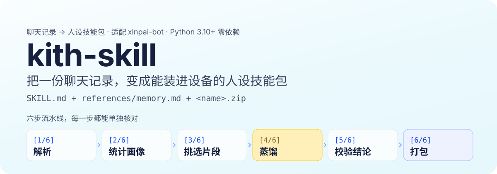
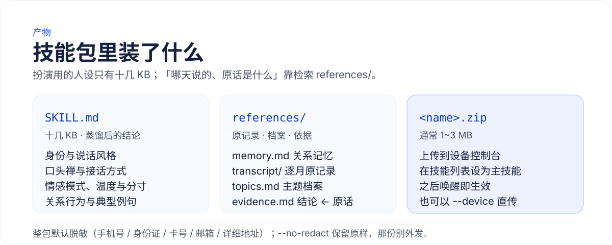
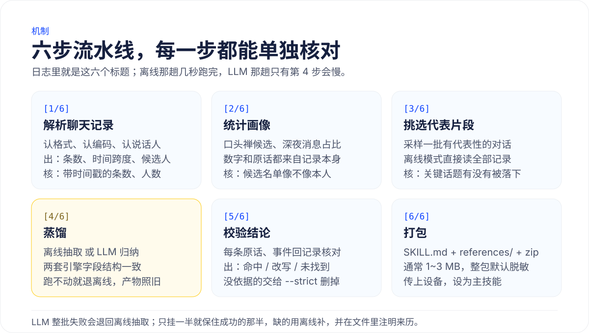
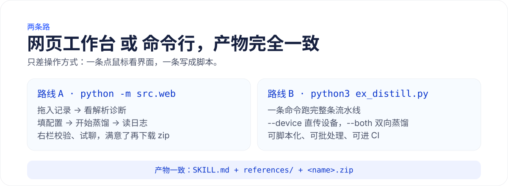
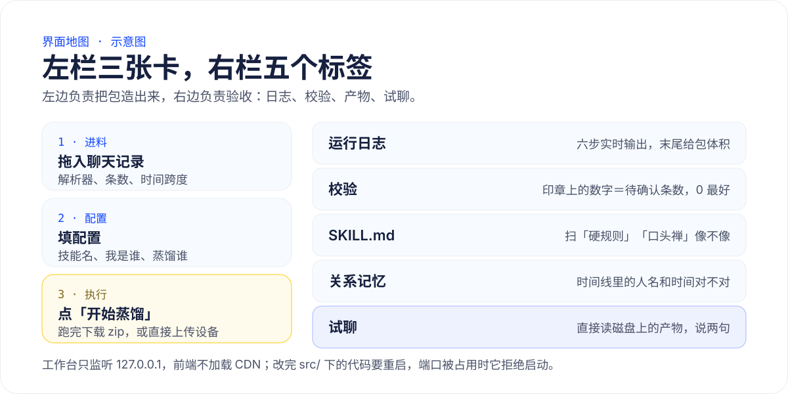

# xpskill

<div align="center"></div>

<p align="center">🇺🇸 <a href="./README.en.md">English</a> | 🇨🇳 <a href="./README.md">简体中文</a></p>

<p align="center">

</p>

**Turn a chat log into a persona skill pack you can drop onto a device**: `SKILL.md` + `references/memory.md` + `<name>.zip`.

Python 3.10+ standard library only: no `pip install`, no model downloads, and no network unless you explicitly turn on LLM distillation. The result loads into tools that support the Skill format or a similar packaging mechanism; it currently targets xinpai-bot (open-sourcing in progress).

> Every nickname, skill name, path and API key in this document is a placeholder. Replace them with your own values, and check the generated files for personal information before uploading.

How to read: [What you get](#what-you-get) · [Six-step pipeline](#the-six-step-pipeline-checkable-at-every-step) · [Illustrated tutorial](#illustrated-tutorial) · [Common options](#common-options) · [Troubleshooting](#troubleshooting) · [Privacy](#privacy-and-security)

## First look

<p align="center">

</p>

One web workbench, two commands, two routes. The left column builds the pack and the right column accepts it: as soon as a run finishes you can say a couple of things to them under "try-chat", and if it does not feel right, edit the artifact by hand or change the recipe and re-run.

## What you get

| Artifact | What it is |
| --- | --- |
| `SKILL.md` | The persona: identity, speaking style, filler words, **how they reply**, emotional patterns, **warmth and restraint**, relationship behaviour, example lines |
| `references/memory.md` | Relationship memory: timeline, shared places, inside jokes, conflict patterns, forms of address |
| `references/` | The reference layer: every message by month (`transcript/`), quotes regrouped by topic (`topics.md`), the claim ← quote table (`evidence.md`), a redacted copy of the raw export (`source/`) |
| `<name>.zip` | All of the above, packed. Upload it in the device console, set it as the main skill, and it takes effect on the next wake-up |

<p align="center">

</p>

The directory looks like this, and every layer has its own job:

```text
<out>/<name>/SKILL.md                          persona (role-play instructions)
<out>/<name>/references/memory.md              relationship memory
<out>/<name>/references/transcript/YYYY-MM.md  every message, by month (redacted by default)
<out>/<name>/references/topics.md              quotes regrouped by topic
<out>/<name>/references/evidence.md            claim ← original line, for every claim
<out>/<name>/references/source/                redacted copy of the raw export (--no-source to skip)
<out>/<name>.zip                               all of the above; usually 1–3 MB
```

The persona documents are only a dozen KB — those are distilled conclusions; "on which day, and what exactly was said" comes from searching `references/`. Entries that fail verification carry `（未在记录中找到依据）`; parts that came from a fallback or a fill-in are stated at the top of `SKILL.md` (for example "LLM 蒸馏 + 本地抽取式蒸馏补齐").

## The six-step pipeline, checkable at every step

<p align="center">

</p>

In between sits a six-step pipeline, and those are the six headings you see in the log:
`[1/6]` parse → `[2/6]` profile → `[3/6]` sample → `[4/6]` distil → `[5/6]` verify → `[6/6]` package.

Below is the verbatim offline run of the synthetic sample that ships with this repository, `samples/demo-chat.json` (only the path is a placeholder):

```text
[1/6] 解析聊天记录：demo-chat.json
      共 123 条消息；说话者 {'潘小雨': 66, '小蒯': 57}
      蒸馏对象：潘小雨
      关系类型：恋人（自动判断：恋人信号最密（每千字命中 2.5 次））
[2/6] 统计画像
      潘小雨 口头禅候选：下次一定、我擦、食堂二楼、行吧
      深夜消息占比：32%
[3/6] 挑选代表片段
      跳过：本地抽取模式直接读全部记录，不采样、不联网
[4/6] 本地抽取式蒸馏（不调用 LLM）
      潘小雨：说话风格 8 条、口头禅 4 条、接话方式 8 条、情感模式 3 条、温度与分寸 4 条、关系行为 6 条、典型例句 8 条、关系记忆 6 条
[5/6] 校验结论
      17 条可核验结论：原文命中 17、改写命中 0、未找到依据 0、时间不符 0
[6/6] 打包
      参考资料：2 个月的原记录 + 主题档案 + 结论依据 + 带路文件，共 0.0 MB
      参考文献：12 条原话（正文里的 [n] 都能在记录里搜到原句）
      <out>/demo-persona.zip（11.5 KB）
```

Distillation has two engines with an identical field structure, switchable at any time:

| | `--no-llm` (offline, run this first) | LLM (default) |
| --- | --- | --- |
| Speed / dependencies | Seconds; no network, no key | Minutes; needs a network |
| Where claims come from | Statistics plus quotes lifted verbatim from the log | Model summaries; may over-generalise or rewrite |
| Good for | Confirming parsing and speakers are right | Richer narrative about events |

## Illustrated tutorial

Both routes produce exactly the same thing, so **pick one and stay on it**: route A if you would rather not touch a terminal, route B if you want to script it.

<p align="center">

</p>

### Route A: the web workbench

```bash
python -m src.web            # defaults to http://127.0.0.1:8765/ and opens a browser
python -m src.web --port 9000 --no-open
```

The interface is **three cards on the left** (input → settings → run) and **five tabs on the right** (log / verification / SKILL.md / memory / try-chat):

<p align="center">

</p>

> [!IMPORTANT]
> The workbench is a long-running process: **editing `src/` requires a restart** to take effect; and if another workbench already holds the port it **refuses to start** rather than running side by side.

**A1 · Drop in the log and read the diagnosis first.** Once parsing succeeds: the header shows the file name and message count, the diagnosis expands below the drop zone, and only then does "Start distillation" stop being greyed out (it stays disabled while nothing has been parsed).

> The screenshot below is the synthetic sample that ships with this repository, `samples/demo-chat.json` (123 messages, 潘小雨 / 小蒯), dropped straight in.

<p align="center">

</p>

Build a habit around two numbers: **how many messages carry a timestamp** (the generic parser can produce a thousand messages with not a single timestamp, and every time-based statistic downstream is then void) and **the speaker count**. If the counts look wrong, switch files first, or re-save as UTF-8 and drop it again.

**A2 · Fill in the settings.** Skill name (ASCII; it determines the directory and zip name), who am I, who to distil — all pickable from candidates or typed in; the distillation mode is either `本地抽取` (offline) or `LLM 蒸馏` (the latter reveals endpoint, model and API key). Optional: extra description, relationship type, strict mode, distil both sides, public use.

<p align="center">

</p>

**A3 · Click "Start distillation" and read the log.** The right column streams those `[N/6]` steps live — the same six headings shown above — and the offline pass finishes in seconds.

<p align="center">

</p>

With LLM distillation step 4 gets slow, but it reports three things: how many batches and calls in total, which one is running now, and how long each call actually took. Seeing `改用本地抽取式蒸馏` means that LLM stage failed and offline extraction already filled in — **the pack is still complete**, and you can re-run once the endpoint recovers.

**A4 · Download and upload.** Download `<skill-name>.zip` from the "run" card → upload it in the device console (board → Settings → Assistant, scan the QR code, or open `http://<DEVICE_IP>:8080`) → set it as the main skill in the skill list.

### Route B: the command line

The two commands in the quick start are the main path; here is what you can stack on top:

```bash
python3 ex_distill.py ... --device '<DEVICE_IP>:8080'   # upload straight to the device
python3 ex_distill.py ... --both                        # also distil you → references/self.md
python3 ex_distill.py ... --audience 公开                # the main skill becomes you, plus redaction
python3 ex_distill.py ... --dry-run-llm                 # print the request that would be sent, send nothing
python3 ex_distill.py ... --llm-chars 12000 --llm-batches 1   # smaller requests, less waiting
```

Command-line artifacts can be tried out too: they live under `out/`, so open `/play?skill=<skill-name>`, or pick one from the dropdown in the try-chat header.

### Acceptance: three places to look

| Where | What you should see |
| --- | --- |
| "verification" tab | The number on the stamp is how many entries need a human decision (**0 is best**). On an LLM run a few "no evidence found" entries are normal — **what matters is the "closest original line" it prints next to each one** |
| "SKILL.md" / "memory" tabs | Skim "hard rules" and "filler words" for plausibility, then check the timeline for wrong names and dates (suspicious entries are marked in vermilion) |
| "try-chat" tab | Say a couple of things to them. This takes the least time and surfaces the most problems |

Try-chat reads the **artifacts on disk**: edit `out/<name>/SKILL.md` or `references/memory.md` by hand and refresh the page — no re-distillation needed. It never modifies the artifacts either.

<p align="center">

</p>

### Does not sound like them: three fixes

1. **Edit the artifacts by hand** (fastest): delete the line it keeps repeating, add a tic, replace an example line that does not sound like them → refresh the try-chat page. A few rounds of this usually beats re-distilling.
2. **Change the recipe and re-run**: `--desc 'quiet, likes to bicker'`, `--relation 同事`, `--both` — all of them change what the model sees.
3. **Drop entries with no evidence**: if you are sure a line was invented, re-run with `--strict` so it is deleted rather than annotated.

> [!TIP]
> If try-chat still sounds bookish, over-explaining or too polite, suspect the **model** first (try a non-reasoning model, or a larger one) and the persona text second: the "speaking style" and "example lines" rows move the register far more than the character budget does.

## Common options

| Option | Default | Description |
| --- | --- | --- |
| `--input` | required | Chat log file or directory (a directory is read recursively). |
| `--name` | required | Skill directory and zip name. |
| `--me` | `我` | Your nickname(s) in the log; comma-separated for several. |
| `--target` | automatic | Who to distil: the most talkative person other than you. |
| `--out` | `<tool dir>/dist` | Output directory; passing it explicitly is recommended. |
| `--no-llm` | off | Offline extraction: no network, no key. |
| `--desc` | empty | Extra description of the relationship, personality or background, e.g. `ENFP, Gemini`. |
| `--relation` | `auto` | `auto` / `恋人` / `朋友` / `同事` / `家人`; changes headings and wording only. |
| `--both` | off | Two-way distillation: also writes your profile to `references/self.md`. |
| `--audience` | `本人` | `公开`: the main skill plays you, redacts the pack, and flags references only the original counterpart can resolve. |
| `--corpus-mb` | `8` | Size budget in MB for the reference layer; `0` disables it. |
| `--strict` | off | Drop failing entries instead of annotating them. |
| `--no-redact` | off | Turn redaction off (on by default for the whole pack: phone numbers, ID numbers, card numbers, e-mail addresses, detailed addresses). |
| `--device` | none | Upload to `<DEVICE_IP>:8080` after generating. |
| `--timeout` / `--max-tokens` | `600` / `0` | Per-request read ceiling (seconds) / output ceiling. |

Full list: `python3 ex_distill.py --help`.

## Troubleshooting

| Symptom | Most likely cause | What to do |
| --- | --- | --- |
| Nothing / very few messages parsed | Format or encoding mismatch; another parser took the file | Read the parsing diagnosis in the workbench (how many messages each candidate got); for text files, re-save as UTF-8 |
| `LLM 返回的不是 JSON` | The model did not answer in JSON | Try a non-reasoning model |
| `等待 N 秒仍没等到响应` | Read timeout | `--timeout 1200`; if it always sticks around 200 seconds, that ceiling is on the gateway side — change models |
| `输出被截断（finish_reason=length）` | A reasoning model spent the budget on thinking | `--max-tokens 8192` or more |
| The workbench behaves like the old code / `端口 … 已有一个服务在运行` | The long-running process holds the old modules / the previous one is still up | Restart it; or use `--port 9000` |
| An entry carries `（未在记录中找到依据）` | The model may have invented a quote | Read the "closest original line" and search the source file for it; if it is not there, `--strict` |
| Try-chat says it cannot find the run / there is no API key | The job id only lives in the process / an offline pack carries no key | Pick an artifact from the header dropdown; enter a key under "Endpoint" |
| In try-chat it answers like a support agent | The model is too assistant-like, or the style rows are too vague | Change models; or edit "speaking style / filler words / example lines" and refresh |
| The words are right but it does not feel like them | Context and warmth are missing | Check "how they reply" first (are the exchanges typical of them?); then adjust the warmth level in "warmth and restraint" |

## Privacy and security

> [!WARNING]
> Chat logs can contain highly sensitive personal information. Before uploading them anywhere or calling an external LLM, confirm that you have the right to use the data and check the provider's policy.

- With `--no-llm`, chat content is processed on your machine only; in LLM mode samples are redacted before they leave.
- **The whole pack is redacted by default**: phone numbers, ID numbers, card numbers, e-mail addresses and detailed addresses become `[标签]`, across `SKILL.md`, `memory.md` and `references/`. `--no-redact` keeps the originals — **do not send that pack anywhere**.
- A `--audience 公开` pack will be read by other people: the tool **flags** references only the original counterpart can resolve and deliberately **does not rewrite them** — confirm every one before publishing.
- The try-chat API key is never written to disk or to the log; never put a key in the README, in source code or in a commit.
- The workbench listens on `127.0.0.1` only; the front end is plain static files with no CDN assets, so it works offline.

> [!CAUTION]
> The screenshots in this document use the synthetic sample that ships with this repository, `samples/demo-chat.json` (nicknames 潘小雨 / 小蒯). A real run contains real nicknames and conversations, so review any output before publishing it.

## Advanced

<details>
<summary><b>Supported input formats</b></summary>

#### Supported input

| Type | Example | Parsing behaviour |
| --- | --- | --- |
| JSON | `chat.json` | Looks for a message array under `messages`, `list`, `items`, `data` and friends; bodies use `text`/`content`/`message`/`body`, senders use `name`/`remark`/`nickname`. |
| CSV | `chat.csv` | Detects common column names for time, sender, body and `IsSender`. |
| TXT | `chat.txt` | `nickname: text`, timestamped message lines, QQ text exports, WhatsApp exports. |
| HTML / MHT / MHTML | `chat.html` | Strips the MIME envelope, undoes quoted-printable, then takes the plain text (QQ message-manager exports go this way). |
| WeChat SQLite | `EnMicroMsg.db` | Reads the `MSG` table of a decrypted database; `--channel` filters by `StrTalker`. |
| Twitter / X | `tweets.js` | `tweets.js` and `direct-messages.js` from an archive. |
| mbox | `archive.mbox` | Mail archive: body text, sender, date. |
| Directory | `exports/` | Recurses into `.txt` `.csv` `.json` `.js` `.mbox` `.html` `.htm` `.mht` `.mhtml`. |

Encodings are tried in order `utf-8-sig → utf-8 → gb18030 → utf-16`; formats are recognised by **extension plus content sniffing**, and **a mismatch degrades silently** — which is why the step-1 diagnosis matters.

A WeChat PC 4.x `chat.json` from wx-cli / WeChatExporter goes through the JSON path, but "who is who" needs untangling: **the other side's messages have an empty `sender`** (only your own messages carry a nickname) — in a private chat the empty string becomes the conversation name and the other side is normalised to "我".

</details>

<details>
<summary><b>LLM configuration and failure fallback</b></summary>

#### LLM configuration

| Setting | Resolution order |
| --- | --- |
| API key | `--api-key` → `LLM_API_KEY` → `MODELSCOPE_API_KEY` → `DASHSCOPE_API_KEY` → `OPENAI_API_KEY` |
| Endpoint | `--base-url` → `LLM_BASE_URL` → the ModelScope default |
| Model | `--model` → `LLM_MODEL` → `Qwen/Qwen3-235B-A22B` |

Requests are non-streaming: the call returns only once the model has written the whole JSON, so "slow" is normal — one or two minutes for the persona is routine, and the relationship memory has an even longer JSON to write.

A failure never leaves you empty-handed:

- **Whole-batch failure** (no key, unreachable, rate limiting, or a response that is not JSON) → falls back to offline extraction; the pack is still complete.
- **Half failure** (the persona came through, the memory timed out) → the successful half is kept, the missing half is filled in offline, with the provenance noted in the file.
- **Upstream flakiness** (an HTTP 200 shell, a read timeout) → backs off and retries, then splits that batch in half and re-runs each part; results are merged as usual.
- **One broken JSON blob does not take the whole run down** — only that batch is dropped.
- **A misbehaving gateway** (a BOM, an SSE-wrapped body, another JSON object glued to the end, or the bare completion text) → all four are salvaged.

</details>

<details>
<summary><b>Relationship types</b></summary>

#### Relationship types

`--relation` changes headings and wording only, **never facts**: `auto` / `恋人` / `朋友` / `同事` / `家人`. The default `auto` judges by the density of forms of address and topic words and prints its reasoning (for example "colleague signal densest (5.3 hits per 1,000 characters)"); `--relation` overrides it at any time.

| Internal field | 恋人 | 朋友 | 同事 | 家人 |
| --- | --- | --- | --- | --- |
| relationship timeline | 关系时间线 | 认识与相处时间线 | 共事时间线 | 关系时间线 |
| highlights | 甜蜜瞬间 | 相处高光 | 配合默契的瞬间 | 温暖瞬间 |
| conflicts | 争吵模式 | 闹别扭的时候 | 分歧与摩擦 | 争执模式 |
| inside_jokes | inside jokes | inside jokes | 你们之间的固定说法 | 家里的梗 |

</details>

<details>
<summary><b>How verification checks a claim</b></summary>

#### Verification

Every claim that says "this is a quote" or "this happened then" is checked against the original log (standard library only, no network): a quote check (verbatim hit / rewritten hit with coverage ≥ 0.75 / not found), a date check, and an evidence check. Because the prompt asks for provenance, quotes often carry a `time speaker:` prefix — verification strips that layer before comparing.

When checking by hand, read the **closest original line in the log** that the tool prints:

| What you see | What it means | What to do |
| --- | --- | --- |
| It is the same sentence as your quote | A hit; only a prefix or punctuation differs | Ignore it |
| The two texts differ | The model rewrote the meaning — this is what needs checking | Search the source file for that sentence; if it is not there, it was invented |
| It is an unrelated system line | There really is nothing close in the log | Suspect it |

Three ways to handle it: ignore it (the artifact already carries the annotation), edit the file, or re-run with `--strict` (which also drops false positives).

A deliberate boundary: **this checks whether a quotation is genuine, not whether a claim is semantically true.** Turning "I did not say that" into "I said that" is a reversal no string comparison can catch — that needs a semantic model of several hundred MB, which contradicts the zero-dependency goal. Luckily, wholesale invention is far more common than subtle inversion.

</details>

## Development and validation

```bash
python3 -m py_compile ex_distill.py
python3 ex_distill.py --help

python3 ex_distill.py --input /path/to/chat.json --me 'your nickname' \
  --name smoke-test --out ./dist-smoke --no-llm
unzip -l ./dist-smoke/smoke-test.zip

python3 -m src.web --no-open     # workbench self-check: http://127.0.0.1:8765/
```

The project currently has no separate test suite; the commands above cover syntax, imports, argument parsing and the no-LLM packaging path.

## Contributing

Issues and pull requests are welcome. Before submitting:

- [ ] Run `python3 -m py_compile ex_distill.py`
- [ ] Validate parsing behaviour with redacted or synthetic chat data
- [ ] Do not commit chat logs, API keys or generated persona files
- [ ] Keep the related documentation in sync

## Acknowledgements

- [agenmod/immortal-skill](https://github.com/agenmod/immortal-skill): the ideas behind a digital double, per-dimension distillation and evidence awareness.
- [shuakami/qq-chat-exporter](https://github.com/shuakami/qq-chat-exporter): JSON export for QQ chat logs.
- [93857536-pixel/WeChatExporter](https://github.com/93857536-pixel/WeChatExporter): WeChat chat-log export.

## License

Released under the [MIT License](LICENSE).
