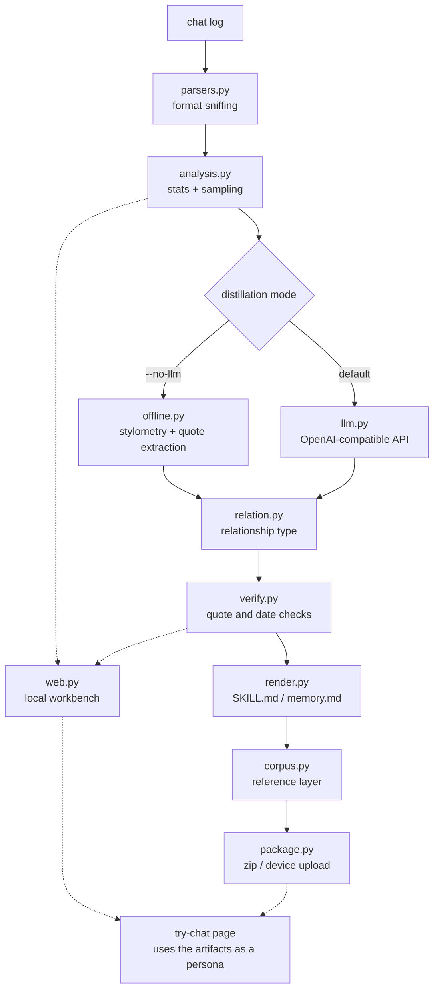

# xpskill

<div align="center"></div>

<p align="center">🇺🇸 <a href="./README.en.md">English</a> | 🇨🇳 <a href="./README.md">简体中文</a></p>

<p align="center">

</p>

A chat-persona skill-pack generator: it distills chat logs (QQ and friends) into a lightweight `SKILL.md`, a relationship-memory file, and a `.zip` skill pack that is easy to upload and move around. The output works with anything that speaks the Skill format or a similar pack mechanism; today it mainly targets xinpai-bot (not open source yet).

Everything runs on the Python standard library alone: no `pip install`, no model downloads, and no network unless you explicitly turn on LLM distillation.

> [!NOTE]
> Every nickname, skill name, path and API key in this document is a placeholder. Replace them with your own values, and check the generated files for personal information before uploading.

## Table of Contents

- [Features](#features)
- [How It Works](#how-it-works)
- [Installation](#installation)
- [Tutorial](#tutorial)
- [Web GUI](#web-gui)
- [Supported Inputs](#supported-inputs)
- [CLI Reference](#cli-reference)
- [LLM Configuration](#llm-configuration)
- [Output](#output)
- [Relationship Types](#relationship-types)
- [Verification](#verification)
- [Privacy and Security](#privacy-and-security)
- [Development and Validation](#development-and-validation)
- [Contributing](#contributing)
- [Acknowledgements](#acknowledgements)
- [License](#license)

## Features

In one sentence: **it turns a chat log into a skill pack you can drop onto a device** — `SKILL.md` (the persona) + `references/memory.md` (relationship memory) + the `references/` reference layer + `<name>.zip`.

The difference from "one-click persona generation" is a single thing: there are six steps in between, and **each one can be inspected and checked on its own**. Below: pipeline → artifacts → engines → resilience → try-chat → use cases → deliberate trade-offs.

### 1. The six-step pipeline (these are the headings you see in the log)

| Step | Log heading | What it does | What you can check |
| --- | --- | --- | --- |
| 1 | `[1/6] 解析聊天记录` (parse) | Sniffs format and encoding, reads the log into `(timestamp, speaker, text)` | **Which parser** took the file, how many messages it got, who is talking, the time span, and **how many messages each candidate parser got** |
| 2 | `[2/6] 统计画像` (profile) | Message counts, span, late-night share, who starts conversations, mean/median length, filler words, emoji, burst habits, reply latency, conflict signals | Every number comes from counting, with no model judgement mixed in |
| 3 | `[3/6] 挑选代表片段` (sample) | Splits into sessions, prefers late-night, conflict and long ones, then fills a character budget for the model | How much text actually goes out (`--llm-chars`) |
| 4 | `[4/6] LLM 蒸馏` / `[4/6] 本地抽取式蒸馏` (distill) | Two engines with an identical field structure (below) | Where each claim came from (offline) / the evidence table (LLM) |
| 5 | `[5/6] 校验结论` (verify) | Checks every "this is a quote" claim and every date against the original log | Verbatim hit / rewritten hit / no evidence found / date mismatch, plus **the closest original line** |
| 6 | `[6/6] 打包` (package) | Writes `SKILL.md` + `references/`, zips them, and optionally uploads with `--device` | The file list and the pack size |

Parsing recognises sources by **extension plus content sniffing** (a mismatch degrades silently, which is why the step-1 diagnosis matters): QQ message-manager exports (`.txt` / `.mht`), WeChat SQLite (a decrypted `EnMicroMsg.db`), WeChat PC 4.x JSON from wx-cli / WeChatExporter, WhatsApp exports, CSV tables (WeChatMsg / 留痕 / PyWxDump and friends), generic JSON message arrays, HTML / MHT / MHTML, Twitter/X archives, mbox mail archives, and a final fallback for plain `nickname: text` files; passing a directory to `--input` recurses into it. Encodings are tried in order: `utf-8-sig → utf-8 → gb18030 → utf-16`.

### 2. The artifacts come in three layers

| Layer | Files | For whom |
| --- | --- | --- |
| **Persona** | `SKILL.md` (role-play instructions), `references/memory.md` (relationship memory) | The main skill on the device: how it talks, and what happened between you |
| **Background** | `references/self.md` or `references/other.md` (with `--both` / `--audience 公开`) | What the main skill should know about *the other side* — **with the role-play instructions stripped**, so the device does not read it as a persona too |
| **Reference** | `references/transcript/YYYY-MM.md` (every message, by month), `topics.md` (quotes regrouped by topic), `evidence.md` (the original line behind each claim), `source/` (a redacted copy of the raw export), `README.md` (a signpost) | So the device can **retrieve actual quotes** — and so you can check whether a sentence is a quote or a paraphrase |

The persona documents are only a dozen KB: they are distilled conclusions. "On which day, and what exactly was said" comes from the reference layer, which is why it is generated by default (`--corpus-mb` sets its size budget, 8MB by default; `0` disables it). When the budget runs out, months are packed **newest first** and the dropped ones are stated plainly in the signpost file, so you never have to wonder whether records went missing.

### 3. Two engines: offline (`--no-llm`) and LLM (default)

| | Offline (`--no-llm`) | LLM (default) |
| --- | --- | --- |
| Speaking style, relationship behaviour | Measured stylometrically, with percentages and counts | Summarised by the model, may over-generalise |
| Filler words, example lines, nicknames, places | Extracted verbatim from the log, checkable one by one | Paraphrased by the model, may rewrite or invent |
| Narrative events in the timeline | Only objective anchors such as months and gaps | Written by the model, needs human checking |
| Network | None | Required (samples are redacted before they leave) |
| Dependencies | None | None (`urllib` only) |

The two produce an **identical field structure** and you can switch at any time: run offline first (seconds, no key) to confirm parsing is right, then switch to LLM for richer prose. Offline deliberately refuses to write what it cannot verify — a section with no evidence is left empty with an explanation instead of being filled with plausible-sounding text.

### 4. You never end up empty-handed (resilience)

This part is the easiest to overlook, and it decides whether you have something usable at 2 a.m.:

- **An LLM failure still yields a full pack.** If the whole batch fails, it falls back to offline extraction; if only half fails (the persona came through, the memory timed out), the **successful half is kept** and only the missing half is filled in offline, with the provenance noted in the file.
- **"Upstream gave us nothing" retries itself, and splits when the write is too long.** Rate limiting and upstream flakiness often show up as an HTTP 200 shell (`choices: null`, `usage` all zeros) — it backs off and retries twice; if there is still no content, or the read times out, that batch is **split in half by paragraphs** and re-run, and the two halves are merged as usual.
- **One broken JSON blob does not take the whole run down.** If a batch returns prose, only that batch is dropped; whatever the other batches produced is kept.
- **A misbehaving gateway can still be salvaged.** A response body with a BOM, wrapped as SSE, with another JSON object glued to the end, or with the raw completion text returned bare — all four are recovered; only genuine truncation is reported as an error.
- **Errors have to be actionable.** Truncation says `finish_reason=length` and points at `--max-tokens`; a timeout says exactly how long it waited (600-second ceiling by default, tunable with `--timeout`); broken JSON reports the reason, the offset and the surrounding text.

### 5. Try-chat: verify on the spot, fix on the spot

Open the **Try-chat** tab on the right, or click **Open try-chat page** on the left for a standalone page (`/play?job=<job-id>`). It answers the question "**now that it is generated, how do I know it sounds right?**":

- **The persona is exactly the files you just generated, read straight from disk.** Edit `out/<name>/SKILL.md` or `references/memory.md` by hand and refresh the page — trying out a phrasing, deleting a line it keeps repeating, adding a tic: none of it requires re-running the distillation.
- **Switching personas is easy.** If the workbench was restarted, or you want to chat with another skill under `out/`, pick one from the dropdown in the header (or open `/play?skill=<skill-name>`). Switching clears the current conversation.
- **What the model receives is not the whole report.** `## 参考文献`, the `skill_search` retrieval notes and statistics like `0%`/`92%` are filtered out first; then **five real short exchanges picked from the original log** are attached as a register sample; only then come the rules for this session. The model reads a *persona*, not an analysis report.
- **It is sent as real multi-turn messages, at a chat-appropriate temperature.** The conversation goes out as `user`/`assistant` turns rather than being flattened into one block of text; `temperature=1.1` (extraction uses `0.3`, where the point is stability), **selectable in four steps on the try-chat page** (0.7 steady / 1.1 default / 1.3 lively / 1.6 loose; a change applies to the next message and the browser remembers your pick), and `LLM_CHAT_TEMPERATURE` can set a global default; replies may arrive as two or three short lines, the way people actually text.
- **The API settings carry over from the run**, and the key exists only for the duration of a request — never written to disk or to the log. The header shows how many files and how many sample exchanges were used.

> [!NOTE]
> Try-chat only speaks to an LLM endpoint (an `--no-llm` pack carries no key, so you have to enter one under "Endpoint"). It **never modifies the artifacts** — edit the files directly for that.

### 6. Two-way distillation and who the skill is for

A single run can produce two profiles; `--audience` decides which one becomes the main skill:

| | `--audience 本人` (default) | `--audience 公开` |
| --- | --- | --- |
| Who the main skill plays | **The other person** — you talk to them | **You** — other people talk to your double |
| The "about X" section | About **you**: so they know who you are and how to talk to you | About **them**: so they are not misdescribed when mentioned |
| Background file | `references/self.md` (your profile) | `references/other.md` (their profile) |
| Privacy | Whole pack redacted (persona docs + chat logs under `references/`, disable with `--no-redact`) | Same, plus references that only the original counterpart can resolve ("the two of us", "what you said last time", "that time") are flagged; in LLM mode the prompt also asks for them to be rewritten as background statements |
| How to enable | `--both` | `--audience 公开` (implies `--both`) |

Each profile gets its own statistics, so the other person's verbal tics never end up attributed to you.

### 7. Deliberate trade-offs

- **Filler words are picked by "clearly more characteristic of this person than of the other side"**, not by raw frequency — otherwise the winners are always words everyone uses, like "no" and "also".
- **Offline mode does not write what it cannot verify.** A section without evidence is left empty with a reason, rather than filled with a plausible paragraph.
- **Verification checks whether a quotation is genuine, not whether a claim is semantically true.** Turning the original "I did not say that" into the conclusion "I said that" is a reversal no string comparison can catch — that needs a semantic model of several hundred MB, which contradicts the zero-dependency goal. Luckily, wholesale invention is far more common than subtle inversion.
- **Chat does not recite its own profile.** The report-ish sections are filtered out for try-chat, and the model is explicitly told not to explain, summarise or bullet-point: it should sound like the person on WeChat, not like someone reading their own dossier aloud.
- **Standard library only.** No `pip install`, no model downloads, no CDN assets; `jieba` is an optional upgrade and the whole pipeline runs with or without it.

## How It Works

<!-- Experimental: if rendering fails, preview on GitHub -->



Solid lines are the pipeline, dotted lines are the workbench: `web.py` **duplicates no business logic** — it calls the very same `cli.main` and only redirects stdout/stderr into the page, so the command line and the web UI can never disagree. The distillation mode forks in the middle; verification, rendering, the reference layer and packaging are shared afterwards, which is exactly why both engines produce an identical file structure.

## Installation

At runtime you only need **Python 3.10+** and its standard library; no `pip install`, no third-party dependencies.

```bash
git clone https://github.com/<YOUR_ACCOUNT>/xpskill.git
cd xpskill
python3 -m py_compile ex_distill.py
python3 ex_distill.py --help   # confirms the whole package imports
```

<details>
<summary>Optional: install <code>jieba</code> to improve filler-word accuracy</summary>

```bash
pip install jieba    # optional
```

Without it, filler words come from a built-in character n-gram miner. With it, topic words are filtered out by part of speech — which matters, because the most frequent strings in a conversation are usually the topic nouns of that conversation (`power supply`, `lab`, `led`), not speech habits. It also joins adjacent words along word boundaries, so the character n-gram miner stops producing cross-word fragments like `么不` or `个吗` that look like tics and have a respectable frequency.

Either way the full pipeline runs; only the quality of the filler-word list changes.
</details>

## Tutorial

Goal: turn one chat log into `SKILL.md` + `references/memory.md` + `<name>.zip`. Both routes produce the same thing, so **pick one and stay on it**: route A if you would rather not touch a terminal, route B if you want to run it in a shell or script it.

### 0. Get a chat log first

Supported sources are listed under [Supported Inputs](#supported-inputs). For QQ, use the message manager or [qq-chat-exporter](https://github.com/shuakami/qq-chat-exporter); for WeChat you need to decrypt `EnMicroMsg.db` locally; plain text works too — one `nickname: text` line per message is enough.

> [!TIP]
> For a first run, take the offline route: no network, no key, results in seconds, and you can see immediately whether parsing is right. Switch to the LLM version once that looks good.

### Route A: the web workbench (no terminal)

The interface has two columns whose order matches the workflow: **three cards on the left** — input → settings → run; **five tabs on the right** — log / verification / SKILL.md / memory / try-chat (the last four unlock once a run finishes).

**A1 · Start the workbench**

```bash
python -m src.web            # defaults to http://127.0.0.1:8765/ and opens a browser
python -m src.web --no-open  # serve only, do not open anything
python -m src.web --port 9000
```

The console prints these lines — the last one is a **version fingerprint**, which is how you confirm the browser is talking to the process you just started (the banner itself is printed in Chinese, so here it is verbatim):

```text
xpskill web 已启动：http://127.0.0.1:8765/
  输出目录：<current dir>/out（打包好的 zip 会落在这里）
  临时目录：<temp dir>/xpskill-web-xxxx（只放上传的聊天记录，退出即删）
  只监听本机；聊天记录与 API Key 都不会离开这台机器。Ctrl+C 结束。
  注意：本进程启动时把 src/ 的代码读进了内存，改完代码要重启它才生效（命令行每次都是新进程，所以改动立刻可见）
```

> [!IMPORTANT]
> The workbench is a long-running process: it runs the code as it was at startup, so **editing `src/` requires a restart**; and if another workbench already holds the port it **refuses to start** rather than running side by side. Both are in the [troubleshooting table](#when-something-goes-wrong).

**A2 · Drop in the log, read the diagnosis first** (left column, "input")

Click the drop zone to pick a file, or drag one in. Once parsing succeeds there are three things to look at:

- the header lights up with the file name and message count;
- the **diagnosis** expands below the drop zone (field meanings in the table);
- only then does "Start distillation" stop being greyed out. **It stays disabled while nothing has been parsed**, so the order cannot be reversed.

| Diagnosis field | What you should see |
| --- | --- |
| Parser | The one that took the file (e.g. `JSON 消息数组`). It is the entry marked "in use" in the candidate table below |
| Message count / speakers | How many messages, how many people; a wrong speaker count means "who is who" was not untangled correctly |
| Time span / messages without a timestamp | First and last message time, and how many messages have no parsed time (this affects date verification) |
| Decodable encodings | Which encodings read cleanly (e.g. `utf-8-sig`, `utf-8`, `utf-16`) — the first place to look when text is mangled |
| Candidate list | **How many messages each candidate parser got**: a large gap means another parser grabbed the file |

With the sample `68.json` in this repository, the candidate table looks like this:

| Candidate parser | Messages | Speakers | With timestamps |
| --- | --- | --- | --- |
| **JSON 消息数组** (in use) | 1342 | 3 | 1342 |
| 通用「昵称: 内容」文本 | 1347 | 6 | 0 |
| QQ 消息管理器导出 | 0 | 0 | 0 |
| WhatsApp 导出 | 0 | 0 | 0 |

Two numbers are worth building a habit around: **how many messages carry a timestamp** (the generic parser got 1347 of them with not a single timestamp — use that as the main parser and every time-based statistic downstream is void) and **the speaker count**. If the counts look wrong, switch files first, or re-save as UTF-8 and drop it again: a mismatched format degrades silently, and "only 3 messages came out" is visible nowhere else.

<!-- Screenshot slot: docs/images/tutorial-a2-diagnose.png (drop zone + parsing diagnosis panel).
     Once added, replace the line below with: <p align="center"></p> -->
> Screenshot slot · `docs/images/tutorial-a2-diagnose.png`: drop zone + parsing diagnosis panel

**A3 · Fill in the settings** (left column, "settings")

Both "who am I" and "who to distill" **can be picked from candidates or typed in**: the candidates come from the speakers just parsed (which is why the file has to come first) and the ▾ button lists them all; anything missing (say a WeChat remark that differs from the nickname) can simply be typed. Clicking a speaker chip in the diagnosis sets "who to distill"; **Alt+click** on the same chip fills "who am I" instead.

| Field | How to fill it |
| --- | --- |
| Skill name | ASCII; it determines the directory and zip name (defaults to `persona`) |
| Who am I | Your own nickname in the log (pick or type); leave empty to use the default "我" when you are not in the log |
| Who to distill | Pick or type; empty means automatic — the most talkative person other than you |
| Relationship type | Leave it on automatic; it only changes headings and wording, never facts |
| Extra description | Optional, e.g. `ENFP, Gemini` |
| Distillation mode | `本地抽取` (offline) needs no network and finishes in seconds; choosing `LLM 蒸馏` reveals endpoint, model and API key |
| Strict mode | Tick to delete failing entries instead of annotating them |
| Distill both sides | Also build a profile of you, so the main skill knows who it is talking to |
| Public use | For other people: the main skill plays you and the pack is redacted; ticking it enables "distill both sides" too |

<!-- Screenshot slot: docs/images/tutorial-a3-config.png (left "settings" card: fields, with the LLM endpoint expanded).
     Once added, replace the line below with: <p align="center"></p> -->
> Screenshot slot · `docs/images/tutorial-a3-config.png`: the "settings" card on the left

**A4 · Click "Start distillation" and learn to read the log** (left column, "run")

The log tab streams live and every step carries an `[N/6]` heading (what the six headings mean is in the first section of [Features](#features)). **The offline pass finishes in seconds**, and prints a log like this (nicknames replaced with sample values; the CLI prints its log in Chinese, what matters here is the shape):

```text
[1/6] 解析聊天记录：68.json
      共 1342 条消息；说话者 {'小雨': 721, '我': 610, '系统消息': 11}
      蒸馏对象：小雨
      关系类型：朋友（--relation 指定）
[2/6] 统计画像
      小雨 口头禅候选：我擦、是啊、牛嘿、啥阴、md、几把的、收到、几把
      深夜消息占比：38%
[3/6] 挑选代表片段
      跳过：本地抽取模式直接读全部记录，不采样、不联网（脱敏照做，见第 6 步）
[4/6] 本地抽取式蒸馏（jieba 分词，不调用 LLM）
      小雨：说话风格 9 条、口头禅 13 条、情感模式 4 条、关系行为 6 条、典型例句 8 条、关系记忆 13 条
[5/6] 校验结论
      37 条可核验结论：原文命中 37、改写命中 0、未找到依据 0、时间不符 0
[6/6] 打包
      参考资料：2 个月的原记录 + 主题档案 + 结论依据 + 带路文件 + 原始导出，共 0.8 MB（--corpus-mb 8，0 可关；已脱敏）
      参考文献：22 条原话（正文里的 [n] 都能在记录里搜到原句）
      脱敏：手机号 / 身份证 / 银行卡 / 邮箱 / 详细地址 已替换成 [标签]（想保留原样加 --no-redact）
      <out>/<skill-name>.zip（93.4 KB）
```

(The size reflects this sample log; a 50,000-message pack is around 1.6 MB.)

**With LLM distillation, step 4 gets slow — and it has to stay estimable**, so it reports three things: the total size, which call is running now, and how long each call actually took (again the tool's own log, printed in Chinese):

```text
[4/6] LLM 蒸馏（Qwen/Qwen3-235B-A22B @ https://api-inference.modelscope.cn/v1）
  · 共 1 批，每批 2 次调用（人格分析 + 关系记忆），合计 2 次请求
  · 第 1/1 批 · 人格分析…（输入 29920 字符）
      人格分析完成：用时 106.3 秒，返回 3343 字符
  · 第 1/1 批 · 关系记忆…（输入 29920 字符）
```

The relationship-memory call looks exactly the same, except that it writes a longer JSON and is usually slower. Seeing "完成：用时" means that batch succeeded; seeing `改用本地抽取式蒸馏` means that LLM stage failed and offline extraction has already filled in — the pack is still complete, and you can re-run once the endpoint recovers.

Log lines are coloured by meaning, and **red is reserved for things that genuinely need attention**: a yellow step number for headings, blue for LLM progress, grey for secondary notes, red for failing verification entries and real errors.

<!-- Screenshot slot: docs/images/tutorial-a4-log.png (the log while LLM distillation is on batch 2/3).
     Once added, replace the line below with: <p align="center"></p> -->
> Screenshot slot · `docs/images/tutorial-a4-log.png`: the run log (step headings + batch progress + per-call timing)

**A5 · Accept the result: four things, from "is it right" to "does it sound right"**

| Where | What you should see |
| --- | --- |
| "verification" tab | The number on the stamp is how many entries need a human decision (**0 is best**). Below it, the checked total is split into four kinds: verbatim hit / rewritten hit / no evidence found / date mismatch. On an offline run this line should be all hits (e.g. `37 条可核验结论：原文命中 37、改写命中 0、未找到依据 0、时间不符 0`); on an LLM run a few "no evidence found" entries are normal — **what matters is the "closest original line" it prints next to each one** |
| "SKILL.md" / "memory" tabs | The rendered artifacts. Skim the rules and filler words first for plausibility, then check the timeline for wrong names or dates — suspicious entries are marked in vermilion |
| "try-chat" tab | Say a couple of things and see whether it sounds like them (see [try-chat](#5-try-chat-verify-on-the-spot-fix-on-the-spot)). This takes the least time and surfaces the most problems |
| "run" card, "download skill pack" | You get `<skill-name>.zip`, whose size the end of the log reports. Upload it in the device console and set it as the main skill; it takes effect on the next wake-up |

After an offline run the console also prints the next steps (in Chinese, like every other log line):

```text
下一步：
  1) 打开设备控制台（板子 → 设置 → 助手 扫码，或直接访问 http://<设备IP>:8080）
  2) 上传 <技能名>.zip
  3) 在技能列表里把它设为「主技能」（人设类）——之后唤醒即生效
  4) 想改口味就编辑 SKILL.md / references/memory.md 再传一次
```

<!-- Screenshot slot: docs/images/tutorial-a5-play.png (try-chat page; the header shows the persona, file count and sample count).
     Once added, replace the line below with: <p align="center"></p> -->
> Screenshot slot · `docs/images/tutorial-a5-play.png`: the try-chat page

**A6 · Does not sound like them? Three fixes, fastest first**

1. **Edit the artifacts by hand (fastest, no re-run)**: open `out/<name>/SKILL.md` or `references/memory.md` and delete the line it keeps repeating, add a tic, replace an example under "speaking style" with a more characteristic one — then **refresh the try-chat page**. It reads from disk, so the change is live immediately, and a few rounds of this usually beats re-distilling.
2. **Change the input and re-run**: add an extra description (`--desc`, e.g. `ENFP, quiet, likes to bicker`), pin the relationship type (`--relation`), or include your own profile (`--both`) — all of them change what the model sees.
3. **Deal with failing verification entries**: use the manual check described under [Verification](#verification) to decide whether a line was invented or rewritten; if it is genuinely useless, re-run with `--strict` to have it dropped.

> [!TIP]
> If try-chat still sounds bookish, over-explaining or too polite, suspect the **model** first (try a non-reasoning model, or a larger one) and the persona text second: the "speaking style" and "example lines" sections influence register far more than the character budget does.

### Route B: on the command line

**B1 · Run offline first** (no network, no key)

```bash
python3 ex_distill.py \
  --input /path/to/chat.json \
  --me 'your nickname' \
  --target 'their nickname' \
  --name chat-persona \
  --out ./dist \
  --no-llm
```

When `--target` is omitted it picks the most talkative speaker other than `--me`.

**B2 · Switch to LLM distillation**

```bash
export MODELSCOPE_API_KEY="<YOUR_API_KEY>"     # or pass --api-key directly

python3 ex_distill.py \
  --input /path/to/chat.json \
  --me 'your nickname' \
  --target 'their nickname' \
  --name chat-persona \
  --desc 'extra context about the relationship and speaking style' \
  --base-url 'https://api-inference.modelscope.cn/v1' \
  --model 'Qwen/Qwen3-235B-A22B' \
  --out ./dist
```

> [!TIP]
> Add `--dry-run-llm` to print the request that would be sent (URL and sample length) without actually sending any chat content.

**B3 · (Optional) upload straight to the device**

```bash
python3 ex_distill.py ... --device '<DEVICE_IP>:8080'
```

**B4 · (Optional) two-way distillation / for other people**

```bash
python3 ex_distill.py ... --both              # also writes a profile of you, references/self.md
python3 ex_distill.py ... --audience 公开      # the main skill becomes you, and the pack is redacted
```

Artifacts produced on the command line can also be tried out in the workbench: they live under `out/`, so open `/play?skill=<skill-name>` (or pick one from the header dropdown).

### Where the two routes meet

- **Artifacts**: `<out>/<name>/SKILL.md`, `references/memory.md`, `references/self.md` or `other.md` (with two-way distillation), the reference layer (`references/transcript/` by month, `references/topics.md`, `references/evidence.md`, `references/source/` with the redacted raw export), and `<name>.zip`.
- **Verification**: the most useful column in the report is "closest original line". If it is **the same sentence** as your quote, it is a hit — the model often writes `[time] speaker:` into the quotation because the prompt asks for provenance, and the checker strips that prefix before comparing. It is when **the two texts differ** that a human has to look, and the way to do it is to search the source file for that sentence. See [Verification](#verification).
- **Upload**: put the zip into the device console (board → Settings → Assistant, scan the QR code, or open `http://<DEVICE_IP>:8080` directly), set it as the main skill, and it takes effect on the next wake-up.

### When something goes wrong

| Symptom | Most likely cause | What to do |
| --- | --- | --- |
| Nothing was parsed | Format or encoding mismatch | Check the parsing diagnosis in the workbench (how many messages each candidate got); for text files, re-save as UTF-8 and try again |
| Very few messages parsed | Another parser grabbed the file first | Same as above; read the candidate list |
| `LLM 返回的不是 JSON` | The model did not answer in JSON, or the gateway wrapped the response | Try a non-reasoning model; SSE, bare text and trailing garbage are all salvaged automatically, and when they are not, the reason and offset are written to the log |
| `等待 N 秒仍没等到响应` | Read timeout | Raise `--timeout 1200`; if it always sticks around 200 seconds, that ceiling is on the gateway side, so change models |
| `输出被截断（finish_reason=length）` | A reasoning model spent the budget on thinking | `--max-tokens 8192` or more |
| The workbench behaves like the old code | The long-running process still holds the old modules | Restart it; the last line of the startup banner is the version fingerprint |
| `端口 … 上已经有一个服务在运行` | The previous workbench is still up | Stop it, or use `--port 9000` |
| An entry carries `（未在记录中找到依据）` | The model may have invented a quote | See the manual check under [Verification](#verification) |
| An entry carries `（公开版需确认：…）` | In a public pack, only the original counterpart can resolve that reference | The tool flags it and deliberately does not rewrite it; rewrite or delete it before uploading |
| Try-chat says it cannot find the run | The workbench was restarted, so the job (which only lives in memory) is gone | No need to re-run: the artifacts are still under `out/`, so pick one from the dropdown in the try-chat header (`?skill=<skill-name>` works too) |
| Try-chat says there is no API key | This was an offline run, so the pack carries no endpoint settings | Enter a key under "Endpoint" on the try-chat page, or re-run with LLM distillation |
| In try-chat it answers like a support agent | The model is too assistant-like, or the style section is too vague | Change models; or edit "speaking style / filler words / example lines" in the artifacts and refresh the page (see A6) |

## Web GUI

If you would rather not touch a terminal, use the web workbench — **how to use it is in [Route A](#route-a-the-web-workbench-no-terminal) of the tutorial**. This section is about why it looks the way it does.

It drives the very same `cli.main`, so results are identical to the command line; it merely surfaces what the CLI cannot show. Three parts exist purely so you can *see* what happened:

- **Parsing diagnosis**: which parser took the file, how many messages came out, who is speaking, the time span, the encoding that worked, and how many messages each candidate parser got — a mismatched format degrades silently, and this is the only place that reveals who took it.
- **Verification panel**: the count of failures is stamped large; every suspicious entry lists the "closest original line", so you can tell invention from rewriting.
- **Try-chat**: view it next to `SKILL.md`, edit an artifact and refresh to see the change; or open it standalone and compare while chatting. The persona comes from the artifacts on disk, so **no re-distillation is needed**; the endpoint settings carry over from the run and the key exists only for the duration of a request — it is never written to disk or to the log. The tab embeds the same page (`?embed=1` hides its own header), so both are one implementation.

### LLM progress is estimable

Step 4 (LLM distillation) takes minutes, so it must report three things, all of them necessary: the **total size** (how many batches, how many calls), **which call is running** (batch N/M · persona or memory), and **how long each call actually took**. Reporting only "working on batch N" without the total and the per-call time leaves the user unable to estimate the wait — which is exactly where "I have no idea how long this takes" comes from.

Log colouring is layered by meaning too, and **red is reserved for genuinely actionable problems**:

| Class | Used for | Appearance |
| --- | --- | --- |
| `.log-step` | `[N/6]` step headings | Number badge on a yellow ground + display typeface |
| `.log-prog` | LLM progress lines (`· 第 1/3 批 · 人格分析…`) | Brand blue |
| `.log-dim` | Secondary notes, `完成：用时 …` | Tertiary grey |
| `.log-bad` | Failing verification entries (`· [section] 「claim」`), genuine errors | Red + bold |

Note that `.log-bad` **must require a bracket right after the `·`**. It once keyed on "starts with `·`" alone, and since LLM progress lines start the same way, the whole block turned into red alerts — looking like a failure rather than like work in progress.

<p align="center">

</p>

<details>
<summary>How to read this verification panel</summary>

The red stamp is the number of entries that failed verification. The line below splits the checked total into verbatim hits, rewritten hits, no evidence found and date mismatches.

Each entry awaiting review lists three things: which section it came from, the claim itself, and **the closest original line in the log**. For example, a claim quoting "you said you wanted to see the sea last time" against a closest original line of "you said you wanted to go to the river last time" is a rewrite that drifted in meaning: coverage puts it in "rewritten hit", and the original line is shown so you can make the call yourself.

</details>

It listens on `127.0.0.1` only and never sends chat logs to any external address; the API key lives in local memory only and disappears when the process exits. The front end is plain static files under `src/webui/` with no build step and no CDN assets, so it works offline.

## Supported Inputs

| Type | Example | Parsing behaviour |
| --- | --- | --- |
| JSON | `--input chat.json` | Looks for a message array under `messages`, `list`, `items`, `posts`, `comments`, `statuses` or `data`. |
| CSV | `--input chat.csv` | Detects common column names for time, sender, body and `IsSender`. |
| TXT | `--input chat.txt` | Handles `nickname: text`, timestamped message lines, QQ text exports, and WhatsApp export fragments. |
| HTML / MHT / MHTML | `--input chat.html` | Strips the MIME envelope, undoes quoted-printable, then parses the extracted text. QQ message-manager exports go this way (`.mht` and `.mhtml` are the same format with two extensions; both work). |
| WeChat SQLite | `--input EnMicroMsg.db` | Reads the `MSG` table of a decrypted database; `--channel` filters by `StrTalker`. |
| Twitter/X | `--input tweets.js` | Parses `tweets.js` and `direct-messages.js` from an X/Twitter archive. |
| mbox | `--input archive.mbox` | Reads a local mail archive, taking body text, sender and date. |
| Directory | `--input exports/` | Recurses into `.txt`, `.csv`, `.json`, `.js`, `.mbox`, `.html`, `.htm`, `.mht`, `.mhtml` files. |

JSON message bodies may use `text`, `content`, `message`, `body` and similar fields; senders may use `name`, `remark`, `nickname`, `uin` and similar fields.

A WeChat PC 4.x `chat.json` exported with wx-cli / WeChatExporter (top-level `chat`, `username`, `chat_type`) goes through this same path. Such logs need "who is who" untangled: **the other side's messages have an empty `sender`** (only your own messages carry your nickname — in practice "File Transfer" is all your own messages, so its `sender` is your nickname). For a private chat the empty string is filled with the conversation name and the other side is normalised to "我"; entries of type "system" become "系统消息"; and a trailing `local_id=…` on image bodies is stripped (otherwise `local_id` creeps into the filler-word ranking).

## CLI Reference

| Option | Default | Description |
| --- | --- | --- |
| `--input` | required | Chat log file or directory. |
| `--name` | required | Skill directory and zip name. |
| `--display` | `--name` | Name shown for the skill on the device. |
| `--me` | `我` | Your own nickname(s) in the log; comma-separated for several. |
| `--target` | automatic | Who to distill; defaults to the most talkative speaker other than you. |
| `--channel` | none | `StrTalker` conversation name for WeChat SQLite. |
| `--desc` | empty | Extra description of the relationship, personality or background. |
| `--out` | `<tool dir>/dist` | Output directory, cross-platform safe; passing it explicitly is recommended so you never depend on an absolute path such as a drive root. |
| `--llm-chars` | `30000` | Character budget for the LLM sample. |
| `--corpus-mb` | `8` | Size budget in MB for the reference layer: monthly transcripts + topic file + evidence. `0` disables it. |
| `--llm-batches` | `3` | Maximum number of analysis batches. |
| `--no-source` | off | Do not attach the raw export under `references/source/`. **It is attached by default** (a redacted copy when redaction is on: every field kept, sensitive numbers replaced with `[标签]`) — it dominates the zip size (about 0.9 MB for a 50,000-message log) and it is how you re-distill with different settings later or look up fields the digests omit (message type, internal id). Applies to the "本人" version only. |
| `--base-url` | ModelScope-compatible URL | OpenAI-compatible API root. |
| `--model` | `Qwen/Qwen3-235B-A22B` | Model name. |
| `--api-key` | environment | API key; supports `LLM_API_KEY`, `MODELSCOPE_API_KEY`, `DASHSCOPE_API_KEY`, `OPENAI_API_KEY`. |
| `--max-tokens` | `0` | Output ceiling per LLM call; unset means the server default. |
| `--timeout` | `600` | Read timeout per LLM request, in seconds; `LLM_TIMEOUT` overrides it. |
| `--no-llm` | off | Offline extraction: stylometry plus verbatim quoting, every claim backed by statistics, no network (redaction still applies). |
| `--relation` | `auto` | Relationship type: `auto` / `恋人` / `朋友` / `同事` / `家人`. Decides headings and wording. |
| `--both` | off | Two-way distillation: also build a profile of you under `references/self.md` (`references/other.md` for public use). |
| `--audience` | `本人` | Who the skill is for. `本人`: the main skill plays the other person and you talk to them. `公开`: the main skill plays you, others talk to your double; implies `--both`, redacts the pack, and flags references only the original counterpart can resolve. |
| `--no-verify` | off | Skip verification. |
| `--strict` | off | Drop failing entries instead of annotating them. |
| `--dry-run-llm` | off | Print the request without calling the API. |
| `--no-redact` | off | Turn redaction off. It is on by default for the **whole pack**: phone numbers, ID numbers, card numbers, e-mail addresses and detailed addresses become `[标签]` across `SKILL.md`/`memory.md`, the reference list, and the monthly transcripts, topic file and evidence under `references/`. |
| `--device` | none | Upload to `<DEVICE_IP>:8080` after generating. |

Full help:

```bash
python3 ex_distill.py --help
```

## LLM Configuration

Precedence:

| Setting | Resolution order |
| --- | --- |
| API key | `--api-key` → `LLM_API_KEY` → `MODELSCOPE_API_KEY` → `DASHSCOPE_API_KEY` → `OPENAI_API_KEY` |
| Endpoint | `--base-url` → `LLM_BASE_URL` → the ModelScope default |
| Model | `--model` → `LLM_MODEL` → `Qwen/Qwen3-235B-A22B` |

Persona analysis and relationship-memory analysis are requested separately for each sample batch. To shrink the requests:

```bash
python3 ex_distill.py ... --llm-chars 12000 --llm-batches 1
```

Use `--dry-run-llm` to inspect the request URL and sample length without sending any chat content (the sample itself is already redacted).

### Timeouts and output ceilings

Requests are non-streaming: the call returns only once the model has written the whole JSON, so "slow" is normal rather than exceptional. One to two minutes for the persona is routine, and the relationship memory writes a longer JSON, which can take several minutes.

| Option | Default | When to touch it |
| --- | --- | --- |
| `--timeout` | `600` seconds (or `LLM_TIMEOUT`) | Raise it when you see `等待 N 秒仍没等到响应`. The log reports **how long it actually waited**: if it always stops around 200 seconds, that ceiling is on the gateway side, so tuning the client will not help — change models. |
| `--max-tokens` | `0` (unset, server default) | Raise it when you see `finish_reason=length` or the body cut off mid-write. Reasoning models spend budget on thinking first, so they need it most. |

### A failure does not leave you empty-handed

- **Whole-batch failure** (no key, unreachable endpoint, rate limiting, or a response that is not JSON at all) → it falls back to offline extraction and still produces a complete pack.
- **Half failure** (the persona succeeded, the memory timed out) → the successful half is kept, the missing half is filled in offline, and the provenance is noted at the top of `SKILL.md`.
- **Gateway quirks** (a BOM, an SSE-wrapped body, another JSON object glued to the end, or the bare completion text returned as the body) → all salvageable; when they are not, the log gives the reason, the offset and the surrounding text.

## Output

Each run produces:

```text
<out>/<name>/SKILL.md
<out>/<name>/references/memory.md
<out>/<name>/references/transcript/YYYY-MM.md   # reference layer: every message, by month (redacted by default)
<out>/<name>/references/topics.md               # reference layer: quotes regrouped by topic
<out>/<name>/references/evidence.md             # reference layer: the original line behind each claim
<out>/<name>/references/README.md               # reference layer: signpost file
<out>/<name>/references/source/<raw export>     # redacted copy of the raw export (disable with --no-source)
<out>/<name>.zip
```

| File | Contents |
| --- | --- |
| `SKILL.md` | The persona skill: identity, speaking style, filler words, emotional patterns, relationship behaviour, hard rules and example lines. |
| `references/memory.md` | Relationship timeline, shared places, inside jokes, conflict patterns, highlights, forms of address and statistics. |
| `references/self.md` or `other.md` | Background profile for two-way distillation: what the main skill should know about the other side. `self.md` is your profile (personal use), `other.md` theirs (public use). |
| `references/transcript/` | **Every message, by month** (`2026-09-27 15:46 小雨：content`), redacted by default. The persona documents are only a dozen KB — those are distilled conclusions; "on which day, and what exactly was said" comes from searching here. |
| `references/topics.md` | **Quotes regrouped by topic**: topic nouns mined from the log each get a section with several quotes across time (with timestamp and speaker). Not the raw stream — this is what answers "what have we talked about". |
| `references/evidence.md` | A "claim ← original line" table: every claim is followed by the line it hit (with coverage) and its context, so you can tell a quote from a paraphrase. |
| `references/source/` | **A redacted copy of the raw export** (attached by default, disable with `--no-source`): every field kept, only phone numbers, ID numbers and addresses replaced with tags. Use it to re-distill with different settings, or to look up fields the digests omit (message type, local id, timestamps). It also dominates the pack size — which is how a 50,000-message pack grows from 0.65MB to 1.6MB. |
| `references/README.md` | The signpost for the reference layer: which files exist, how big they are, how many months were kept, how to search. |
| `<name>.zip` | Everything above, ready to upload (text compresses well; with `--corpus-mb 8` the pack is usually 1–3MB). |

<p align="center">

</p>

Entries that fail verification carry `（未在记录中找到依据）` / `（记录中查无此时间）`; seeing one of those means that line has no source, so either edit it or let `--strict` drop it.

With no API key, with `--no-llm`, or when the LLM fails, the full persona/memory files and statistics are still written; the part that came from a fallback or a fill-in is stated at the top of `SKILL.md` (for example "LLM 蒸馏 + 本地抽取式蒸馏补齐（部分环节失败）").

## Relationship Types

The sections in `render.py` were originally designed for romantic relationships, so distilling a colleague's work log used to produce gems like "sweet moments: X: 'go queue and it's fine'" while "inside jokes" stayed empty.

`--relation` decides two things:

1. **Section headings** (field names internally unchanged, only the wording differs):

   | Field | 恋人 (romantic) | 朋友 (friends) | 同事 (colleagues) | 家人 (family) |
   | --- | --- | --- | --- | --- |
   | relationship timeline | 关系时间线 | 认识与相处时间线 | 共事时间线 | 关系时间线 |
   | highlights | 甜蜜瞬间 | 相处高光 | 配合默契的瞬间 | 温暖瞬间 |
   | conflicts | 争吵模式 | 闹别扭的时候 | 分歧与摩擦 | 争执模式 |
   | inside_jokes | inside jokes | inside jokes | 你们之间的固定说法 | 家里的梗 |

2. **Wording guidance**: in LLM mode an extra hint keeps the model from writing sweet nothings to a colleague; in offline mode it drops entries that mean nothing outside a romance, such as "directness: no explicit missing-you / liking-you".

The default `auto` guesses from the density of forms of address and topic words, and prints its reasoning at run time (for example "colleague signal densest (5.3 hits per 1,000 characters)"). **A wrong guess does not affect the extracted facts**, only headings and wording, and `--relation` overrides it at any time.

## Verification

Every distilled claim that asserts "this is a quote" or "this happened then" is checked against the chat log. This step uses **the standard library only** — no network, no model, no extra API calls.

Three kinds of check:

| Check | Target | Verdict |
| --- | --- | --- |
| **Quote check** | everything inside quotation marks, plus each `典型例句` (example line) | verbatim hit / rewritten hit (coverage ≥ 0.75) / not found |
| **Date check** | points in time such as `2024-03` or `3月8日` | whether they fall inside the log's range |
| **Evidence check** | the `claim ← source` pairs the LLM is asked to provide | whether the quoted line really exists |

Quotes are often prefixed with `time speaker:` because the prompt asks for provenance; verification strips that layer before comparing — only bracketed dates, timestamps and **speakers that actually occur in the corpus** followed by a colon, so colons inside the text are never eaten by mistake.

Outcomes:

- entries that pass (verbatim or rewritten) are kept as they are
- entries with no evidence are annotated `（未在记录中找到依据）`, and wrong dates `（记录中查无此时间）`
- with `--strict` they are dropped instead of annotated
- the report lists the "closest original line", so you can tell invention from rewriting

### How to check by hand

Every entry awaiting review hands you the most useful clue: **the closest original line in the log**. Look at that first:

| What you see | What it means | What to do |
| --- | --- | --- |
| It is the same sentence as your quote | A hit; only a prefix or punctuation differs | Ignore it |
| The two texts differ | The model rewrote the meaning — this is what actually needs checking | Search the source file for that sentence (a global search in your editor is enough); if it is not there, it was invented |
| It is an unrelated system line (like "X poked Y") | There really is nothing close in the log | Suspect it |

Three ways to handle it: **ignore it** (the artifact already carries the annotation), **edit it** (open `out/<name>/SKILL.md` or `references/memory.md`, fix it, then repackage and upload — no need to re-run the LLM), or **re-run with `--strict`** (drops it outright, but false positives go with it).

It doubles as a **self-check for the offline extractor**: its entries are lifted from the original text, so they should pass 100% of the time; if they do not, the extraction logic has a bug.

A deliberate boundary: **this checks whether a quotation is genuine, not whether a claim is semantically true.** Turning the original "I did not say that" into "I said that" is a reversal no string comparison can catch — that needs a semantic model, costing several hundred MB of dependencies and contradicting the zero-dependency goal. Luckily, wholesale invention is far more common than subtle inversion, and the former is caught here.

## Privacy and Security

> [!WARNING]
> Chat logs can contain highly sensitive personal information. Before uploading them anywhere or calling an external LLM, confirm that you have the right to use the data and check the provider's policy.

- With `--no-llm`, chat content is processed on your machine only.
- **The whole pack is redacted by default**: `SKILL.md`/`memory.md`, the reference list, and the monthly transcripts, topic file, evidence and signpost under `references/` — phone numbers, ID numbers, card numbers, e-mail addresses and detailed addresses all become `[标签]`. LLM mode goes one step further: samples are redacted before they leave.
- `--no-redact` keeps the original numbers (for local use and cross-checking only); do not send that pack anywhere.
- A `--audience 公开` pack will be read by people other than the original counterpart: the tool flags references only the counterpart can resolve, but **does not rewrite them for you** — confirm every one before publishing.
- The raw export is attached under `references/source/` by default, but as a **redacted copy** (about 60% of the zip size with default settings). It is only available for the "本人" version: a `--audience 公开` pack is meant to be read by others, so it never includes it. `--no-source` drops it entirely.
- The try-chat page takes its API key from the page or from this run's command line only: **never written to disk, never logged**. Chat content goes only to the endpoint you configured.
- Never put an API key in the README, in source code or in a commit; use environment variables or a secret manager.
- The generated `SKILL.md` and `memory.md` may contain personal information — review them by hand before uploading.

> [!CAUTION]
> The screenshots in this document use synthetic data (`小雨`). A real distillation contains real nicknames and conversations, so review any output before publishing it.

## Development and Validation

```bash
python3 -m py_compile ex_distill.py
python3 ex_distill.py --help
```

To run the full statistics pipeline on a local sample, pass a throwaway output directory explicitly (do not rely on the default):

```bash
python3 ex_distill.py \
  --input /path/to/chat.json \
  --me 'your nickname' \
  --name smoke-test \
  --out ./dist-smoke \
  --no-llm

unzip -l ./dist-smoke/smoke-test.zip
```

Self-check for the web workbench:

```bash
python3 -m src.web --no-open     # then open http://127.0.0.1:8765/
```

Two things to keep in mind: it **refuses to start on a port that is already in use** (so two workbenches never run side by side with the browser talking to the stale one), and it is a long-running process, so editing code under `src/` requires a restart.

The project currently has no separate test suite; the commands above cover syntax, imports, argument parsing and the no-LLM packaging path.

## Contributing

Issues and pull requests are welcome. Before submitting:

- [ ] Run `python3 -m py_compile ex_distill.py`
- [ ] Validate parsing behaviour with redacted or synthetic chat data
- [ ] Do not commit chat logs, API keys or generated persona files
- [ ] Update documentation that relates to the behaviour change

## Acknowledgements

Thanks to these open-source projects:

- [agenmod/immortal-skill](https://github.com/agenmod/immortal-skill): the ideas of a general-purpose digital double, character templates, per-dimension distillation and evidence awareness. xpskill builds on them with a lightweight implementation shaped by the xinpai-bot device workflow.
- [shuakami/qq-chat-exporter](https://github.com/shuakami/qq-chat-exporter): JSON export for QQ chat logs. xpskill parses and distills the structured data it produces.

## License

Released under the [MIT License](LICENSE).
