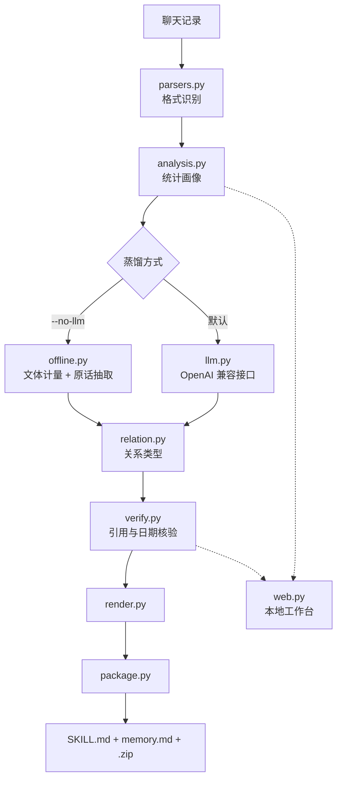

# xpskill

<div align="center"></div>

<p align="center">🇺🇸 <a href="./README.en.md">English</a> | 🇨🇳 <a href="./README.md">简体中文</a></p>

<p align="center">

</p>

一个聊天人格 Skill 包生成工具，将 QQ 等来源的聊天记录蒸馏为轻量、便于上传和迁移的 `SKILL.md`、关系记忆文件及 `.zip` 技能包。生成结果可用于支持 Skill 格式或类似技能包机制的工具，当前主要适配 xinpai-bot（项目待开源）。

全程只用 Python 标准库：不需要 `pip install`，不下载模型，除非显式启用 LLM 蒸馏，否则不联网。

> [!NOTE]
> 本文中的昵称、技能名、路径和 API Key 均为占位符。请替换为你自己的值，并在上传前检查生成文件中的个人信息。

## 目录

- [功能](#功能)
- [工作原理](#工作原理)
- [安装](#安装)
- [教程](#教程)
- [图形界面](#图形界面)
- [支持的输入](#支持的输入)
- [命令行参考](#命令行参考)
- [LLM 配置](#llm-配置)
- [输出](#输出)
- [关系类型](#关系类型)
- [结论校验](#结论校验)
- [隐私与安全](#隐私与安全)
- [开发与验证](#开发与验证)
- [贡献](#贡献)
- [致谢](#致谢)
- [许可证](#许可证)

## 功能

从一份聊天记录到能装进设备的技能包，中间有六步；每一步都能单独看、单独核对。

| 阶段 | 能力 | 离线 | LLM |
| --- | --- | --- | --- |
| 解析 | 8 类来源：QQ 导出 / 微信 SQLite / 通用「昵称: 内容」/ CSV / JSON / HTML·MHT / Twitter 归档 / mbox；目录可递归；编码按 utf-8-sig → utf-8 → gb18030 → utf-16 依次回落 | ✅ | ✅ |
| 诊断 | 报告这份文件被哪个解析器接走、解出几条、谁在说话、时间跨度，以及**每个候选解析器分别能解出多少条** | ✅ | ✅ |
| 画像 | 消息量、时间跨度、深夜占比、主动开口次数、平均与中位长度、语气词、表情、连发习惯、回复延迟、冲突线索 | ✅ | ✅ |
| 采样 | 按会话切分，优先深夜、冲突和长会话，凑够字预算再送给模型 | — | ✅ |
| 蒸馏 | 两个引擎，字段结构完全一致：**离线抽取式**（文体计量 + 原话抽取，每条结论附统计依据）或 **LLM**（OpenAI 兼容接口，叙述更细腻） | ✅ | ✅ |
| 关系类型 | 恋人 / 朋友 / 同事 / 家人，可自动判断（会打印判断依据）或 `--relation` 指定，决定章节标题与措辞 | ✅ | ✅ |
| 校验 | 拿原始记录核对每条「声称是原话」的内容和每个日期，不通过的标注出来或 `--strict` 剔除，并给出**最相近的原话** | ✅ | ✅ |
| 打包 | `SKILL.md` + `references/memory.md` + `<name>.zip`，可用 `--device` 直接传到板子 | ✅ | ✅ |
| 工作台 | 只监听本机的网页：解析诊断、实时日志、校验面板、产物预览；走的还是同一个 `cli.main` | ✅ | ✅ |
| 隐私 | 默认对送出去的样本脱敏（手机号 / 身份证 / 卡号 / 邮箱 / 详细地址）；离线模式不采样、不脱敏、不联网 | ✅ | ✅ |

**韧性**——这一栏最容易被忽略，但它决定你凌晨两点有没有东西可用：

- **LLM 挂了也交得出东西。** 整批失败就退回离线抽取式蒸馏；只挂了一半（比如人设跑成、关系记忆超时）就**保住成功的那半**，缺的那半才用离线补，并在文件里注明来历。
- **网关抽风也救得回来。** 响应体带 BOM、被裹成 SSE、对象后面粘了别的 JSON、干脆把补全文本裸着返回——四种都能抢救；只有真被截断才报错。
- **报错要能定位。** 截断会说 `finish_reason=length` 并提示 `--max-tokens`；超时会说清等了多少秒（默认上限 600 秒，`--timeout` 可调）；JSON 坏了会给出失败原因、出错位置和附近原文。

**几条刻意的设计取舍：**

- **口头禅按「这个人明显比对话另一方更常用」挑**，不是只看频次——否则挑出来的永远是「不要」「还有」这种谁都在用的词。
- **离线模式不写它无法验证的东西。** 没有依据的章节宁可留空并说明原因，也不编一段像样的文字。
- **校验只验「引用是否为真」，不验「语义是否成立」。** 把原话「我那天没说」洗成结论「我那天说了」这类反转，字符串核验看不出来——那需要几百 MB 的语义模型，与零依赖定位冲突。好在「整段编出来」比「改写反转」常见得多。
- **全程只用标准库。** 不 `pip install`、不下载模型、不加载 CDN；`jieba` 是可选增强，装与不装都能跑完整流程。

## 工作原理

<!-- Experimental: if rendering fails, preview on GitHub -->



两条引擎刻意分开，各自能保证什么、不能保证什么：

| | 离线（`--no-llm`） | LLM（默认） |
| --- | --- | --- |
| 说话风格、关系行为 | 由文体计量统计得出，附百分比/次数 | 由模型归纳，可能过度概括 |
| 口头禅、典型例句、称呼、地点 | 从记录里原样抽出，可逐条核对 | 由模型复述，可能改写或编造 |
| 关系时间线里的事件叙述 | 只有月份与空窗期等客观锚点 | 由模型叙述，需要人工核对 |
| 是否联网 | 不联网 | 需要 |
| 依赖 | 无 | 无（只用 `urllib`） |

离线模式刻意不写它无法验证的东西：没有依据的章节会留空并说明原因，而不是编一段像样的文字。两种模式产出的字段结构完全一致，随时可以切换。

## 安装

运行时只需要 Python 3.9+ 标准库，不需要 `pip install` 或第三方依赖。

```bash
git clone https://github.com/<YOUR_ACCOUNT>/xpskill.git
cd xpskill
python3 -m py_compile ex_distill.py
python3 ex_distill.py --help   # 确认整个包可以导入
```

<details>
<summary>可选：安装 <code>jieba</code> 提升口头禅准确度</summary>

```bash
pip install jieba    # 可选
```

不装时口头禅走内置字符 n-gram 挖掘。装了会按词性过滤话题词——这很关键，因为一段对话里频次最高的字符串往往是一次聊天的话题名词（`电源`、`实验室`、`led`），而不是说话习惯。它还会沿词边界组合相邻词，避免字符 n-gram 切出 `么不`、`个吗` 这种跨词碎片，它们频次不低、看着还像口癖。

装与不装都能跑完整流程，只影响口头禅的质量。
</details>

## 教程

目标：把一份聊天记录变成 `SKILL.md` + `references/memory.md` + `<name>.zip`。两条路产出完全一样，**选一条走到头就行**：不想碰命令行走路线 A，要在终端里跑或脚本化走路线 B。

### 0. 先备一份聊天记录

支持的来源见[支持的输入](#支持的输入)。QQ 用消息管理器或 [qq-chat-exporter](https://github.com/shuakami/qq-chat-exporter) 导出；微信需要在本地解密 `EnMicroMsg.db`；手里只有纯文本也行——「昵称: 内容」每行一条就能解析。

> [!TIP]
> 第一次跑建议先走离线那条：不联网、不需要 Key、几秒出结果，能立刻看出解析对不对。确认没问题再换 LLM 版本。

### 路线 A：网页工作台（不想碰命令行）

界面分两栏，顺序和操作一致：**左栏三张卡**——进料 → 配置 → 执行；**右栏四个标签**——运行日志 / 校验 / SKILL.md / 关系记忆（后三个跑完才可用）。空状态里也写着这三步。

**A1 · 起工作台**

```bash
python -m src.web            # 默认 http://127.0.0.1:8765/，会自动打开浏览器
python -m src.web --no-open  # 只起服务，不弹窗
python -m src.web --port 9000
```

> [!IMPORTANT]
> 工作台是常驻进程：它按启动那一刻的代码运行，**改完 `src/` 要重启才生效**；端口上已经有另一个工作台时，它会**拒绝启动**而不是并排跑。两条都在[排错表](#出问题了按这张表查)里。

**A2 · 拖入聊天记录**（左栏「进料」）

点投放区选文件，或直接把文件拖进去。解析成功后有三件事可看：

- 顶栏亮起文件名与消息条数；
- 投放区下方展开**诊断**：解析器、条数、时间跨度、命中的编码，以及各候选解析器分别解出多少条——带「实际采用」标记的那个，就是接走这份文件的解析器；
- 「开始蒸馏」才从灰变亮。**没解出消息时它一直是禁用的**，所以顺序不能颠倒。

条数明显不对就先换文件、或另存成 UTF-8 再拖一次：对不上号的格式会静默降级，「只解出 3 条」这种事只在这里看得见。

**A3 · 填配置**（左栏「配置」）

「我是谁」「蒸馏谁」两个下拉的候选**来自刚解析出的说话人**，所以先拖文件才有得选；点诊断里的说话人 chip，等于把「蒸馏谁」设成那个人。

| 字段 | 怎么填 |
| --- | --- |
| 技能名 | 英文，决定目录名与 zip 名（默认 `persona`） |
| 我是谁 | 你自己在记录里的昵称；记录里没有你，就保持默认「我」 |
| 蒸馏谁 | 留「自动」＝除你之外说话最多的人 |
| 关系类型 | 自动判断即可；它只改标题和措辞，不改事实 |
| 补充描述 | 可选，例如 `ENFP，双子座` |
| 蒸馏方式 | `本地抽取` 不联网、几秒出结果；`LLM 蒸馏` 选中后才出现接口地址、模型、API Key |
| 严格模式 | 勾上＝校验不过的条目直接删，而不是标注保留 |

**A4 · 点「开始蒸馏」**（左栏「执行」）

右栏「运行日志」实时输出。第 4 步（LLM 蒸馏）是分钟级的，所以它报三件事：**总规模**（几批、共几次请求）、**当前是第几批的第几次调用**、**每次实际用时**——照着就能估算还要等多久。

**A5 · 看结果**（右栏三个标签 + 左栏「执行」）

- **校验**：印章是待确认条数，下面把「共核验多少条」拆成原文命中 / 改写命中 / 未找到依据 / 时间不符四类，每条待确认条目附上记录里最相近的原话；
- **SKILL.md / 关系记忆**：直接渲染的产物预览，可疑条目用朱红标出；
- **下载技能包**（左栏「执行」）：拿到 zip；传进设备控制台后设为「主技能」，之后唤醒即生效。

### 路线 B：在终端里跑

**B1 · 先跑一遍离线**（不联网、不需要 Key）

```bash
python3 ex_distill.py \
  --input /path/to/chat.json \
  --me '你的昵称' \
  --target '聊天对象昵称' \
  --name chat-persona \
  --out ./dist \
  --no-llm
```

`--target` 省略时自动选「除 `--me` 之外说话最多的人」。

**B2 · 换成 LLM 蒸馏**

```bash
export MODELSCOPE_API_KEY="<YOUR_API_KEY>"     # 也可以用 --api-key 直接传

python3 ex_distill.py \
  --input /path/to/chat.json \
  --me '你的昵称' \
  --target '聊天对象昵称' \
  --name chat-persona \
  --desc '关系和说话风格的补充描述' \
  --base-url 'https://api-inference.modelscope.cn/v1' \
  --model 'Qwen/Qwen3-235B-A22B' \
  --out ./dist
```

> [!TIP]
> 加 `--dry-run-llm` 可以只打印将要发送的请求（URL 与样本长度），不真的把聊天内容发出去。

**B3 ·（可选）直接传到设备**

```bash
python3 ex_distill.py ... --device '<DEVICE_IP>:8080'
```

### 两条路的汇合点

- **产物**：`<out>/<name>/SKILL.md`、`<out>/<name>/references/memory.md`、`<out>/<name>.zip`。
- **校验**：报告里最值得看的是「最相近的原话」。它和你的引用是**同一句**，就是命中——模型常按格式要求把 `[时间] 说话人:` 一起写进引用，程序会先剥掉这段前缀再比；**两段文字对不上**才是要人工核的，核对方法就是去源文件里搜那句话。详见[结论校验](#结论校验)。
- **上传**：把 zip 放进设备控制台（板子 → 设置 → 助手 扫码，或直接访问 `http://<设备IP>:8080`），在技能列表里设为「主技能」，之后唤醒即生效。

### 出问题了按这张表查

| 现象 | 多半是 | 怎么办 |
| --- | --- | --- |
| 没解析出任何消息 | 格式或编码没对上 | 到工作台看解析诊断（各候选解析器分别解出多少条）；文本类可另存 UTF-8 再试 |
| 只解出很少几条 | 被别的解析器抢先接走了 | 同上，看诊断里的候选列表 |
| `LLM 返回的不是 JSON` | 模型没按 JSON 说话，或网关把响应裹成了别的形状 | 换一个非思考型模型；SSE / 裸文本 / 带尾巴的响应程序能救回来，救不回来会把原因和位置打在日志里 |
| `等待 N 秒仍没等到响应` | 读超时 | `--timeout 1200` 调大；若每次都卡在 200 秒上下，那是网关侧的上限，换模型 |
| `输出被截断（finish_reason=length）` | 思考型模型把预算花在推理上了 | `--max-tokens 8192` 或更大 |
| 工作台行为没变 | 常驻进程还拿着旧代码 | 重启工作台；启动横幅最后一行是版本指纹 |
| `端口 … 上已经有一个服务在运行` | 上次的工作台还开着 | 停掉它，或 `--port 9000` |
| 条目带 `（未在记录中找到依据）` | 模型可能编了原话 | 见[结论校验](#结论校验)的人工核对法 |

## 图形界面

不想碰命令行的话用网页工作台，用法见[教程](#教程)的路线 A。

界面走的是同一个 `cli.main`，所以结果和命令行完全一致，只是把 CLI 里**看不见的部分**摆了出来：左栏三张卡是**进料 → 配置 → 执行**，右栏四个标签是**运行日志 / 校验 / SKILL.md / 关系记忆**。两个专门为"看清楚"做的部分：

- **解析诊断**：这份文件被哪个解析器接走、解出几条、谁在说话、时间跨度、命中的编码，以及各候选解析器分别能解出多少——对不上号的格式会静默降级，只有这里能看到是谁接走的。
- **校验面板**：通过数盖成印章；每条可疑结论列出它的「最相近原话」，方便判断是编的还是被改写的。

### LLM 蒸馏的进度是"可估算"的

第 4 步（LLM 蒸馏）是分钟级的，所以它必须报三件事，缺一不可：**总规模**（几批、共几次请求）、**当前在哪一次**（第 N/M 批 · 人格分析还是关系记忆）、以及**每次调用实际用了多久**。只报"正在做第几批"而不知道总数和单次耗时，用户没法估算还要等多久——这正是"不知道进度"的来源。

日志逐行着色也按语义分层，**红色只留给真正要处理的问题**：

| 类名 | 用于 | 外观 |
| --- | --- | --- |
| `.log-step` | `[N/6]` 步骤标题 | 黄底序号徽标 + 站酷标题 |
| `.log-prog` | LLM 进度行（`· 第 1/3 批 · 人格分析…`） | 品牌蓝 |
| `.log-dim` | 次级说明、`完成：用时 …` | 三级灰 |
| `.log-bad` | 校验待确认条目（`· [章节] 「结论」`）、真正的报错 | 红 + 加粗 |

注意 `.log-bad` 的判定**必须要求 `·` 后面紧跟方括号**。曾经只按"以 `·` 开头"就标红，结果 LLM 的进度行同样是 `·` 开头，被整片渲染成红色警报——看起来像出错了，而不是像"正在跑"。

<p align="center">

</p>

<details>
<summary>怎么看这张校验面板</summary>

红色印章是没通过校验的条数。下面一行把「共核验多少条」拆成原文命中 / 改写命中 / 未找到依据 / 时间不符四类。

每条待确认条目列出三样东西：来自哪一节、结论原文、**记录里最相近的那句原话**。例如声称的原话是「你上次说想去看海」，实际最接近的是「你上次说想去江边」——这是被改写后偏离了原意，字符串核验按覆盖率判定为「改写命中」，同时把原话摆出来让你自己定夺。

</details>

只监听 `127.0.0.1`，不会把聊天记录发到任何外部地址；API Key 只留在本机内存，进程结束即消失。前端是 `src/webui/` 下的纯静态文件，没有构建步骤，也不加载任何 CDN 资源——断网可用。

界面为什么长这样（液态玻璃、字体分层、一屏放下、动效取舍）：见 [docs/design-notes.md](docs/design-notes.md)。

## 支持的输入

| 类型 | 示例 | 解析行为 |
| --- | --- | --- |
| JSON | `--input chat.json` | 查找 `messages`、`list`、`items`、`posts`、`comments`、`statuses` 或 `data` 消息数组。 |
| CSV | `--input chat.csv` | 自动识别时间、发送者、正文和 `IsSender` 等常见列名。 |
| TXT | `--input chat.txt` | 支持 `昵称: 内容`、带时间的消息行、QQ 导出文本，以及 WhatsApp 导出片段。 |
| HTML / MHT / MHTML | `--input chat.html` | 先剥掉 MIME 信封、还原 quoted-printable，再提取纯文本解析。QQ 消息管理器导出走的就是这条路径（`.mht` 与 `.mhtml` 是同一格式的两种扩展名，都支持）。 |
| 微信 SQLite | `--input EnMicroMsg.db` | 读取已解密数据库的 `MSG` 表；可用 `--channel` 过滤 `StrTalker`。 |
| Twitter/X | `--input tweets.js` | 解析 X/Twitter 归档里的 `tweets.js`、`direct-messages.js`。 |
| mbox | `--input archive.mbox` | 读取本地邮箱归档，取文本正文、发件人和日期。 |
| 目录 | `--input exports/` | 递归读取 `.txt`、`.csv`、`.json`、`.js`、`.mbox`、`.html`、`.htm`、`.mht`、`.mhtml` 文件。 |

JSON 消息正文支持 `text`、`content`、`message`、`body` 等字段，发送者支持 `name`、`remark`、`nickname`、`uin` 等字段。

## 命令行参考

| 参数 | 默认值 | 说明 |
| --- | --- | --- |
| `--input` | 必填 | 聊天记录文件或目录。 |
| `--name` | 必填 | 技能目录名和 zip 名称。 |
| `--display` | `--name` | 设备中显示的技能名称。 |
| `--me` | `我` | 本人在记录中的昵称；可用逗号分隔多个名称。 |
| `--target` | 自动判断 | 要蒸馏的对象；省略时选择消息最多的非本人说话者。 |
| `--channel` | 无 | 微信 SQLite 的 `StrTalker` 会话名。 |
| `--desc` | 空 | 对关系、性格或背景的补充描述。 |
| `--out` | `<工具目录>/dist` | 输出目录，跨平台安全；建议显式指定，避免依赖系统盘根目录等绝对路径。 |
| `--llm-chars` | `30000` | LLM 样本字符预算。 |
| `--llm-batches` | `3` | 最多分析批次数。 |
| `--base-url` | ModelScope 兼容地址 | OpenAI 兼容接口根地址。 |
| `--model` | `Qwen/Qwen3-235B-A22B` | 模型名称。 |
| `--api-key` | 环境变量 | API Key；支持 `LLM_API_KEY`、`MODELSCOPE_API_KEY`、`DASHSCOPE_API_KEY`、`OPENAI_API_KEY`。 |
| `--max-tokens` | `0` | 单次 LLM 调用的输出上限；默认不传，用服务端默认值。 |
| `--timeout` | `600` | 单次 LLM 请求的等待上限（秒）；可用 `LLM_TIMEOUT` 覆盖。 |
| `--no-llm` | 关闭 | 离线抽取式蒸馏：文体计量 + 原话抽取，每条结论附统计依据，不联网、不脱敏。 |
| `--relation` | `auto` | 关系类型：`auto` / `恋人` / `朋友` / `同事` / `家人`。决定章节标题与措辞。 |
| `--no-verify` | 关闭 | 跳过结论校验。 |
| `--strict` | 关闭 | 校验不通过的条目直接剔除，而不是打上标注保留。 |
| `--dry-run-llm` | 关闭 | 打印请求信息但不真正调用接口。 |
| `--no-redact` | 关闭 | 关闭默认的手机号、身份证、卡号、邮箱和详细地址脱敏。 |
| `--device` | 无 | 生成后上传到 `<设备IP>:8080`。 |

完整帮助：

```bash
python3 ex_distill.py --help
```

## LLM 配置

参数优先级如下：

| 配置 | 读取顺序 |
| --- | --- |
| API Key | `--api-key` → `LLM_API_KEY` → `MODELSCOPE_API_KEY` → `DASHSCOPE_API_KEY` → `OPENAI_API_KEY` |
| 接口地址 | `--base-url` → `LLM_BASE_URL` → ModelScope 默认地址 |
| 模型名 | `--model` → `LLM_MODEL` → `Qwen/Qwen3-235B-A22B` |

每个样本批次分别请求人格分析和关系记忆分析。可以缩小请求：

```bash
python3 ex_distill.py ... --llm-chars 12000 --llm-batches 1
```

使用 `--dry-run-llm` 可检查请求 URL 和样本长度而不发送聊天内容。

### 超时与输出上限

请求是非流式的：要等模型把整段 JSON 写完才返回，所以"慢"是常态而不是异常。人设那一次跑一两分钟很常见；关系记忆要写的 JSON 更长，可能要几分钟。

| 参数 | 默认 | 什么时候动它 |
| --- | --- | --- |
| `--timeout` | `600` 秒（或环境变量 `LLM_TIMEOUT`） | 报「等待 N 秒仍没等到响应」时调大。日志会报出**实际等了多少秒**：如果每次都卡在 200 秒上下，那是网关侧的上限，调客户端没用，得换模型。 |
| `--max-tokens` | `0`（不传，用服务端默认） | 报 `finish_reason=length`、正文写到一半被切断时调大。思考型模型会先花预算推理，尤其需要。 |

### 失败不会让你两手空空

- **整批失败**（没配 Key、连不上、限流、返回的根本不是 JSON）→ 自动退回离线抽取式蒸馏，产物照样完整。
- **只挂一半**（比如人设跑成了、关系记忆超时）→ 保住成功的那一半，缺的那半用离线补齐，并在 `SKILL.md` 顶部注明来历。
- **网关抽风**（响应体带 BOM、被裹成 SSE、对象后面粘了别的 JSON、把补全文本裸着返回）→ 都能抢救；救不回来时日志会给出失败原因、出错位置和附近原文。

## 输出

每次运行会生成：

```text
<out>/<name>/SKILL.md
<out>/<name>/references/memory.md
<out>/<name>.zip
```

| 文件 | 内容 |
| --- | --- |
| `SKILL.md` | 人设技能：身份、说话风格、口头禅、情感模式、关系行为、硬规则和典型例句。 |
| `references/memory.md` | 关系时间线、共同地点、内部玩笑、争吵模式、甜蜜瞬间、称呼和统计数据。 |
| `<name>.zip` | 包含以上两个文件，可上传到设备。 |

<p align="center">

</p>

校验不通过的条目会带上 `（未在记录中找到依据）` / `（记录中查无此时间）` 标注；看到这类标注就说明那条内容没有出处，要么手改，要么用 `--strict` 让程序直接剔除。

没有 API Key、使用 `--no-llm` 或 LLM 失败时，仍会写入完整的人设 / 关系记忆文件和统计结果；由回退或补齐得到的那部分，会在 `SKILL.md` 顶部写明来历（例如「LLM 蒸馏 + 本地抽取式蒸馏补齐（部分环节失败）」）。

离线模式与 LLM 模式的分工见上文「[工作原理](#工作原理)」的对照表。想要更细腻的叙述就把 `--no-llm` 去掉。

## 关系类型

`render.py` 的章节原本是按恋爱关系设计的，拿一份同事协作记录去蒸馏就会产出「甜蜜瞬间：某某：『打go的那就稳了』」这种滑稽结果，而「inside jokes」只能留空。

`--relation` 决定两件事：

1. **章节标题**（内部字段名不变，只换显示说法）：

   | 内部字段 | 恋人 | 朋友 | 同事 | 家人 |
   | --- | --- | --- | --- | --- |
   | 关系时间线 | 关系时间线 | 认识与相处时间线 | 共事时间线 | 关系时间线 |
   | 甜蜜瞬间 | 甜蜜瞬间 | 相处高光 | 配合默契的瞬间 | 温暖瞬间 |
   | 争吵模式 | 争吵模式 | 闹别扭的时候 | 分歧与摩擦 | 争执模式 |
   | inside_jokes | inside jokes | inside jokes | 你们之间的固定说法 | 家里的梗 |

2. **措辞要求**：LLM 模式下会追加一句提示，让模型不要对同事写恋人向的甜言蜜语；离线模式下会去掉「直球程度：没有直接的想你 / 喜欢你」这类对非恋爱关系没意义的条目。

默认 `auto`：用称呼与话题词的密度粗略判断，并在运行时打印依据（例如「同事信号最密（每千字命中 5.3 次）」）。**判断错了也不影响抽取出的事实**，只影响标题和措辞，`--relation` 可以随时覆盖。

## 结论校验

蒸馏出来的每一条结论，如果声称「这是原话」或「这时发生过什么」，都会被拿去和聊天记录核对一遍。这一步**只用标准库**，不联网、不加载模型、不额外调用接口。

检查三类内容：

| 检查 | 对象 | 判定 |
| --- | --- | --- |
| **引用核验** | 「」里的内容，以及 `典型例句` 整条 | 原文命中 / 改写命中（覆盖率 ≥ 0.75）/ 未找到 |
| **日期核验** | `2024-03`、`3月8日` 这类时间点 | 是否落在记录的时间范围内 |
| **依据核验** | LLM 按要求给出的 `结论 ← 出处` | 引用的原话是否真实存在 |

引用前常被模型加上「时间 说话人:」这层前缀（因为 prompt 要求出处带时间），核验会先把这层剥掉再比——只剥括号里的时间、时间戳，以及**语料里真出现过的**说话人加冒号，所以正文里自带的冒号不会被误吃。

处理方式：

- 通过（原文命中 / 改写命中）的条目原样保留
- 未找到依据的条目标注 `（未在记录中找到依据）`，日期对不上的标注 `（记录中查无此时间）`
- 加 `--strict` 时直接剔除，而不是标注
- 报告里会列出「最相近的原话」，方便你判断到底是编的、还是被改写了

### 怎么人工核对

每条待确认条目都给了最有用的线索：**记录里最相近的那句原话**。先看它：

| 你看到的情况 | 说明 | 怎么办 |
| --- | --- | --- |
| 它和你的引用是同一句 | 命中，只是引用带了前缀或标点差异 | 不用管 |
| 两段文字对不上 | 模型改写了原意，这是真正要核的 | 去源文件里搜那句话（编辑器全局搜即可），搜不到就是编的 |
| 它是一条很不相关的系统行（如「某某戳了戳某某」） | 记录里确实找不到相近内容 | 重点怀疑 |

处理三选一：**不管**（产物里已带标注）／**手改**（直接编辑 `out/<名字>/SKILL.md` 或 `references/memory.md`，改完重新打包上传，不用重跑 LLM）／**重跑加 `--strict`**（直接剔除，但误报也会连着一起删）。

它同时是离线抽取器的**自检**：`offline.py` 的条目本来就来自原文，正常应该 100% 通过；如果没过，说明抽取逻辑有 bug。

刻意的边界：**只验「引用是否为真」，不验「语义是否成立」**。把原话「我那天没说」洗成结论「我那天说了」这类反转，字符串核验看不出来——那需要语义模型，代价是几百 MB 依赖，与项目的零依赖定位冲突。好在「整段编出来」比「改写反转」常见得多，前者这里能抓住。

## 隐私与安全

> [!WARNING]
> 聊天记录可能包含高度敏感的个人信息。上传或调用外部 LLM 前，请先确认数据授权和服务商政策。

- `--no-llm` 模式下，聊天内容只在本机处理。
- 默认只把抽取出的代表片段发送给指定 LLM，并先脱敏常见手机号、身份证、银行卡、邮箱和详细地址。
- `--no-redact` 会发送未经脱敏的样本，仅在风险可接受时使用。
- 不要把 API Key 写入 README、源代码或 Git 提交；使用环境变量或密钥管理器。
- 生成的 `SKILL.md` 和 `memory.md` 可能包含个人信息，上传前请人工检查。

> [!CAUTION]
> 本文截图使用手写的合成数据（`小雨`）。真实蒸馏产物里是真实的昵称和对话，公开任何输出前请先检查。

## 开发与验证

```bash
python3 -m py_compile ex_distill.py
python3 ex_distill.py --help
```

使用本地样本做完整统计流程时，请显式指定占位输出目录（不要依赖默认值）：

```bash
python3 ex_distill.py \
  --input /path/to/chat.json \
  --me '你的昵称' \
  --name smoke-test \
  --out ./dist-smoke \
  --no-llm

unzip -l ./dist-smoke/smoke-test.zip
```

网页工作台自检：

```bash
python3 -m src.web --no-open     # 然后访问 http://127.0.0.1:8765/
```

两点注意：它**拒绝在已被占用的端口上启动**（免得两个工作台并排跑、浏览器连的还是旧的那个）；它是常驻进程，改完 `src/` 下的代码要重启才生效。

项目当前未检测到独立测试套件；上述命令覆盖语法、导入、参数解析和无 LLM 打包路径。

## 贡献

欢迎提交 Issue 或 Pull Request。请在提交前：

- [ ] 运行 `python3 -m py_compile ex_distill.py`
- [ ] 使用脱敏或合成聊天数据验证解析行为
- [ ] 不提交聊天记录、API Key 或生成的人设文件
- [ ] 更新与行为变更相关的文档

## 致谢

感谢以下开源项目：

- [agenmod/immortal-skill](https://github.com/agenmod/immortal-skill)：提供通用数字分身、角色模板、分维度蒸馏和证据意识等思路。xpskill 在此基础上，结合 xinpai-bot 的设备工作流进行了轻量化实现。
- [shuakami/qq-chat-exporter](https://github.com/shuakami/qq-chat-exporter)：提供 QQ 聊天记录 JSON 导出能力。xpskill 使用其导出的结构化数据进行解析和蒸馏。

## 许可证

本项目以 [MIT License](LICENSE) 发布。
