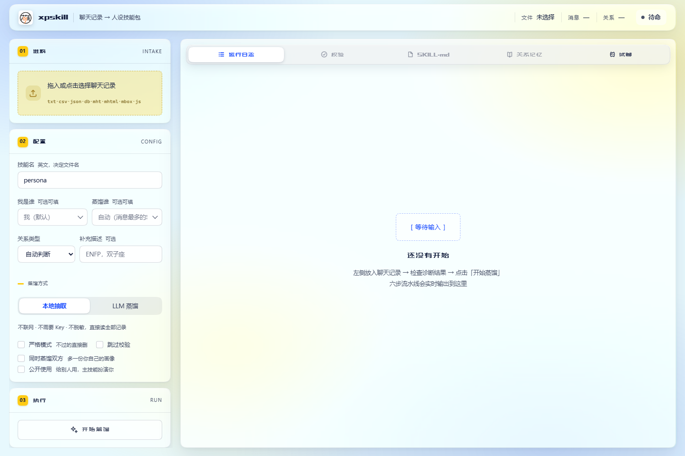
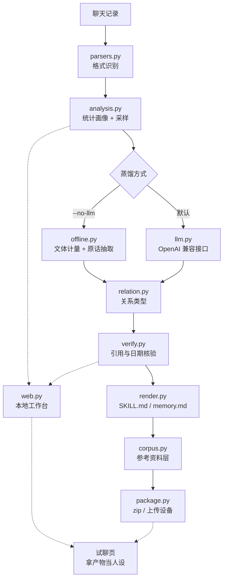
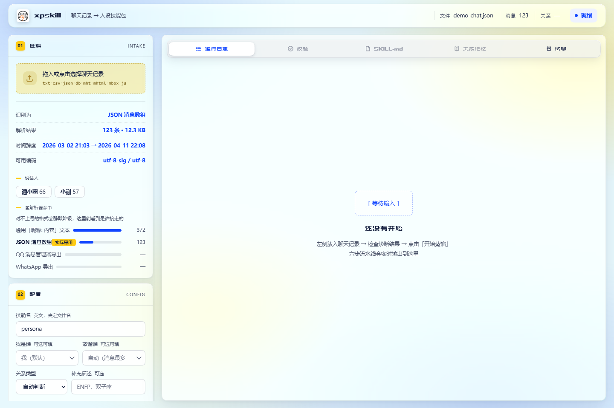
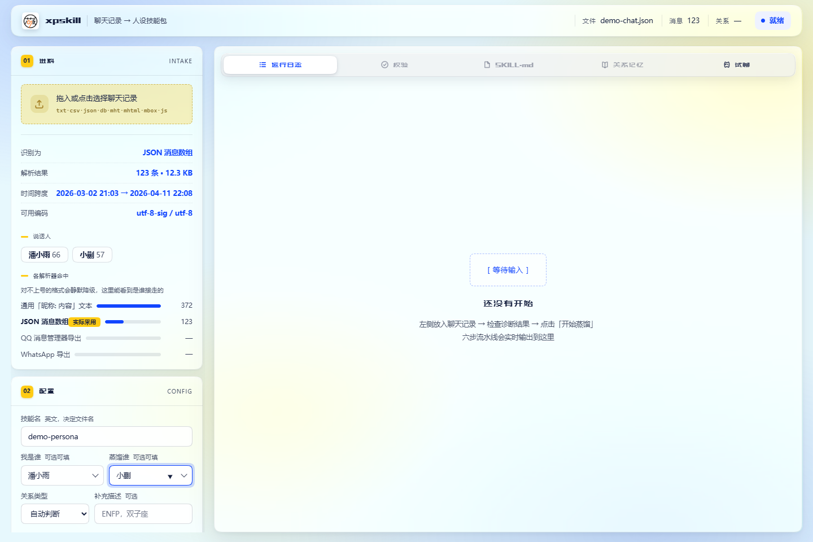
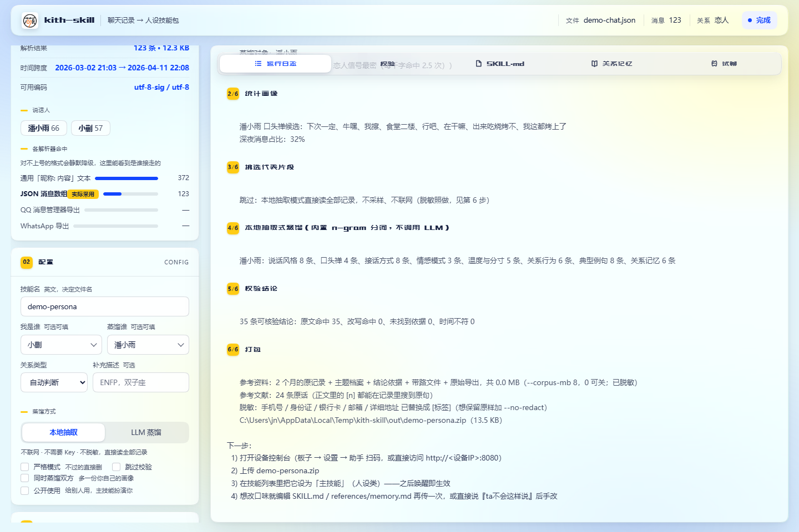
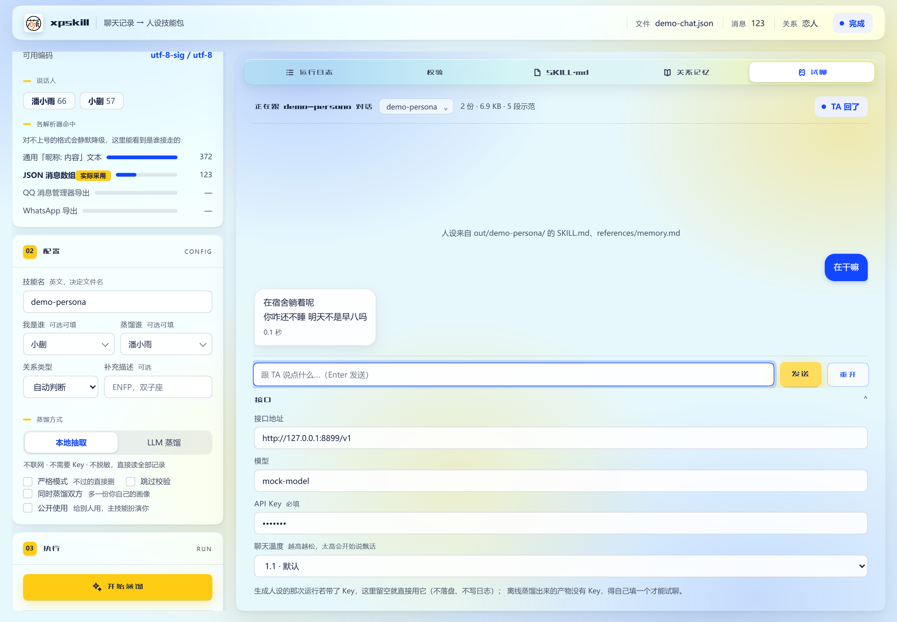
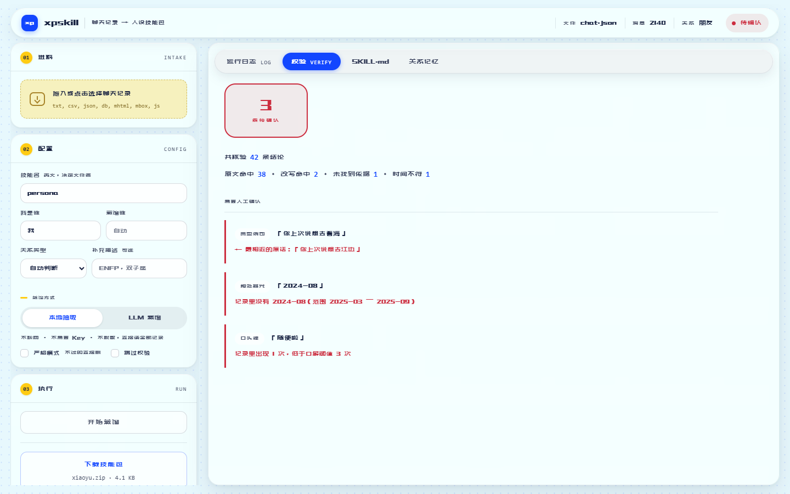
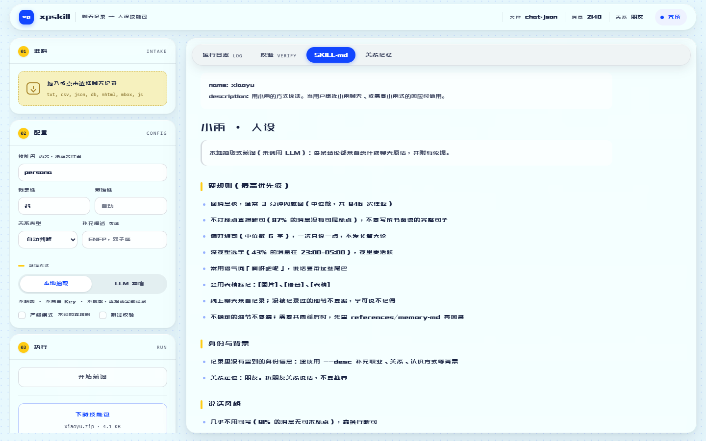

# xpskill

<div align="center"></div>

<p align="center">🇺🇸 <a href="./README.en.md">English</a> | 🇨🇳 <a href="./README.md">简体中文</a></p>

<p align="center">

</p>

一个聊天人格 Skill 包生成工具，将 QQ 等来源的聊天记录蒸馏为轻量、便于上传和迁移的 `SKILL.md`、关系记忆文件及 `.zip` 技能包。生成结果可用于支持 Skill 格式或类似技能包机制的工具，当前主要适配 xinpai-bot（项目待开源）。

全程只用 Python 标准库：不需要 `pip install`，不下载模型，除非显式启用 LLM 蒸馏，否则不联网。

> [!NOTE]
> 本文中的昵称、技能名、路径和 API Key 均为占位符。请替换为你自己的值，并在上传前检查生成文件中的个人信息。

## 目录

- [功能](#功能)
- [工作原理](#工作原理)
- [安装](#安装)
- [教程](#教程)
- [图形界面](#图形界面)
- [支持的输入](#支持的输入)
- [命令行参考](#命令行参考)
- [LLM 配置](#llm-配置)
- [输出](#输出)
- [关系类型](#关系类型)
- [结论校验](#结论校验)
- [隐私与安全](#隐私与安全)
- [开发与验证](#开发与验证)
- [贡献](#贡献)
- [致谢](#致谢)
- [许可证](#许可证)

## 功能

一句话：**把一份聊天记录变成能装进设备的技能包**——`SKILL.md`（人设）+ `references/memory.md`（关系记忆）+ `references/` 参考资料层 + `<name>.zip`。

它和"一键生成人设"的区别只有一条：中间六步，**每一步都能单独看、单独核对**。下面按"流水线 → 产物 → 引擎 → 韧性 → 试聊 → 用途 → 取舍"排。

### 一、六步流水线（日志里就是这几个标题）

| 步 | 日志标题 | 做什么 | 你能核对到什么 |
| --- | --- | --- | --- |
| 1 | `[1/6] 解析聊天记录` | 嗅探格式与编码，读成 `(时间, 说话人, 内容)` | 这份文件被**哪个解析器**接走、解出几条、谁在说话、时间跨度，以及**各候选解析器分别能解出多少条** |
| 2 | `[2/6] 统计画像` | 消息量、跨度、深夜占比、主动开口次数、平均与中位长度、语气词、表情、连发习惯、回复延迟、冲突线索 | 每个数字都来自统计，不带模型判断 |
| 3 | `[3/6] 挑选代表片段` | 按会话切分，优先深夜、冲突、长会话，凑够字预算再送给模型 | 送出去的字数（`--llm-chars`） |
| 4 | `[4/6] LLM 蒸馏` / `[4/6] 本地抽取式蒸馏` | 两个引擎，字段结构完全一致（见下） | 每条结论的出处（离线）／依据表（LLM） |
| 5 | `[5/6] 校验结论` | 拿原始记录核对每一条"声称是原话"的内容和每个日期 | 原文命中 / 改写命中 / 未找到依据 / 时间不符，外加**最相近的原话** |
| 6 | `[6/6] 打包` | 写 `SKILL.md` + `references/`，压缩成 zip，可按 `--device` 直接上传 | 文件清单与包体积 |

解析支持这些来源，识别靠**后缀 + 内容特征**双重判定（对不上号时会静默降级，所以第 1 步的诊断才是关键）：QQ 消息管理器导出（`.txt` / `.mht`）、微信 SQLite（已解密的 `EnMicroMsg.db`）、微信 PC 4.x 用 wx-cli / WeChatExporter 导出的 JSON、WhatsApp 导出、CSV 表格（WeChatMsg / 留痕 / PyWxDump 等）、通用 JSON 消息数组、HTML / MHT / MHTML、Twitter·X 归档、mbox 邮件归档，以及兜底的「昵称: 内容」纯文本；`--input` 传目录可递归。编码按 `utf-8-sig → utf-8 → gb18030 → utf-16` 依次回落。

### 二、产物分三层

| 层 | 文件 | 给谁 |
| --- | --- | --- |
| **人设层** | `SKILL.md`（扮演指令）、`references/memory.md`（关系记忆） | 设备侧的主技能：它怎么说话、你们之间发生过什么 |
| **背景层** | `references/self.md` 或 `references/other.md`（`--both` / `--audience 公开` 时） | 主技能该知道的「对面是谁、怎么跟我说话」——**去掉扮演指令**，免得设备把它也当人设读 |
| **参考资料层** | `references/transcript/YYYY-MM.md`（逐月逐条原记录）、`topics.md`（按主题重组的原话档案）、`evidence.md`（每条结论的原话依据）、`source/`（原始导出的脱敏副本）、`README.md`（带路） | 设备侧**检索原话**用；人核对"这句到底是原话还是概括"也用它 |

人设文档只有十几 KB——那是提炼过的结论。「哪天说的、当时原话是什么」要靠检索参考资料层，所以它默认生成（`--corpus-mb` 控制体积预算，默认 8MB；`0` = 不生成）。预算不够时**从最新月份往回**装，丢掉的旧月份会如实写进带路文件，免得你以为记录丢了。

### 三、两个引擎：离线（`--no-llm`）与 LLM（默认）

| | 离线（`--no-llm`） | LLM（默认） |
| --- | --- | --- |
| 说话风格、关系行为 | 由文体计量统计得出，附百分比/次数 | 由模型归纳，可能过度概括 |
| 口头禅、典型例句、称呼、地点 | 从记录里原样抽出，可逐条核对 | 由模型复述，可能改写或编造 |
| 关系时间线里的事件叙述 | 只有月份与空窗期等客观锚点 | 由模型叙述，需要人工核对 |
| 是否联网 | 不联网 | 需要（样本先脱敏再发出） |
| 依赖 | 无 | 无（只用 `urllib`） |

两者**字段结构完全一致**，随时可切换：先跑一遍离线（几秒、不要 Key）确认解析对不对，再换 LLM 要更细腻的叙述。离线刻意不写它无法验证的东西——没有依据的章节宁可留空并说明原因。

### 四、跑完不会两手空空（韧性）

这一栏最容易被忽略，但它决定你凌晨两点有没有东西可用：

- **LLM 挂了也交得出东西。** 整批失败就退回离线抽取式蒸馏；只挂了一半（比如人设跑成、关系记忆超时）就**保住成功的那半**，缺的那半才用离线补，并在文件里注明来历。
- **上游"什么都没给"会自己重试，还写不完就拆小重试。** 限流和上游抖动常表现为 HTTP 200 的空壳（`choices: null`、`usage` 全 0）——先退避重试 2 次；仍拿不到内容、或读超时时，把这一批**按段落对半拆开**再各跑一次，两半结果照常合并。
- **一段坏 JSON 不会带走整轮。** 某一批回了一段废话，只丢那一批，其它批已经跑成的结果照旧保留。
- **网关抽风也救得回来。** 响应体带 BOM、被裹成 SSE、对象后面粘了别的 JSON、干脆把补全文本裸着返回——四种都能抢救；只有真被截断才报错。
- **报错要能定位。** 截断会说 `finish_reason=length` 并提示 `--max-tokens`；超时会说清等了多少秒（默认上限 600 秒，`--timeout` 可调）；JSON 坏了会给出失败原因、出错位置和附近原文。

### 五、试聊：跑完当场验收，不满意当场改

右栏「试聊」标签直接开聊，或点左栏「打开试聊页」单开一页（`/play?job=<任务号>`）。它解决的是"**生成完，怎么知道像不像**"：

- **人设取的就是刚生成的那几份文件，而且从磁盘现读。** 手改 `out/<名字>/SKILL.md` 或 `references/memory.md`，刷新页面即生效——试嘴型、删掉它老说的那句、补上口癖，都不用重跑蒸馏。
- **换人设很方便。** 工作台重启过、或想聊 `out/` 下别人设：表头右侧的下拉直接挑（`/play?skill=<技能名>` 也能打开）；换的时候清空当前这轮对话。
- **喂给模型的不是整份报告。** `## 参考文献`、`skill_search` 检索说明、`0%`/`92%` 这类统计口径会先被滤掉，然后附上 **5 段从原记录里挑的真实短对话**当腔调示范，最后才是这次的规矩——模型读到的是一份"人设"，而不是一份分析报告。
- **按真正的多轮消息发，温度用陪聊档。** 对话不是压成一段文本丢过去，而是 `user`/`assistant` 轮次；`temperature=1.1`（抽取那档是 `0.3`，要的是稳），**试聊页「接口」里有四档可挑**（0.7 稳 / 1.1 默认 / 1.3 活跃 / 1.6 很飘；改完下一条消息就生效，浏览器会记住你挑的那档），也能用环境变量 `LLM_CHAT_TEMPERATURE` 定一个全局默认；回答允许两三行的微信式连发。
- **接口配置沿用这次运行的那套**，Key 只在发请求时出现一次，不落盘、不写日志；表头会写明这次用了几个文件、几段示范。

> [!NOTE]
> 试聊只对 LLM 接口说话（`--no-llm` 的产物里没有 Key，得在「接口」里填一个才能聊）。它**不改动产物**——改产物请直接编辑文件。

### 六、双向蒸馏与技能用途

一次运行可以同时出两份画像，`--audience` 决定哪一份当主技能：

| | `--audience 本人`（默认） | `--audience 公开` |
| --- | --- | --- |
| 主技能扮演谁 | **对方** —— 你和 TA 聊 | **你自己** —— 别人来跟你的分身聊 |
| 主技能里的「关于 X」一节 | 关于**你**：TA 开口前先知道你是谁、怎么跟你说话 | 关于**TA**：别人提到 TA 时不会答错 |
| 背景资料文件 | `references/self.md`（你的画像） | `references/other.md`（TA 的画像） |
| 隐私处理 | 整包脱敏（人设文档 + `references/` 下的聊天记录，`--no-redact` 可关） | 同上，另外把只有本人对得上的指代（「咱俩」「你上次说的」「那次」）标注出来；LLM 模式还会在 prompt 里要求改写成背景陈述 |
| 怎么打开 | `--both` | `--audience 公开`（会自动带上 `--both`） |

两份画像各配自己的统计，不会把对方的口癖安到你头上。

### 七、几条刻意的设计取舍

- **口头禅按「这个人明显比对话另一方更常用」挑**，不是只看频次——否则挑出来的永远是「不要」「还有」这种谁都在用的词。
- **离线模式不写它无法验证的东西。** 没有依据的章节宁可留空并说明原因，也不编一段像样的文字。
- **校验只验「引用是否为真」，不验「语义是否成立」。** 把原话「我那天没说」洗成结论「我那天说了」这类反转，字符串核验看不出来——那需要几百 MB 的语义模型，与零依赖定位冲突。好在「整段编出来」比「改写反转」常见得多。
- **陪聊不复述设定。** 试聊时人设里的报告腔一节会被滤掉，模型被明确要求"别解释、别总结、别列条目"——它该像微信上那个人，而不是像在朗读自己的档案。
- **全程只用标准库。** 不 `pip install`、不下载模型、不加载 CDN；`jieba` 是可选增强，装与不装都能跑完整流程。

## 工作原理

<!-- Experimental: if rendering fails, preview on GitHub -->



实线是流水线，虚线是工作台：`web.py` **不复制任何业务逻辑**，它调的就是同一个 `cli.main`（只是把 stdout/stderr 重定向进网页），所以命令行和网页跑出来的结果一定一致。蒸馏方式在中途分叉，之后的校验、渲染、参考资料层、打包四步完全共用——这正是两种引擎产出的文件结构能完全一致的原因。

## 安装

运行时只需要 **Python 3.10+** 标准库，不需要 `pip install` 或第三方依赖。

```bash
git clone https://github.com/<YOUR_ACCOUNT>/xpskill.git
cd xpskill
python3 -m py_compile ex_distill.py
python3 ex_distill.py --help   # 确认整个包可以导入
```

<details>
<summary>可选：安装 <code>jieba</code> 提升口头禅准确度</summary>

```bash
pip install jieba    # 可选
```

不装时口头禅走内置字符 n-gram 挖掘。装了会按词性过滤话题词——这很关键，因为一段对话里频次最高的字符串往往是一次聊天的话题名词（`电源`、`实验室`、`led`），而不是说话习惯。它还会沿词边界组合相邻词，避免字符 n-gram 切出 `么不`、`个吗` 这种跨词碎片，它们频次不低、看着还像口癖。

装与不装都能跑完整流程，只影响口头禅的质量。
</details>

## 教程

目标：把一份聊天记录变成 `SKILL.md` + `references/memory.md` + `<name>.zip`。两条路产出完全一样，**选一条走到头就行**：不想碰命令行走路线 A，要在终端里跑或脚本化走路线 B。

### 0. 先备一份聊天记录

支持的来源见[支持的输入](#支持的输入)。QQ 用消息管理器或 [qq-chat-exporter](https://github.com/shuakami/qq-chat-exporter) 导出；微信需要在本地解密 `EnMicroMsg.db`；手里只有纯文本也行——「昵称: 内容」每行一条就能解析。

> [!TIP]
> 第一次跑建议先走离线那条：不联网、不需要 Key、几秒出结果，能立刻看出解析对不对。确认没问题再换 LLM 版本。

### 路线 A：网页工作台（不想碰命令行）

界面分两栏，顺序和操作一致：**左栏三张卡**——进料 → 配置 → 执行；**右栏五个标签**——运行日志 / 校验 / SKILL.md / 关系记忆 / 试聊（后四个跑完才可用）。

**A1 · 起工作台**

```bash
python -m src.web            # 默认 http://127.0.0.1:8765/，会自动打开浏览器
python -m src.web --no-open  # 只起服务，不弹窗
python -m src.web --port 9000
```

控制台会打出这几行——最后一行是**版本指纹**，用它确认浏览器连的是不是刚起的这个进程：

```text
xpskill web 已启动：http://127.0.0.1:8765/
  输出目录：<当前目录>/out（打包好的 zip 会落在这里）
  临时目录：<系统临时目录>/xpskill-web-xxxx（只放上传的聊天记录，退出即删）
  只监听本机；聊天记录与 API Key 都不会离开这台机器。Ctrl+C 结束。
  注意：本进程启动时把 src/ 的代码读进了内存，改完代码要重启它才生效（命令行每次都是新进程，所以改动立刻可见）
```

> [!IMPORTANT]
> 工作台是常驻进程：它按启动那一刻的代码运行，**改完 `src/` 要重启才生效**；端口上已经有另一个工作台时，它会**拒绝启动**而不是并排跑。两条都在[排错表](#出问题了按这张表查)里。

**A2 · 拖入聊天记录，先看诊断**（左栏「进料」）

点投放区选文件，或直接把文件拖进去。解析成功后有三件事可看：

- 顶栏亮起文件名与消息条数；
- 投放区下方展开**诊断**（字段含义见下表）；
- 「开始蒸馏」才从灰变亮。**没解出消息时它一直是禁用的**，所以顺序不能颠倒。

| 诊断字段 | 该看到什么 |
| --- | --- |
| 解析器 | 接走这份文件的那个（如 `JSON 消息数组`）。下面候选表里带「实际采用」标记的就是它 |
| 条数 / 说话人 | 解出多少条、几个人在说话；说话人数不对说明「谁是谁」没掰对 |
| 时间跨度 / 无时间戳条数 | 首末消息时间，以及有多少条没解析出时间（会影响校验里的日期核验） |
| 可解码编码 | 哪些编码能读通（如 `utf-8-sig`、`utf-8`、`utf-16`）——中文乱码时先看这里 |
| 候选列表 | **每个候选解析器分别解出多少条**：数量差得远说明格式被别的解析器抢走了 |

以仓库里的样例 `68.json` 为例，候选列表长这样：

| 候选解析器 | 解出条数 | 说话人 | 带时间 |
| --- | --- | --- | --- |
| **JSON 消息数组**（实际采用） | 1342 | 3 | 1342 |
| 通用「昵称: 内容」文本 | 1347 | 6 | 0 |
| QQ 消息管理器导出 | 0 | 0 | 0 |
| WhatsApp 导出 | 0 | 0 | 0 |

两个数字要养成看的习惯：**带时间戳的条数**（通用解析器解出 1347 条却一条时间都没有——用它当主解析器，后面所有按时间统计的东西都会失效）和**说话人数**。条数明显不对就先换文件、或另存成 UTF-8 再拖一次：对不上号的格式会静默降级，「只解出 3 条」这种事只在这里看得见。

<!-- 截图位：docs/images/tutorial-a2-diagnose.png（进料区 + 解析诊断面板）。
     补图后把下面这行换成：<p align="center"></p> -->
> 截图位 · `docs/images/tutorial-a2-diagnose.png`：进料区 + 解析诊断面板

**A3 · 填配置**（左栏「配置」）

「我是谁」「蒸馏谁」两个字段**都可以选、也都可以直接填**：候选来自刚解析出的说话人（所以先拖文件才有得选），右侧 ▾ 把它们摊开，填不进的（比如微信记录里备注名和昵称不是同一个词）直接手打即可。点诊断里的说话人 chip，等于把「蒸馏谁」设成那个人；**Alt+点击**同一个 chip，则填「我是谁」。

| 字段 | 怎么填 |
| --- | --- |
| 技能名 | 英文，决定目录名与 zip 名（默认 `persona`） |
| 我是谁 | 你自己在记录里的昵称（可从候选里选，也可手填）；记录里没有你，就留空用默认「我」 |
| 蒸馏谁 | 可从候选里选，也可手填；留空＝自动，即除你之外说话最多的人 |
| 关系类型 | 自动判断即可；它只改标题和措辞，不改事实 |
| 补充描述 | 可选，例如 `ENFP，双子座` |
| 蒸馏方式 | `本地抽取` 不联网、几秒出结果；`LLM 蒸馏` 选中后才出现接口地址、模型、API Key |
| 严格模式 | 勾上＝校验不过的条目直接删，而不是标注保留 |
| 同时蒸馏双方 | 多蒸馏一份你自己的画像，主技能因此知道「对面是谁」 |
| 公开使用 | 给别人用：主技能扮演你、产物自动脱敏；勾上它自动带上「同时蒸馏双方」 |

<!-- 截图位：docs/images/tutorial-a3-config.png（左栏「配置」卡：字段与 LLM 接口展开态）。
     补图后把下面这行换成：<p align="center"></p> -->
> 截图位 · `docs/images/tutorial-a3-config.png`：左栏「配置」卡

**A4 · 点「开始蒸馏」，学会看日志**（左栏「执行」）

右栏「运行日志」实时输出，每一步都带 `[N/6]` 标题（六个标题的含义见[功能](#功能)第一节）。**离线那趟几秒就完**，你会看到这样一份日志（昵称已换成示例值）：

```text
[1/6] 解析聊天记录：68.json
      共 1342 条消息；说话者 {'小雨': 721, '我': 610, '系统消息': 11}
      蒸馏对象：小雨
      关系类型：朋友（--relation 指定）
[2/6] 统计画像
      小雨 口头禅候选：我擦、是啊、牛嘿、啥阴、md、几把的、收到、几把
      深夜消息占比：38%
[3/6] 挑选代表片段
      跳过：本地抽取模式直接读全部记录，不采样、不联网（脱敏照做，见第 6 步）
[4/6] 本地抽取式蒸馏（jieba 分词，不调用 LLM）
      小雨：说话风格 9 条、口头禅 13 条、情感模式 4 条、关系行为 6 条、典型例句 8 条、关系记忆 13 条
[5/6] 校验结论
      37 条可核验结论：原文命中 37、改写命中 0、未找到依据 0、时间不符 0
[6/6] 打包
      参考资料：2 个月的原记录 + 主题档案 + 结论依据 + 带路文件 + 原始导出，共 0.8 MB（--corpus-mb 8，0 可关；已脱敏）
      参考文献：22 条原话（正文里的 [n] 都能在记录里搜到原句）
      脱敏：手机号 / 身份证 / 银行卡 / 邮箱 / 详细地址 已替换成 [标签]（想保留原样加 --no-redact）
      <out>/<技能名>.zip（93.4 KB）
```

（体积是这份样例的记录量；5 万条记录的包约 1.6 MB。）

**换成 LLM 蒸馏后，第 4 步变慢，但必须"可估算"**——它报三件事：总规模、当前在哪一次、每次实际用时：

```text
[4/6] LLM 蒸馏（Qwen/Qwen3-235B-A22B @ https://api-inference.modelscope.cn/v1）
  · 共 1 批，每批 2 次调用（人格分析 + 关系记忆），合计 2 次请求
  · 第 1/1 批 · 人格分析…（输入 29920 字符）
      人格分析完成：用时 106.3 秒，返回 3343 字符
  · 第 1/1 批 · 关系记忆…（输入 29920 字符）
```

关系记忆那一次的长相完全一样，只是它要写的 JSON 更长，通常比人格分析更慢。看到「完成：用时」就知道这一批成了；看到 `改用本地抽取式蒸馏` 说明 LLM 那一环失败了，程序已经用离线补上——产物照样完整，接口恢复后重跑即可。

日志逐行着色，**红色只留给真正要处理的问题**：黄底序号是步骤标题，蓝色是 LLM 进度，灰色是次级说明，红色是校验待确认条目和真正的报错。

<!-- 截图位：docs/images/tutorial-a4-log.png（LLM 蒸馏跑到第 2/3 批时的运行日志）。
     补图后把下面这行换成：<p align="center"></p> -->
> 截图位 · `docs/images/tutorial-a4-log.png`：运行日志（步骤标题 + 批次进度 + 单次用时）

**A5 · 验收：四件事，从"对不对"看到"像不像"**

| 看哪里 | 该看到什么 |
| --- | --- |
| 右栏「校验」 | 印章上的数字＝待人工确认的条数（**0 最好**）。下面把「共核验多少条」拆成四类：原文命中 / 改写命中 / 未找到依据 / 时间不符。跑离线时这一行应当是全中（如 `37 条可核验结论：原文命中 37、改写命中 0、未找到依据 0、时间不符 0`）；跑 LLM 时出现几条「未找到依据」很正常，**重点看它给出的"最相近的原话"** |
| 右栏「SKILL.md」/「关系记忆」 | 直接渲染的产物预览。先扫「硬规则」和「口头禅」像不像，再看「关系时间线」里的事件有没有写错人名、时间——可疑条目会用朱红标出 |
| 右栏「试聊」 | 跟 TA 说两句，看像不像本人（见[试聊](#五试聊跑完当场验收不满意当场改)）。这一步花的时间最少、暴露的问题最多 |
| 左栏「执行」→ 下载技能包 | 拿到 `<技能名>.zip`，日志末尾会给出体积。传进设备控制台后设为「主技能」，之后唤醒即生效 |

离线跑完，控制台末尾还会给下一步：

```text
下一步：
  1) 打开设备控制台（板子 → 设置 → 助手 扫码，或直接访问 http://<设备IP>:8080）
  2) 上传 <技能名>.zip
  3) 在技能列表里把它设为「主技能」（人设类）——之后唤醒即生效
  4) 想改口味就编辑 SKILL.md / references/memory.md 再传一次
```

<!-- 截图位：docs/images/tutorial-a5-play.png（试聊页：表头显示人设、文件数与示范段数）。
     补图后把下面这行换成：<p align="center"></p> -->
> 截图位 · `docs/images/tutorial-a5-play.png`：试聊页

**A6 · 不像本人？三种改法，从快到慢**

1. **手改产物（最快，不用重跑）**：直接编辑 `out/<名字>/SKILL.md` 或 `references/memory.md`——删掉它老挂在嘴边的那句、把口癖补上、把"说话风格"里的例子换成更像的——然后**刷新试聊页**。试聊读的是磁盘上的文件，改完立刻生效，反复几轮通常比重新蒸馏管用。
2. **换配方重跑**：加补充描述（`--desc`，例如「ENFP，话少，爱抬杠」）、指定关系类型（`--relation`）、带上你自己的画像（`--both`）——它们都会改变模型看到的输入。
3. **处理校验不过的条目**：按[结论校验](#结论校验)里的人工核对法判断是编的还是被改写的；确认没用就 `--strict` 重跑，让它直接剔除。

> [!TIP]
> 试聊里若仍显得书面、爱解释、礼貌过头，先怀疑**模型**（换个非思考型或更大的模型），再怀疑人设文本：人设里那几行"说话风格"和"典型例句"对腔调的影响，比字数预算大得多。

### 路线 B：在终端里跑

**B1 · 先跑一遍离线**（不联网、不需要 Key）

```bash
python3 ex_distill.py \
  --input /path/to/chat.json \
  --me '你的昵称' \
  --target '聊天对象昵称' \
  --name chat-persona \
  --out ./dist \
  --no-llm
```

`--target` 省略时自动选「除 `--me` 之外说话最多的人」。

**B2 · 换成 LLM 蒸馏**

```bash
export MODELSCOPE_API_KEY="<YOUR_API_KEY>"     # 也可以用 --api-key 直接传

python3 ex_distill.py \
  --input /path/to/chat.json \
  --me '你的昵称' \
  --target '聊天对象昵称' \
  --name chat-persona \
  --desc '关系和说话风格的补充描述' \
  --base-url 'https://api-inference.modelscope.cn/v1' \
  --model 'Qwen/Qwen3-235B-A22B' \
  --out ./dist
```

> [!TIP]
> 加 `--dry-run-llm` 可以只打印将要发送的请求（URL 与样本长度），不真的把聊天内容发出去。

**B3 ·（可选）直接传到设备**

```bash
python3 ex_distill.py ... --device '<DEVICE_IP>:8080'
```

**B4 ·（可选）双向蒸馏 / 给别人用**

```bash
python3 ex_distill.py ... --both              # 附带一份你自己的画像 references/self.md
python3 ex_distill.py ... --audience 公开      # 主技能换成你自己，并自动脱敏
```

命令行跑完的工作台也能直接试聊：产物在 `out/` 下，用 `/play?skill=<技能名>` 打开（或在页面表头下拉里挑）。

### 两条路的汇合点

- **产物**：`<out>/<name>/SKILL.md`、`references/memory.md`、`references/self.md` 或 `other.md`（双向蒸馏时）、参考资料层（`references/transcript/` 逐月原记录、`references/topics.md`、`references/evidence.md`、`references/source/` 原始导出脱敏副本），以及 `<name>.zip`。
- **校验**：报告里最值得看的是「最相近的原话」。它和你的引用是**同一句**，就是命中——模型常按格式要求把 `[时间] 说话人:` 一起写进引用，程序会先剥掉这段前缀再比；**两段文字对不上**才是要人工核的，核对方法就是去源文件里搜那句话。详见[结论校验](#结论校验)。
- **上传**：把 zip 放进设备控制台（板子 → 设置 → 助手 扫码，或直接访问 `http://<设备IP>:8080`），在技能列表里设为「主技能」，之后唤醒即生效。

### 出问题了按这张表查

| 现象 | 多半是 | 怎么办 |
| --- | --- | --- |
| 没解析出任何消息 | 格式或编码没对上 | 到工作台看解析诊断（各候选解析器分别解出多少条）；文本类可另存 UTF-8 再试 |
| 只解出很少几条 | 被别的解析器抢先接走了 | 同上，看诊断里的候选列表 |
| `LLM 返回的不是 JSON` | 模型没按 JSON 说话，或网关把响应裹成了别的形状 | 换一个非思考型模型；SSE / 裸文本 / 带尾巴的响应程序能救回来，救不回来会把原因和位置打在日志里 |
| `等待 N 秒仍没等到响应` | 读超时 | `--timeout 1200` 调大；若每次都卡在 200 秒上下，那是网关侧的上限，换模型 |
| `输出被截断（finish_reason=length）` | 思考型模型把预算花在推理上了 | `--max-tokens 8192` 或更大 |
| 工作台行为没变 | 常驻进程还拿着旧代码 | 重启工作台；启动横幅最后一行是版本指纹 |
| `端口 … 上已经有一个服务在运行` | 上次的工作台还开着 | 停掉它，或 `--port 9000` |
| 条目带 `（未在记录中找到依据）` | 模型可能编了原话 | 见[结论校验](#结论校验)的人工核对法 |
| 条目带 `（公开版需确认：…）` | 公开版里这句话只有本人接得住 | 程序只标注、不替你改；改写或删掉再上传 |
| 试聊页说「找不到这次运行」 | 工作台重启过，内存里已经没有这次任务（任务号只活在进程里） | 不用重跑：产物还在 `out/` 下，用试聊页表头的下拉直接挑一份（`?skill=<技能名>` 也能直接打开） |
| 试聊页说「没有 API Key」 | 这次是离线蒸馏，产物里没有接口配置 | 在试聊页的「接口」里填一个 Key，或用 LLM 蒸馏重跑 |
| 试聊里 TA 答得像客服 | 模型本身太"助手"，或人设里的风格行太笼统 | 换模型；或手改产物里的「说话风格 / 口头禅 / 典型例句」再刷新试聊页（改法见 A6） |

## 图形界面

不想碰命令行的话用网页工作台，**用法见[教程](#教程)的路线 A**。这里只讲它为什么长这样。

界面走的是同一个 `cli.main`，所以结果和命令行完全一致，只是把 CLI 里**看不见的部分**摆了出来：左栏三张卡是**进料 → 配置 → 执行**，右栏五个标签是**运行日志 / 校验 / SKILL.md / 关系记忆 / 试聊**。三个专门为"看清楚"做的部分：

- **解析诊断**：这份文件被哪个解析器接走、解出几条、谁在说话、时间跨度、命中的编码，以及各候选解析器分别能解出多少——对不上号的格式会静默降级，只有这里能看到是谁接走的。
- **校验面板**：通过数盖成印章；每条可疑结论列出它的「最相近原话」，方便判断是编的还是被改写的。
- **试聊**：跟 `SKILL.md` 并排看，改完产物刷新就变；也能单开一页边聊边对照。人设取的是磁盘上的产物，**不用重跑蒸馏**；接口配置沿用这次运行的那套，Key 只在发请求时出现一次，不落盘、不写日志。标签里那份是把同一个页面嵌进来的（`?embed=1` 会收掉它自己的顶栏），所以两边是同一套实现。

### LLM 蒸馏的进度是"可估算"的

第 4 步（LLM 蒸馏）是分钟级的，所以它必须报三件事，缺一不可：**总规模**（几批、共几次请求）、**当前在哪一次**（第 N/M 批 · 人格分析还是关系记忆）、以及**每次调用实际用了多久**。只报"正在做第几批"而不知道总数和单次耗时，用户没法估算还要等多久——这正是"不知道进度"的来源。

日志逐行着色也按语义分层，**红色只留给真正要处理的问题**：

| 类名 | 用于 | 外观 |
| --- | --- | --- |
| `.log-step` | `[N/6]` 步骤标题 | 黄底序号徽标 + 站酷标题 |
| `.log-prog` | LLM 进度行（`· 第 1/3 批 · 人格分析…`） | 品牌蓝 |
| `.log-dim` | 次级说明、`完成：用时 …` | 三级灰 |
| `.log-bad` | 校验待确认条目（`· [章节] 「结论」`）、真正的报错 | 红 + 加粗 |

注意 `.log-bad` 的判定**必须要求 `·` 后面紧跟方括号**。曾经只按"以 `·` 开头"就标红，结果 LLM 的进度行同样是 `·` 开头，被整片渲染成红色警报——看起来像出错了，而不是像"正在跑"。

<p align="center">

</p>

<details>
<summary>怎么看这张校验面板</summary>

红色印章是没通过校验的条数。下面一行把「共核验多少条」拆成原文命中 / 改写命中 / 未找到依据 / 时间不符四类。

每条待确认条目列出三样东西：来自哪一节、结论原文、**记录里最相近的那句原话**。例如声称的原话是「你上次说想去看海」，实际最接近的是「你上次说想去江边」——这是被改写后偏离了原意，字符串核验按覆盖率判定为「改写命中」，同时把原话摆出来让你自己定夺。

</details>

只监听 `127.0.0.1`，不会把聊天记录发到任何外部地址；API Key 只留在本机内存，进程结束即消失。前端是 `src/webui/` 下的纯静态文件，没有构建步骤，也不加载任何 CDN 资源——断网可用。

## 支持的输入

| 类型 | 示例 | 解析行为 |
| --- | --- | --- |
| JSON | `--input chat.json` | 查找 `messages`、`list`、`items`、`posts`、`comments`、`statuses` 或 `data` 消息数组。 |
| CSV | `--input chat.csv` | 自动识别时间、发送者、正文和 `IsSender` 等常见列名。 |
| TXT | `--input chat.txt` | 支持 `昵称: 内容`、带时间的消息行、QQ 导出文本，以及 WhatsApp 导出片段。 |
| HTML / MHT / MHTML | `--input chat.html` | 先剥掉 MIME 信封、还原 quoted-printable，再提取纯文本解析。QQ 消息管理器导出走的就是这条路径（`.mht` 与 `.mhtml` 是同一格式的两种扩展名，都支持）。 |
| 微信 SQLite | `--input EnMicroMsg.db` | 读取已解密数据库的 `MSG` 表；可用 `--channel` 过滤 `StrTalker`。 |
| Twitter/X | `--input tweets.js` | 解析 X/Twitter 归档里的 `tweets.js`、`direct-messages.js`。 |
| mbox | `--input archive.mbox` | 读取本地邮箱归档，取文本正文、发件人和日期。 |
| 目录 | `--input exports/` | 递归读取 `.txt`、`.csv`、`.json`、`.js`、`.mbox`、`.html`、`.htm`、`.mht`、`.mhtml` 文件。 |

JSON 消息正文支持 `text`、`content`、`message`、`body` 等字段，发送者支持 `name`、`remark`、`nickname`、`uin` 等字段。

微信 PC 版 4.x 用 wx-cli / WeChatExporter 导出的 `chat.json`（顶层含 `chat`、`username`、`chat_type`）也走这条路径。这类记录要把「谁是谁」掰回来：**对方的消息 `sender` 是空串**（只有本人发言才填自己的昵称——实测「文件传输助手」全是本人发言、`sender` 就是本人昵称），所以私聊里空串补成会话名、另一侧归一为「我」；`type` 为「系统」的提示归为「系统消息」；图片正文尾部的 `local_id=…` 会清掉（否则 `local_id` 会挤进口头禅榜）。

## 命令行参考

| 参数 | 默认值 | 说明 |
| --- | --- | --- |
| `--input` | 必填 | 聊天记录文件或目录。 |
| `--name` | 必填 | 技能目录名和 zip 名称。 |
| `--display` | `--name` | 设备中显示的技能名称。 |
| `--me` | `我` | 本人在记录中的昵称；可用逗号分隔多个名称。 |
| `--target` | 自动判断 | 要蒸馏的对象；省略时选择消息最多的非本人说话者。 |
| `--channel` | 无 | 微信 SQLite 的 `StrTalker` 会话名。 |
| `--desc` | 空 | 对关系、性格或背景的补充描述。 |
| `--out` | `<工具目录>/dist` | 输出目录，跨平台安全；建议显式指定，避免依赖系统盘根目录等绝对路径。 |
| `--llm-chars` | `30000` | LLM 样本字符预算。 |
| `--corpus-mb` | `8` | 参考资料层的体积预算（MB）：逐月原记录 + 主题档案 + 结论依据。`0` = 不生成。 |
| `--llm-batches` | `3` | 最多分析批次数。 |
| `--no-source` | 关闭 | 不把原始导出附进 `references/source/`。**默认会附**（脱敏开着时附的是脱敏副本：字段一个不少，敏感数字换成 `[标签]`）——它是 zip 体积的大头（5 万条记录约 0.9MB），也是以后换口径重新蒸馏、查摘编里没有的字段（类型、内部 id）的依据；仅「本人」版生效。 |
| `--base-url` | ModelScope 兼容地址 | OpenAI 兼容接口根地址。 |
| `--model` | `Qwen/Qwen3-235B-A22B` | 模型名称。 |
| `--api-key` | 环境变量 | API Key；支持 `LLM_API_KEY`、`MODELSCOPE_API_KEY`、`DASHSCOPE_API_KEY`、`OPENAI_API_KEY`。 |
| `--max-tokens` | `0` | 单次 LLM 调用的输出上限；默认不传，用服务端默认值。 |
| `--timeout` | `600` | 单次 LLM 请求的等待上限（秒）；可用 `LLM_TIMEOUT` 覆盖。 |
| `--no-llm` | 关闭 | 离线抽取式蒸馏：文体计量 + 原话抽取，每条结论附统计依据，不联网（脱敏照做）。 |
| `--relation` | `auto` | 关系类型：`auto` / `恋人` / `朋友` / `同事` / `家人`。决定章节标题与措辞。 |
| `--both` | 关闭 | 双向蒸馏：连你自己也做一份画像，放进 `references/self.md`（公开使用时是 `references/other.md`）。 |
| `--audience` | `本人` | 技能给谁用。`本人`：主技能扮演对方，你和 TA 聊；`公开`：主技能扮演你自己，别人来跟你的分身聊，自动带上 `--both`、对产物脱敏并标注只有本人对得上的指代。 |
| `--no-verify` | 关闭 | 跳过结论校验。 |
| `--strict` | 关闭 | 校验不通过的条目直接剔除，而不是打上标注保留。 |
| `--dry-run-llm` | 关闭 | 打印请求信息但不真正调用接口。 |
| `--no-redact` | 关闭 | 关闭脱敏。默认对**整包**做：手机号、身份证、卡号、邮箱、详细地址 → `[标签]`，覆盖 `SKILL.md`/`memory.md` 正文、参考文献表，以及 `references/` 下的逐月记录、主题档案、结论依据。 |
| `--device` | 无 | 生成后上传到 `<设备IP>:8080`。 |

完整帮助：

```bash
python3 ex_distill.py --help
```

## LLM 配置

参数优先级如下：

| 配置 | 读取顺序 |
| --- | --- |
| API Key | `--api-key` → `LLM_API_KEY` → `MODELSCOPE_API_KEY` → `DASHSCOPE_API_KEY` → `OPENAI_API_KEY` |
| 接口地址 | `--base-url` → `LLM_BASE_URL` → ModelScope 默认地址 |
| 模型名 | `--model` → `LLM_MODEL` → `Qwen/Qwen3-235B-A22B` |

每个样本批次分别请求人格分析和关系记忆分析。可以缩小请求：

```bash
python3 ex_distill.py ... --llm-chars 12000 --llm-batches 1
```

使用 `--dry-run-llm` 可检查请求 URL 和样本长度而不发送聊天内容（样本本身也已先脱敏）。

### 超时与输出上限

请求是非流式的：要等模型把整段 JSON 写完才返回，所以"慢"是常态而不是异常。人设那一次跑一两分钟很常见；关系记忆要写的 JSON 更长，可能要几分钟。

| 参数 | 默认 | 什么时候动它 |
| --- | --- | --- |
| `--timeout` | `600` 秒（或环境变量 `LLM_TIMEOUT`） | 报「等待 N 秒仍没等到响应」时调大。日志会报出**实际等了多少秒**：如果每次都卡在 200 秒上下，那是网关侧的上限，调客户端没用，得换模型。 |
| `--max-tokens` | `0`（不传，用服务端默认） | 报 `finish_reason=length`、正文写到一半被切断时调大。思考型模型会先花预算推理，尤其需要。 |

### 失败不会让你两手空空

- **整批失败**（没配 Key、连不上、限流、返回的根本不是 JSON）→ 自动退回离线抽取式蒸馏，产物照样完整。
- **只挂一半**（比如人设跑成了、关系记忆超时）→ 保住成功的那一半，缺的那半用离线补齐，并在 `SKILL.md` 顶部注明来历。
- **网关抽风**（响应体带 BOM、被裹成 SSE、对象后面粘了别的 JSON、把补全文本裸着返回）→ 都能抢救；救不回来时日志会给出失败原因、出错位置和附近原文。

## 输出

每次运行会生成：

```text
<out>/<name>/SKILL.md
<out>/<name>/references/memory.md
<out>/<name>/references/transcript/YYYY-MM.md   # 参考资料层：逐月逐条原记录（默认已脱敏）
<out>/<name>/references/topics.md               # 参考资料层：按主题重组的原话档案
<out>/<name>/references/evidence.md             # 参考资料层：每条结论的原话依据
<out>/<name>/references/README.md               # 参考资料层：带路文件
<out>/<name>/references/source/<原始导出文件>    # 原始导出的脱敏副本（--no-source 可关）
<out>/<name>.zip
```

| 文件 | 内容 |
| --- | --- |
| `SKILL.md` | 人设技能：身份、说话风格、口头禅、情感模式、关系行为、硬规则和典型例句。 |
| `references/memory.md` | 关系时间线、共同地点、内部玩笑、争吵模式、甜蜜瞬间、称呼和统计数据。 |
| `references/self.md` 或 `other.md` | 双向蒸馏时的背景资料：主技能该知道的「对面是谁」。本人使用放你的画像（`self.md`），公开使用放 TA 的画像（`other.md`）。 |
| `references/transcript/` | **逐月逐条的完整记录**（`2026-09-27 15:46 小雨：内容`），默认已脱敏。人设文档只有十几 KB —— 那是提炼过的结论；"哪天说的、原话是什么"要靠检索这里。 |
| `references/topics.md` | **按主题重组的摘编**：从记录里挖出的话题名词各成一章，每章给出跨时间的若干条原话（带时间与说话人）。不是原始流水，回答"我们聊过什么"看它。 |
| `references/evidence.md` | 「结论 ← 原话」对照表：每条结论后面跟着它命中的原话（带覆盖率）和上下文，用来核对文档里的说法是原话还是概括。 |
| `references/source/` | **原始导出文件的脱敏副本**（默认附，`--no-source` 可关）：字段一个不少，只有手机号/身份证/地址这类换成了标签；想换口径重新蒸馏、或查摘编里没有的字段（消息类型、本地 id、时间戳）用它。它也是包体积的大头 —— 5 万条记录的包因此从 0.65MB 长到 1.6MB。 |
| `references/README.md` | 参考资料层的带路文件：有哪些文件、各多大、收了多少个月、怎么检索。 |
| `<name>.zip` | 包含以上文件，可上传到设备（文本压缩率高，`--corpus-mb 8` 时整包通常 1~3MB）。 |

<p align="center">

</p>

校验不通过的条目会带上 `（未在记录中找到依据）` / `（记录中查无此时间）` 标注；看到这类标注就说明那条内容没有出处，要么手改，要么用 `--strict` 让程序直接剔除。

没有 API Key、使用 `--no-llm` 或 LLM 失败时，仍会写入完整的人设 / 关系记忆文件和统计结果；由回退或补齐得到的那部分，会在 `SKILL.md` 顶部写明来历（例如「LLM 蒸馏 + 本地抽取式蒸馏补齐（部分环节失败）」）。

## 关系类型

`render.py` 的章节原本是按恋爱关系设计的，拿一份同事协作记录去蒸馏就会产出「甜蜜瞬间：某某：『打go的那就稳了』」这种滑稽结果，而「inside jokes」只能留空。

`--relation` 决定两件事：

1. **章节标题**（内部字段名不变，只换显示说法）：

   | 内部字段 | 恋人 | 朋友 | 同事 | 家人 |
   | --- | --- | --- | --- | --- |
   | 关系时间线 | 关系时间线 | 认识与相处时间线 | 共事时间线 | 关系时间线 |
   | 甜蜜瞬间 | 甜蜜瞬间 | 相处高光 | 配合默契的瞬间 | 温暖瞬间 |
   | 争吵模式 | 争吵模式 | 闹别扭的时候 | 分歧与摩擦 | 争执模式 |
   | inside_jokes | inside jokes | inside jokes | 你们之间的固定说法 | 家里的梗 |

2. **措辞要求**：LLM 模式下会追加一句提示，让模型不要对同事写恋人向的甜言蜜语；离线模式下会去掉「直球程度：没有直接的想你 / 喜欢你」这类对非恋爱关系没意义的条目。

默认 `auto`：用称呼与话题词的密度粗略判断，并在运行时打印依据（例如「同事信号最密（每千字命中 5.3 次）」）。**判断错了也不影响抽取出的事实**，只影响标题和措辞，`--relation` 可以随时覆盖。

## 结论校验

蒸馏出来的每一条结论，如果声称「这是原话」或「这时发生过什么」，都会被拿去和聊天记录核对一遍。这一步**只用标准库**，不联网、不加载模型、不额外调用接口。

检查三类内容：

| 检查 | 对象 | 判定 |
| --- | --- | --- |
| **引用核验** | 「」里的内容，以及 `典型例句` 整条 | 原文命中 / 改写命中（覆盖率 ≥ 0.75）/ 未找到 |
| **日期核验** | `2024-03`、`3月8日` 这类时间点 | 是否落在记录的时间范围内 |
| **依据核验** | LLM 按要求给出的 `结论 ← 出处` | 引用的原话是否真实存在 |

引用前常被模型加上「时间 说话人:」这层前缀（因为 prompt 要求出处带时间），核验会先把这层剥掉再比——只剥括号里的时间、时间戳，以及**语料里真出现过的**说话人加冒号，所以正文里自带的冒号不会被误吃。

处理方式：

- 通过（原文命中 / 改写命中）的条目原样保留
- 未找到依据的条目标注 `（未在记录中找到依据）`，日期对不上的标注 `（记录中查无此时间）`
- 加 `--strict` 时直接剔除，而不是标注
- 报告里会列出「最相近的原话」，方便你判断到底是编的、还是被改写了

### 怎么人工核对

每条待确认条目都给了最有用的线索：**记录里最相近的那句原话**。先看它：

| 你看到的情况 | 说明 | 怎么办 |
| --- | --- | --- |
| 它和你的引用是同一句 | 命中，只是引用带了前缀或标点差异 | 不用管 |
| 两段文字对不上 | 模型改写了原意，这是真正要核的 | 去源文件里搜那句话（编辑器全局搜即可），搜不到就是编的 |
| 它是一条很不相关的系统行（如「某某戳了戳某某」） | 记录里确实找不到相近内容 | 重点怀疑 |

处理三选一：**不管**（产物里已带标注）／**手改**（直接编辑 `out/<名字>/SKILL.md` 或 `references/memory.md`，改完重新打包上传，不用重跑 LLM）／**重跑加 `--strict`**（直接剔除，但误报也会连着一起删）。

它同时是离线抽取器的**自检**：`offline.py` 的条目本来就来自原文，正常应该 100% 通过；如果没过，说明抽取逻辑有 bug。

刻意的边界：**只验「引用是否为真」，不验「语义是否成立」**。把原话「我那天没说」洗成结论「我那天说了」这类反转，字符串核验看不出来——那需要语义模型，代价是几百 MB 依赖，与项目的零依赖定位冲突。好在「整段编出来」比「改写反转」常见得多，前者这里能抓住。

## 隐私与安全

> [!WARNING]
> 聊天记录可能包含高度敏感的个人信息。上传或调用外部 LLM 前，请先确认数据授权和服务商政策。

- `--no-llm` 模式下，聊天内容只在本机处理。
- **默认对整包脱敏**：`SKILL.md`/`memory.md` 正文、参考文献表，以及 `references/` 下的逐月记录、主题档案、结论依据、带路文件，手机号 / 身份证 / 银行卡 / 邮箱 / 详细地址一律换成 `[标签]`。LLM 模式更早一步：样本在送出去之前就脱敏。
- `--no-redact` 会保留原始数字（本地自用、要拿去核对时才用），这份包别外发。
- `--audience 公开` 的产物会被本人以外的人读到：程序会把只有本人对得上的指代标注出来，但**不会替你改写**——发布前请逐条确认。
- 原始导出默认附进 `references/source/`，但附的是**脱敏副本**（当前默认配置下这个文件占 zip 体积的六成左右）。它只对「本人」版开放：`--audience 公开` 的包是要给别人读的，永远不会附。加 `--no-source` 可以完全不带。
- 试聊页的 API Key 只从页面或本次运行的命令行取，**不落盘、不写日志**；聊天内容只发往你配置的那个接口。
- 不要把 API Key 写入 README、源代码或 Git 提交；使用环境变量或密钥管理器。
- 生成的 `SKILL.md` 和 `memory.md` 可能包含个人信息，上传前请人工检查。

> [!CAUTION]
> 本文截图使用手写的合成数据（`小雨`）。真实蒸馏产物里是真实的昵称和对话，公开任何输出前请先检查。

## 开发与验证

```bash
python3 -m py_compile ex_distill.py
python3 ex_distill.py --help
```

使用本地样本做完整统计流程时，请显式指定占位输出目录（不要依赖默认值）：

```bash
python3 ex_distill.py \
  --input /path/to/chat.json \
  --me '你的昵称' \
  --name smoke-test \
  --out ./dist-smoke \
  --no-llm

unzip -l ./dist-smoke/smoke-test.zip
```

网页工作台自检：

```bash
python3 -m src.web --no-open     # 然后访问 http://127.0.0.1:8765/
```

两点注意：它**拒绝在已被占用的端口上启动**（免得两个工作台并排跑、浏览器连的还是旧的那个）；它是常驻进程，改完 `src/` 下的代码要重启才生效。

项目当前未检测到独立测试套件；上述命令覆盖语法、导入、参数解析和无 LLM 打包路径。

## 贡献

欢迎提交 Issue 或 Pull Request。请在提交前：

- [ ] 运行 `python3 -m py_compile ex_distill.py`
- [ ] 使用脱敏或合成聊天数据验证解析行为
- [ ] 不提交聊天记录、API Key 或生成的人设文件
- [ ] 更新与行为变更相关的文档

## 致谢

感谢以下开源项目：

- [agenmod/immortal-skill](https://github.com/agenmod/immortal-skill)：提供通用数字分身、角色模板、分维度蒸馏和证据意识等思路。xpskill 在此基础上，结合 xinpai-bot 的设备工作流进行了轻量化实现。
- [shuakami/qq-chat-exporter](https://github.com/shuakami/qq-chat-exporter)：提供 QQ 聊天记录 JSON 导出能力。xpskill 使用其导出的结构化数据进行解析和蒸馏。

## 许可证

本项目以 [MIT License](LICENSE) 发布。
