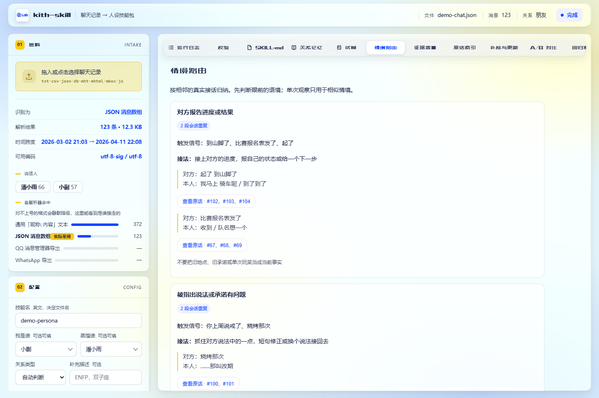
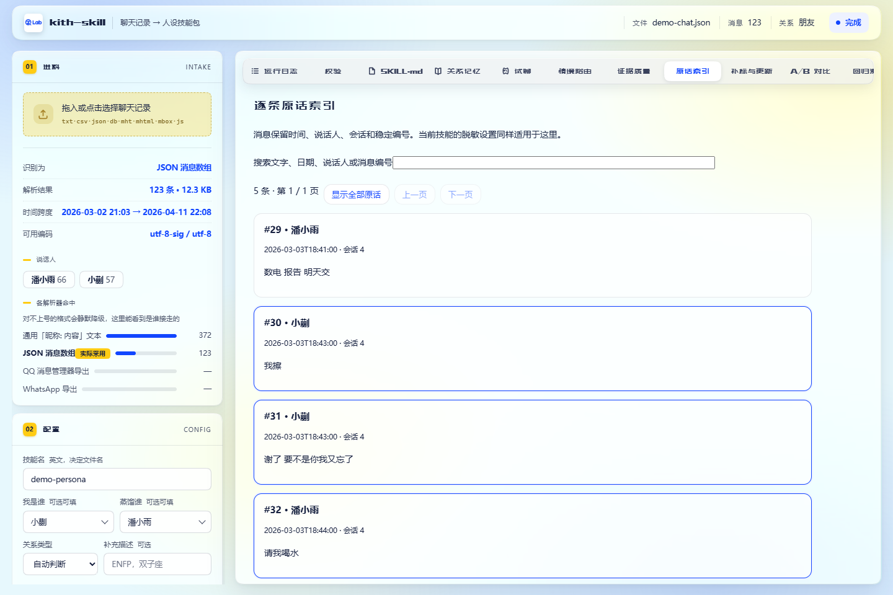
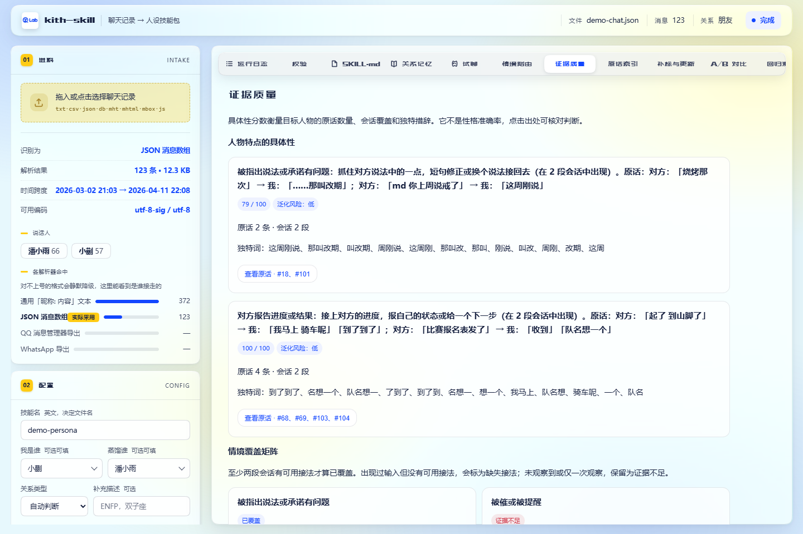
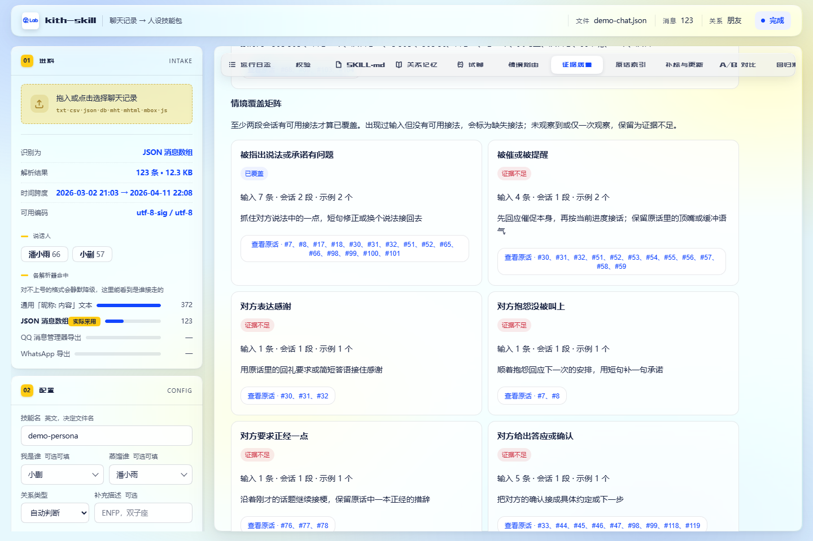
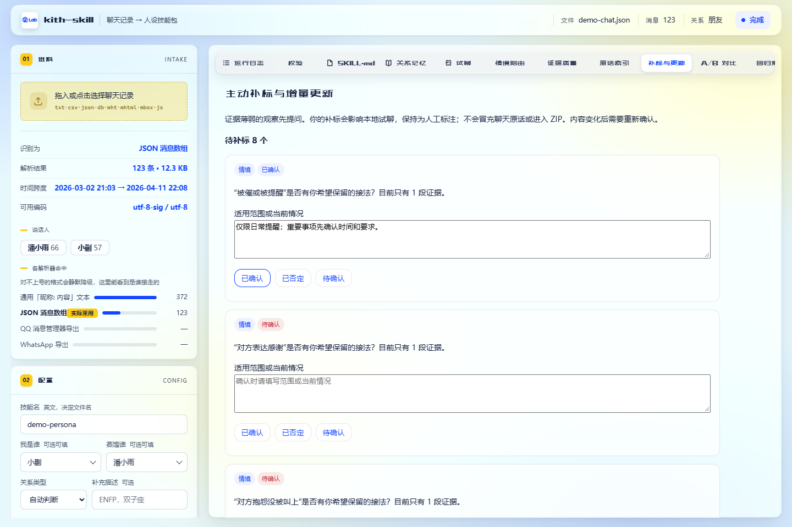
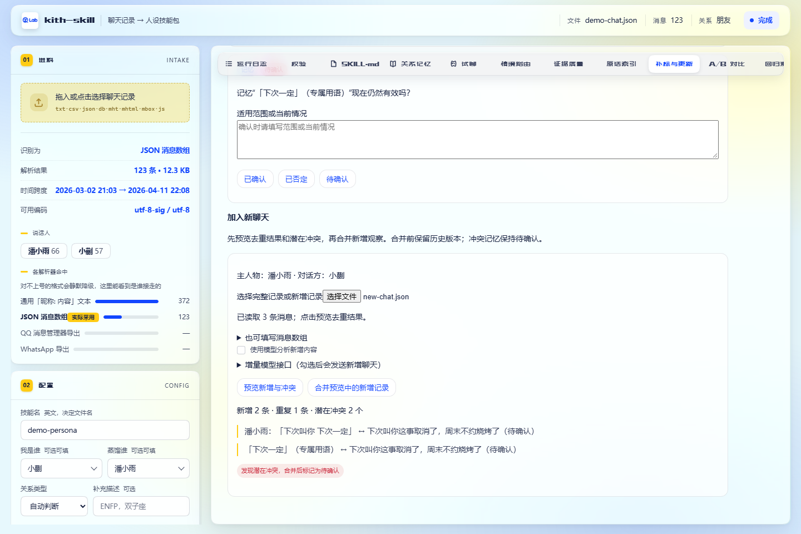
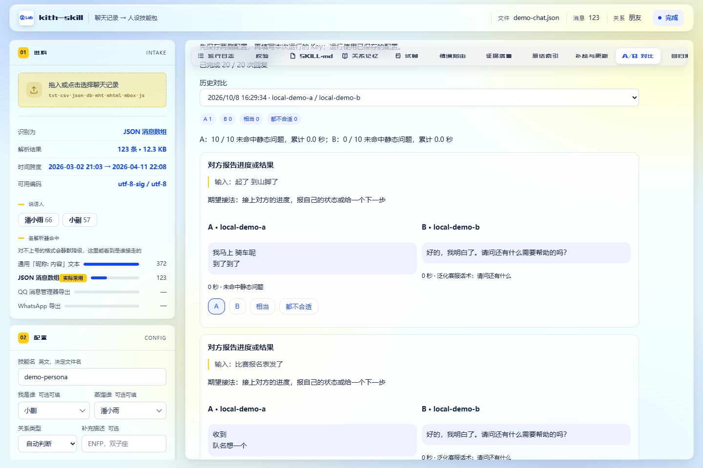

# kith-skill

<div align="center"></div>

<p align="center">🇺🇸 <a href="./README.en.md">English</a> | 🇨🇳 <a href="./README.md">简体中文</a></p>

<p align="center">

</p>

**把一份聊天记录，变成一个能装进设备的人设技能包**：`SKILL.md` + `references/memory.md` + `<name>.zip`。

只用 Python 3.10+ 标准库：不用 `pip install`，不下载模型，不显式启用 LLM 就不联网。产物可用于支持 Skill 格式或同类技能包机制的工具，当前主要适配 QZdesk（项目待开源）。

> 文中的昵称、技能名、路径和 API Key 都是占位符。请换成你自己的值，上传前检查产物里的个人信息。

怎么读：[它给你什么](#它给你什么) · [六步流水线](#六步流水线每一步都能单独核对) · [图文教程](#图文教程) · [常用参数](#常用参数) · [排错](#排错) · [隐私与安全](#隐私与安全)

## 先看结果

<p align="center">

</p>

一个网页工作台，两条命令，两条路。左边把包造出来，右边立刻验收：跑完就能在「试聊」里跟 TA 说两句，不满意就手改产物或换配方重跑。

## 它给你什么

| 产物 | 是什么 |
| --- | --- |
| `SKILL.md` | 人设：身份、**有原话支撑的人物特点**、**情境与接法**、说话风格、口头禅、真实接话示范、温度与分寸、典型例句 |
| `references/memory.md` | 关系记忆：时间线、共同地点、内部玩笑、争吵模式、称呼 |
| `references/scenarios.json` | 情境、触发信号、回应动作、相邻的真实接话和观察强度 |
| `references/memory-ledger.json` | 带日期、证据和状态的记忆账本：事实 / 计划 / 承诺 / 提及 / 玩笑 / 不确定 |
| `references/evaluation.json` | 从情境示例生成的回归用例；原聊天回复作为参考 |
| `references/specificity.json` | 人物特点的具体性评分：原话数、会话数、独特词和泛化风险 |
| `references/coverage.json` | 情境覆盖矩阵：已覆盖、证据不足和缺失接法 |
| `references/message-index.json` | 可搜索的逐条原话索引；界面中的出处按钮直接跳到这里 |
| `references/questions.json` | 低置信度观察的主动补标问题；答案只保存在本机状态 |
| `references/claims.json` | 人物结论审阅卡：支持原话、候选反例与稳定标识；人工决定存本地 |
| `references/observations.json` | 提炼的观察与增量合并使用的本地基线标识 |
| `references/` | 始终保留统计画像 `profile.md` 和原话出处 `quotes.md`；另按体积预算附逐月原记录 `transcript/`、主题档案 `topics.md`、结论依据 `evidence.md`、原始导出脱敏副本 `source/` |
| `<name>.zip` | 以上打包体。传进设备控制台、设为「主技能」，之后唤醒即生效 |

<p align="center">

</p>

目录长这样，每一层都有自己的活：

```text
<out>/<name>/SKILL.md                          人设（扮演指令）
<out>/<name>/references/memory.md              关系记忆
<out>/<name>/references/profile.md             统计画像与观察范围，不作为日常回复指令
<out>/<name>/references/quotes.md              正文 [n] 对应的时间、说话人与原话
<out>/<name>/references/scenarios.json         情境路由与真实接话示例
<out>/<name>/references/memory-ledger.json     记忆日期、状态、证据和置信度
<out>/<name>/references/evaluation.json        情境回归用例
<out>/<name>/references/specificity.json       人物特点的具体性评分
<out>/<name>/references/coverage.json          情境覆盖矩阵
<out>/<name>/references/message-index.json     可定位的逐条原话（按体积预算可能是子集）
<out>/<name>/references/questions.json         待确认的低置信度观察
<out>/<name>/references/observations.json      观察记录与增量基线标识
<out>/<name>/references/transcript/YYYY-MM.md  逐月逐条原记录（默认已脱敏）
<out>/<name>/references/topics.md              按主题重组的原话档案
<out>/<name>/references/evidence.md            每条结论 ← 原话 的对照表
<out>/<name>/references/source/                原始导出的脱敏副本（--no-source 可关）
<out>/<name>.zip                               以上打包，通常 1~3 MB
<out>/.kith/<name>/                            本地反馈、版本快照、增量基线和检查报告，不进 ZIP
```

人设文档只有十几 KB——那是提炼过的结论；「哪天说的、原话是什么」靠检索 `references/`。校验不过的条目会标注 `（未在记录中找到依据）`；由回退或补齐得到的部分会写在 `SKILL.md` 顶部（例如「LLM 蒸馏 + 本地抽取式蒸馏补齐」）。

正文先写「什么时候这样接、接住哪一点、用什么措辞」，再附聊天原话。例如样例里，收到「谢了 要不是你我又忘了」后回「请我喝水」，被提起「烧烤那次」时回「……那叫改期」。这些接法比「幽默风趣」更能指导下一轮回复；单次观察只用于相似语境，不外推成永久性格，也不把旧约定当作当前承诺。

生成时会筛掉泛化标签、话题词冒充的口头禅、跨会话或说话人错误的接话配对，以及「从不使用表情」「隔几分钟再回」这类不适合作为指令的规则。连发消息逐条保留；口头禅在有完整时间戳时还要跨会话重复。**引用核验只确认出处，不能证明人物概括在语义上成立或试聊已经像本人**，仍需结合原文和试聊判断。

## 工作台能力

| 能力 | 怎么用 |
| --- | --- |
| 情境路由 | 在「情境路由」看触发信号、真实接法和证据强度；试聊按当前输入注入匹配情境，认真难过时避免机械套用玩笑。 |
| 情境回归测评 | 在「回归测评」填回复做离线检查，或填模型接口运行全部用例；检查空回复、客服话术和路由冲突，逐条对照原聊天。 |
| 试聊反馈闭环 | 每条回复下可标注「像本人 / 太客气 / 答非所问 / 场景用错 / 事实错误 / 其他」，并写本人会怎么接；修正用于后续试聊和同名生成，四类差评自动加入回归集合。 |
| 带日期和状态的记忆 | 在「关系记忆」查看聊天提及日期、原话和状态；计划、承诺、玩笑不自动当作当前事实，是否兑现需要确认。 |
| 版本比较与回滚 | 每次生成保存快照；在「版本」查看差异、保存手改内容并重新打包、回滚历史版本。回滚前保存当前内容，并保留自定义文件与本地反馈。 |
| 发布前隐私检查 | 在「隐私检查」扫描手机号、邮箱、身份证/卡号、地点、私密指代和无法自动扫描的二进制文件；逐条确认保留，内容变化后确认自动失效。 |
| 具体性评分 | 在「证据质量」查看每条人物特点的原话数、跨会话数、独特词和泛化风险；分数只表示证据密度，不替代人工判断。 |
| 情境覆盖矩阵 | 同一页显示哪些真实场景已有接法、哪些只有一次观察或缺失回复；每个场景都能打开相关原话。 |
| 原话跳转 | 从人物特点、情境示例和记忆的「查看原话」进入带相邻上下文的逐条索引，可搜索和分页。 |
| 增量更新 | 在「补标与更新」上传完整记录或填新增消息，先预览去重和潜在冲突，再合并；旧版本、完整本地基线和冲突待确认记录都会保留。 |
| 模型 A/B 对比 | 用同一组回归用例比较两套模型或配方，逐条保存耗时、静态检查和人工选择；配置可持久化，API Key 只用于当前调用。 |
| 主动补标 | 对低置信度人物特点、情境和记忆提问，确认时必须填写适用范围；答案不冒充聊天原话，内容变化后自动失效。 |

测评报告同样绑定技能内容：手改或回滚后，内容不同就失效。**静态检查通过只表示未命中这些规则，不能证明像本人**；模型测评会向你填写的接口发送人设和用例，离线检查不联网。

回归用例保留输入和回复的原话编号，可点「查看原话」核对前后文。含 `[回复消息]` 等引用标记但无法确定引用对象的接话对不会作为示范；一般叙事里的「说」也不当作质疑承诺的依据。旧用例缺少这类证据时，测评页显示排除原因，不计入结果、不发给模型。重新生成技能可更新包内情境与接话示范。

反馈、测评回复、隐私确认和版本快照存在 `<out>/.kith/<name>/`，重启工作台后仍保留，原始反馈和检查结果不进入技能包。生成时会把适用的反馈整理成修正规则放入 `SKILL.md`；反馈备注只作为回应偏好，不作为聊天事实或原话证据。版本只管理生成器拥有的文件，自定义文件继续保留在目录中。

冲突检测根据共用词和否定信号提示潜在变化，需要核对上下文与时间；后续加入无关聊天不会把冲突记忆恢复成事实。填写适用范围的补标用于本地试聊，不直接改写包内记忆状态。

### 上下文与质量增强

| 能力 | 操作与边界 |
| --- | --- |
| 引用还原与人工关联 | JSON 保留 `message_id` / `id` 与 `reply_to_message_id` / `reply_to` / `replyTo`；CSV 支持 `message_id` 和 `reply_to`。只有唯一且先于回复的原消息能建立关联。在「原话索引」展开目标消息的「关联或修正引用对象」，填写对话方原消息编号，保存后更新情境与回归用例。关联按消息内容保存在本地，重生成时复用。 |
| 上下文情境判断 | 试聊区分讲经历、玩笑、质疑和求安慰，短句追问会参考前文，证据不足时保留不确定。在试聊接口配置中勾选「用模型判断情境」会额外向当前接口发送最近六轮及当前输入；模型必须提供上下文原话依据，无法核对则报错。展开回复下的「本次情境与资料来源」查看判断。 |
| 人物结论审阅 | 在「证据质量」查看支持原话和候选反例，填写适用范围后保留或改写，也可否定、撤销。候选反例只是共用词和否定信号，不是自动证伪。决定立即约束本地试聊，跨重生成保留；下次生成和增量合并会应用到人物特点，人工确认或修订带明确标记，原话仍保留为参考证据。 |
| 留出会话测评 | 生成前勾选「留出测评」，按完整会话确定性留出约 20%（至少需要三段会话）。训练统计、人设、记忆与参考资料仅使用其余会话，原始导出附件关闭；测试输入、原答案和报告仅存本地。在「回归测评」切换到「留出会话」。测试时不注入实时反馈或补标；内容变化后测试集失效，需要重新生成。 |
| 相关记忆检索 | 试聊保留固定人设，按当前输入与最近上下文选择最多五条历史记忆或接话示范，保留计划、提及等状态，并显示原消息编号。使用离线词语匹配；没有相关资料时不强行补记忆。没有结构化资料的旧包沿用原来的加载方式。 |
| 盲评与多轮 A/B | 在「A/B 对比」选择生成示范或有效留出集，勾选盲评后逐个用例随机排列两侧回复，选择后揭晓对应模型。可填写最多五条固定追问；两侧各自使用自己的回复历史，保存逐轮静态检查，连续性与语感仍需人工判断。 |
| 断点续跑与停止 | 默认勾选「复用成功批次」；只有输入、模型和配方匹配的检查点可复用，失败批次重新请求。点击停止会等待当前调用结束，再保存成功批次并退出；重新上传同一记录并运行即可续跑。执行区显示批次、复用、失败数和接口返回的本次 token 用量，没有用量时明确显示未返回。 |

引用关联、审阅决定、留出答案和生成检查点分别保存在 `<out>/.kith/<name>/` 的 `reply-links.json`、`claim-decisions.json`、`holdout.json` 和 `generation-checkpoint.json`，均不进入 ZIP。审阅决定按人物与原话标识匹配。

CLI 可使用 `--holdout-percent 20 --resume`；留出比例支持 0–40，0 关闭。接口配置、输入或配方变化后重新计算，检查点不保存 API Key。

## 六步流水线，每一步都能单独核对

<p align="center">

</p>

中间是六步流水线，日志里就是这六个标题：
`[1/6] 解析` → `[2/6] 统计画像` → `[3/6] 挑选代表片段` → `[4/6] 蒸馏` → `[5/6] 校验结论` → `[6/6] 打包`。

下面是仓库自带合成样例 `samples/demo-chat.json` 的离线日志结构示例；具体条数与包体积以当前运行结果为准：

```text
[1/6] 解析聊天记录：demo-chat.json
      共 123 条消息；说话者 {'潘小雨': 66, '小蒯': 57}
      蒸馏对象：潘小雨
      关系类型：朋友（自动判断：没有明显的关系信号（每千字命中：恋人 0.0, 家人 0.0, 同事 0.0），按默认的「朋友」处理）
[2/6] 统计画像
      潘小雨 口头禅候选：下次一定、牛嘿、我擦、食堂二楼、行吧、在干嘛、出来吃烧烤不、我这都烤上了
      深夜消息占比：33%
[3/6] 挑选代表片段
      跳过：本地抽取模式直接读全部记录，不采样、不联网（脱敏照做，见第 6 步）
[4/6] 本地抽取式蒸馏（内置短句抽取 分词，不调用 LLM）
      潘小雨：说话风格 2 条、口头禅 2 条、接话方式 8 条、情感模式 0 条、温度与分寸 3 条、关系行为 0 条、典型例句 8 条、关系记忆 18 条
[5/6] 校验结论
      内容检查：保留 2 条有原话的人物特点、6 条情境接法、8 段接话示范；引用核验不能判断语义是否成立或是否像本人
      84 条可核验结论：原文命中 84、改写命中 0、未找到依据 0、时间不符 0
[6/6] 打包
      参考资料：2 个月的原记录 + 主题档案 + 结论依据 + 带路文件 + 原始导出，共 0.0 MB（--corpus-mb 8，0 可关；已脱敏）
      参考文献：25 条原话（正文里的 [n] 都能在记录里搜到原句）
      脱敏：手机号 / 身份证 / 银行卡 / 邮箱 / 详细地址 已替换成 [标签]（想保留原样加 --no-redact）
      <out>/demo-persona.zip（16.5 KB）
```

蒸馏有两个引擎，字段结构完全一致、随时可切：

| | `--no-llm`（离线，建议先跑） | LLM（默认） |
| --- | --- | --- |
| 速度 / 依赖 | 几秒，不联网、不要 Key | 分钟级，需要联网 |
| 结论来源 | 全量统计 + 同一会话内相邻的真实接话 + 有限情境归纳 | 完整会话窗口 → 情境与回应动作 → 多批整合，再检查引用和接话配对 |
| 适用 | 先确认解析和说话人，审阅真实示范 | 归纳更复杂的情境和人物特点，仍需人工审阅 |

## 图文教程

两条路产出完全一致，**选一条走到底**：不想碰命令行走路线 A，要脚本化走路线 B。

<p align="center">

</p>

### 路线 A：网页工作台

```bash
python -m src.web            # 默认 http://127.0.0.1:8765/，自动打开浏览器
python -m src.web --port 9000 --no-open
```

界面左栏是进料、配置、执行与已有技能选择器；右栏有**十四个标签**：运行日志 / 校验 / SKILL.md / 关系记忆 / 试聊 / 情境路由 / 证据质量 / 原话索引 / 补标与更新 / A/B 对比 / 回归测评 / 试聊反馈 / 版本 / 隐私检查。下面的界面地图展示基础生成流程，新增能力见上面的能力表。

<p align="center">

</p>

> [!IMPORTANT]
> 工作台是常驻进程：改完 `src/` 下的代码必须停止原进程，再运行 `python -m src.web`；只刷新浏览器不会加载新代码。端口已被占用时它拒绝启动。手改生成的 Markdown 文件则刷新试聊页即可。

**A1 · 拖入聊天记录，先看诊断。** 解析成功后：顶栏显示文件名与条数、投放区下方展开诊断、「开始蒸馏」才变可点（没解出消息时它一直是灰的）。

> 下图是仓库自带的合成样例 `samples/demo-chat.json`（123 条，潘小雨 / 小蒯）拖进去之后的样子。

<p align="center">

</p>

养成看两个数的习惯：**带时间戳的条数**（通用解析器可能解出上千条却一条时间都没有，后面所有按时间的统计都会失效）和**说话人数**。条数明显不对就换文件、或另存成 UTF-8 再拖一次。

**A2 · 填配置。** 技能名（英文，决定目录名和 zip 名）、我是谁、蒸馏谁都可从候选中选，也可手填；蒸馏方式选「本地抽取」或「LLM 蒸馏」（选后者才出现接口地址、模型、API Key）。可选：补充描述、关系类型、严格模式、同时蒸馏双方、公开使用。

<p align="center">

</p>

**A3 · 点「开始蒸馏」，看日志。** 右栏实时输出上面那种 `[N/6]` 步骤，离线那趟几秒结束。

<p align="center">

</p>

换成 LLM 后第 4 步变慢，但会报清三件事：总共几批几次请求、当前在第几批、每次实际用时。看到 `改用本地抽取式蒸馏` 说明 LLM 那一环失败、已自动用离线补齐——**产物照样完整**，接口恢复后重跑即可。

**A4 · 验收、下载并上传。** 在新标签里检查场景、回归用例和隐私；手改后去「版本」点「保存修改并重新打包」。左栏「执行」下载 `<技能名>.zip` → 设备控制台（板子 → 设置 → 助手 扫码，或 `http://<设备IP>:8080`）上传 → 在技能列表里设为「主技能」。

已有技能要加入新记录时，打开「补标与更新」，上传完整导出或填新增消息，点「预览新增与冲突」，核对后点「合并预览中的新增记录」。需要比较模型时，在「A/B 对比」填两侧模型和配方，先点「保存配置并新建对比」，再填写本次 Key 并运行同组用例，最后逐条选择更像本人的回复。

### 生成后的核对与更新

下面按实际操作顺序展示新功能。截图使用合成样例；试聊和 A/B 回复由本地模型替身提供，用于演示操作流程，不能据此判断真实模型表现。[完整中英截图索引](docs/images/README.md)还包含工作台首页、校验和 SKILL.md 长图。

**1 · 看接法，再查出处。** 打开「情境路由」，核对触发条件、对方输入和本人回复。点击「查看原话」会跳到「原话索引」，高亮引用的消息，并保留前后文。

<p align="center">

</p>

<p align="center">

</p>

**2 · 看具体性与覆盖。** 「证据质量」给每条人物特点显示分数、原话数、会话数、独特词和泛化风险；向下滚动查看情境覆盖矩阵。分数不是性格准确率，「证据不足」的场景需要更多真实接话。

<p align="center">

</p>

<p align="center">

</p>

**3 · 给薄弱观察限定范围。** 在「补标与更新」填写适用范围或当前情况，再点「已确认」；不认可的观察点「已否定」。图中只确认日常提醒的范围，重要事项仍需先核对要求。

<p align="center">

</p>

**4 · 加聊天前先预览。** 在同一页向下找到「加入新聊天」，上传记录并点「预览新增与冲突」。图中 3 条输入有 1 条重复、2 条新增，新原话取消旧约定，因此提示潜在冲突。核对后再点合并；这组截图只做预览。

<p align="center">

</p>

**5 · 用同组用例选回复。** 在「A/B 对比」保存两侧接口、模型和配方，再填本次 Key，运行用例。图中两侧已返回回复，并在第一条选择了 A；静态检查只是辅助，仍需逐条判断语感。

<p align="center">

</p>

### 路线 B：命令行

上面快速开始那两条就是主线命令，这里是可叠加的组合：

```bash
python3 ex_distill.py ... --device '<DEVICE_IP>:8080'   # 生成后直接传设备
python3 ex_distill.py ... --both                        # 也蒸馏你自己 → references/self.md
python3 ex_distill.py ... --audience 公开                # 主技能换成你自己 + 自动脱敏
python3 ex_distill.py ... --dry-run-llm                 # 只打印将发出的请求，不真发
python3 ex_distill.py ... --llm-chars 12000 --llm-batches 1   # 缩小请求、省时间
```

命令行跑完也能用完整工作台：指定 `--out ./out`，再运行 `python -m src.web`，左栏「已有技能」会列出产物。单独试聊可用 `/play?skill=<技能名>` 打开，或在试聊页表头的下拉里挑。

### 验收：看这三处

| 看哪里 | 该看到什么 |
| --- | --- |
| 右栏「校验」 | 印章上的数字＝待人工确认的条数（**0 最好**）。跑 LLM 时出现几条「未找到依据」很正常，重点看它给的**最相近的原话** |
| 右栏「SKILL.md」/「关系记忆」 | 先看「人物特点」「情境与接法」是否抓住本人特有的回应，核对两侧原话与连发边界，再看口头禅、时间线和人名（可疑条目朱红标出） |
| 右栏「试聊」 | 跟 TA 说两句。这一步花的时间最少、暴露的问题最多 |


试聊读的是**磁盘上的产物**：手改 `out/<名字>/SKILL.md` 或 `references/memory.md` 后刷新页面即生效，不用重跑蒸馏。它也不改动产物本身。

<p align="center">

</p>

### 不像本人：三种改法

1. **手改产物**（最快）：删掉它老挂在嘴边的那句、补上口癖、换掉不像的例句 → 刷新试聊页。反复几轮通常比重新蒸馏管用。
2. **换配方重跑**：`--desc '话少，爱抬杠'`、`--relation 同事`、`--both` 都会改变模型看到的输入。
3. **剔除没依据的条目**：确认是编的就加 `--strict` 重跑，让它直接删而不是标注。

也可直接在试聊回复下保存反馈，再去「回归测评」检查同类输入。重跑同名技能会读取反馈；把用途从本人切成公开时，生成阶段不沿用上一种用途的反馈。

> [!TIP]
> 试聊仍显得书面、爱解释或礼貌过头时，先核对「情境与接法」「接话方式」是否提供了有辨识度的原话，再检查「说话风格」「典型例句」。示范已经充分但模型仍不遵循时，再换模型测试。

## 常用参数

| 参数 | 默认 | 说明 |
| --- | --- | --- |
| `--input` | 必填 | 聊天记录文件或目录（目录会递归读取）。 |
| `--name` | 必填 | 技能目录名和 zip 名。 |
| `--me` | `我` | 你在记录里的昵称，逗号分隔可填多个。 |
| `--target` | 自动 | 蒸馏对象：除你之外说话最多的人。 |
| `--out` | `<工具目录>/dist` | 输出目录，建议显式指定。 |
| `--no-llm` | 关闭 | 离线抽取式蒸馏，不联网、不要 Key。 |
| `--desc` | 空 | 关系 / 性格 / 背景的补充描述，例如 `大学同学，常聊报告和周末安排`；作为用户意见传入，不替代聊天证据。 |
| `--relation` | `auto` | `auto` / `恋人` / `朋友` / `同事` / `家人`，只改标题和措辞。 |
| `--both` | 关闭 | 双向蒸馏：多出一份你的画像 `references/self.md`。 |
| `--audience` | `本人` | `公开` 时主技能扮演你自己、自动脱敏并标注只有本人接得住的指代。 |
| `--corpus-mb` | `8` | 原记录参考层体积预算（MB）。`0` 关闭 `transcript/`、`topics.md`、`evidence.md`、`source/` 等原记录参考层；仍生成记忆、统计、引用、情境、记忆账本和回归用例。 |
| `--strict` | 关闭 | 校验不过的条目直接剔除，而不是标注保留。 |
| `--no-redact` | 关闭 | 关闭脱敏（默认对整包脱敏：手机号 / 身份证 / 卡号 / 邮箱 / 详细地址）。 |
| `--device` | 无 | 生成后上传到 `<设备IP>:8080`。 |
| `--timeout` / `--max-tokens` | `600` / `0` | LLM 单次请求等待上限（秒）/ 输出上限。 |

完整参数见 `python3 ex_distill.py --help`。

## 排错

| 现象 | 多半是 | 怎么办 |
| --- | --- | --- |
| 没解出消息 / 只解出很少几条 | 格式或编码没对上，被别的解析器抢走 | 看工作台解析诊断（各候选分别解出多少条）；文本类另存 UTF-8 再试 |
| `LLM 返回的不是 JSON` | 模型没按 JSON 说话 | 换一个非思考型模型 |
| `等待 N 秒仍没等到响应` | 读超时 | `--timeout 1200`；若每次卡在 200 秒上下，是网关上限，换模型 |
| `输出被截断（finish_reason=length）` | 思考型模型把预算花在推理上 | `--max-tokens 8192` 或更大 |
| 工作台行为没变 / 端口被占用 | 常驻进程拿着旧代码 / 上次的还没关 | 重启工作台；换 `--port 9000` |
| 条目带 `（未在记录中找到依据）` | 模型可能编了原话 | 看「最相近的原话」，去源文件里搜那句；确认没用就 `--strict` |
| 试聊说「找不到这次运行」/「没有 API Key」 | 任务号只活在进程里 / 离线产物没有 Key | 用表头下拉直接挑 `out/` 下的产物；在「接口」里填一个 Key |
| 试聊里 TA 答得像客服 | 缺少具体接法，或模型没有遵循示范 | 先检查「情境与接法 / 接话方式 / 典型例句」，手改后刷新；示范充分时再换模型 |
| 话都对，就是不像本人 | 特点过泛，或配对原话失去上下文 | 核对触发情境、回应动作和连发原话；修改生成代码后重启工作台并重新蒸馏 |

## 隐私与安全

> [!WARNING]
> 聊天记录可能包含高度敏感的个人信息。上传或调用外部 LLM 前，请确认数据授权和服务商政策。

- `--no-llm` 时聊天内容只在本机处理；LLM 模式的样本在送出前就已脱敏。
- **默认整包脱敏**：手机号 / 身份证 / 银行卡 / 邮箱 / 详细地址 → `[标签]`，覆盖 `SKILL.md`、`memory.md` 和 `references/`。`--no-redact` 保留原样，**这份包别外发**。
- `--audience 公开` 的产物会被别人读到：程序只标注只有本人对得上的指代，**不替你改写**——发布前逐条确认。
- 试聊页的 API Key 不落盘、不写日志；不要把 Key 写进 README、源码或 Git 提交。
- 本地 `.kith/` 会保存试聊原文和历史版本，可能含有个人信息；它不进入 ZIP，但分享输出目录时仍需检查。
- 「隐私检查」的确认只记录你决定保留该条内容，不会自动替换或删除；自动规则不能识别所有上下文隐私。
- 工作台只监听 `127.0.0.1`，前端是纯静态文件、不加载 CDN，断网可用。

> [!CAUTION]
> 本文截图用的是仓库自带的合成样例 `samples/demo-chat.json`（昵称「潘小雨 / 小蒯」）。真实产物里是真实昵称和对话，公开任何输出前请检查。

## 进阶

<details>
<summary><b>支持的输入格式</b></summary>

#### 支持的输入

| 类型 | 示例 | 解析行为 |
| --- | --- | --- |
| JSON | `chat.json` | 查 `messages`、`list`、`items`、`data` 等消息数组；正文认 `text`/`content`/`message`/`body`，发送者认 `name`/`remark`/`nickname`。 |
| CSV | `chat.csv` | 自动识别时间、发送者、正文与 `IsSender` 等列名。 |
| TXT | `chat.txt` | `昵称: 内容`、带时间的消息行、QQ 导出文本、WhatsApp 导出。 |
| HTML / MHT / MHTML | `chat.html` | 剥掉 MIME 信封、还原 quoted-printable 后取纯文本（QQ 消息管理器导出走这条）。 |
| 微信 SQLite | `EnMicroMsg.db` | 读已解密库的 `MSG` 表，`--channel` 过滤 `StrTalker`。 |
| Twitter / X | `tweets.js` | 归档里的 `tweets.js`、`direct-messages.js`。 |
| mbox | `archive.mbox` | 邮箱归档，取正文、发件人、日期。 |
| 目录 | `exports/` | 递归读取 `.txt` `.csv` `.json` `.js` `.mbox` `.html` `.htm` `.mht` `.mhtml`。 |

编码按 `utf-8-sig → utf-8 → gb18030 → utf-16` 依次回落；识别靠「后缀 + 内容特征」双重判定，**对不上号会静默降级**，所以第 1 步的诊断才是关键。

微信 PC 4.x 用 wx-cli / WeChatExporter 导出的 `chat.json` 走 JSON 路径，但要把「谁是谁」掰回来：对方的消息 `sender` 是空串（只有本人发言才填昵称），私聊里空串补成会话名、另一侧归一为「我」。

</details>

<details>
<summary><b>LLM 配置与失败回退</b></summary>

#### LLM 配置

| 配置 | 读取顺序 |
| --- | --- |
| API Key | `--api-key` → `LLM_API_KEY` → `MODELSCOPE_API_KEY` → `DASHSCOPE_API_KEY` → `OPENAI_API_KEY` |
| 接口地址 | `--base-url` → `LLM_BASE_URL` → ModelScope 默认地址 |
| 模型名 | `--model` → `LLM_MODEL` → `Qwen/Qwen3-235B-A22B` |

请求是非流式的，要等模型把整段 JSON 写完才返回，所以「慢」是常态：人设那次跑一两分钟很常见，关系记忆要写的 JSON 更长。

跑不动了也不会两手空空：

- **整批失败**（没 Key / 连不上 / 限流 / 返回的不是 JSON）→ 退回离线抽取式蒸馏，产物照样完整。
- **只挂一半**（人设成、关系记忆超时）→ 保住成功的那半，缺的那半用离线补，并在文件里注明来历。
- **上游抖动**（HTTP 200 空壳、读超时）→ 先退避重试，再把这一批对半拆开各跑一次，结果照常合并。
- **一段坏 JSON 不会带走整轮**：只丢那一批。
- **网关抽风**（响应带 BOM、被裹成 SSE、对象后面粘了别的 JSON、裸返回补全文本）→ 四种都能抢救。

</details>

<details>
<summary><b>关系类型</b></summary>

#### 关系类型

`--relation` 只改章节标题和措辞，**不改事实**：`auto` / `恋人` / `朋友` / `同事` / `家人`。默认 `auto` 用称呼与话题词密度判断并打印依据（例如「同事信号最密（每千字命中 5.3 次）」），判断错了 `--relation` 随时覆盖。

| 内部字段 | 恋人 | 朋友 | 同事 | 家人 |
| --- | --- | --- | --- | --- |
| 关系时间线 | 关系时间线 | 认识与相处时间线 | 共事时间线 | 关系时间线 |
| 甜蜜瞬间 | 甜蜜瞬间 | 相处高光 | 配合默契的瞬间 | 温暖瞬间 |
| 争吵模式 | 争吵模式 | 闹别扭的时候 | 分歧与摩擦 | 争执模式 |
| inside_jokes | inside jokes | inside jokes | 你们之间的固定说法 | 家里的梗 |

</details>

<details>
<summary><b>结论校验怎么核</b></summary>

#### 结论校验

每条声称「这是原话」或「这时发生过什么」的结论都会拿回原始记录核对一遍（只用标准库，不联网）：引用核验（原文 / 改写覆盖率 ≥ 0.75 / 未找到）、日期核验、依据核验。引用前常被模型加上「时间 说话人:」前缀，核验会先剥掉再比。

人工核对时，看程序给出的**记录里最相近的那句原话**：

| 你看到的情况 | 说明 | 怎么办 |
| --- | --- | --- |
| 和你的引用是同一句 | 命中，只是前缀或标点差异 | 不用管 |
| 两段文字对不上 | 模型改写了原意，这是真正要核的 | 去源文件里搜那句话，搜不到就是编的 |
| 是一条不相关的系统行 | 记录里确实找不到相近内容 | 重点怀疑 |

处理三选一：不管（产物已带标注）／手改文件／加 `--strict` 重跑（误报也会一起删）。

刻意的边界：**只验「引用是否为真」，不验「语义是否成立」**。「我那天没说」被洗成「我那天说了」这类反转，字符串核验看不出来——那需要几百 MB 的语义模型，与零依赖定位冲突。好在「整段编出来」比「改写反转」常见得多。

</details>

## 开发与验证

```bash
python3 -m compileall -q src tests
python3 -m unittest discover -s tests -v
python3 ex_distill.py --help

python3 ex_distill.py --input /path/to/chat.json --me '你的昵称' \
  --name smoke-test --out ./dist-smoke --no-llm
unzip -l ./dist-smoke/smoke-test.zip

python3 -m src.web --no-open     # 网页工作台自检：http://127.0.0.1:8765/
python3 tests/smoke.py           # 独立进程冒烟：启动、生成、试聊、反馈、隐私、ZIP、清理和退出
```

测试套件覆盖聊天边界与人物特点、具体性评分、情境覆盖、原话索引、主动补标、增量去重与冲突、A/B 结果、记忆状态、反馈闭环、报告失效、隐私扫描、版本回滚、打包失败恢复和本地 HTTP 接口；模型调用使用替身，不依赖真实 Key。`tests/smoke.py` 会启动真正的独立工作台进程，并断言退出码为 0、临时上传目录已删除。浏览器验收可安装 Playwright 后运行 `python tests/browser_workbench.py`（有 Chromium 时直接运行，使用已安装的 Edge 时加 `--browser-channel msedge`）；该脚本只使用合成数据和本地模型替身，临时产物退出后清理。

新增测试覆盖引用元数据和人工关联、情境证据核对、留出答案与旧反馈隔离、审阅跨重生成保留、检索预算、盲评映射、独立多轮历史以及停止后续跑。GitHub Actions 在 Windows / Linux、Python 3.10 / 3.13 运行单测与冒烟，另用 Chromium 验收浏览器并检查 JavaScript 语法。CI 使用合成记录和本地模型替身，不调用外部模型。

重新生成教程截图（仅开发时需要 Playwright；下面使用已安装的 Edge）：

```powershell
python -m pip install playwright
python tests/capture_tutorials.py --browser-channel msedge
```

脚本在临时工作台上生成中英各 14 张，完成尺寸和浏览器错误检查后才替换 `docs/images/` 与 `docs/images/en/`，结束时清理临时目录。英文版仅在截图时翻译控件、提示和日志，应用界面与聊天原话仍为中文。尺寸和演示数据说明见[截图索引](docs/images/README.md)。

### 工作台接口

所有接口以 `/api/workbench/<技能名>/` 为前缀，技能必须位于工作台启动目录下的 `out/`。

| 接口 | 方法 | 用途 |
| --- | --- | --- |
| `package` / `download` | GET | 预览文档 / 下载当前 ZIP |
| `scenarios` / `memory` | GET | 情境路由 / 带状态记忆 |
| `specificity` / `coverage` / `messages` | GET | 具体性评分 / 情境覆盖矩阵 / 逐条原话索引 |
| `questions` | GET / POST | 获取待补标问题 / 提交 `question`、`status`、`answer` 和 `fingerprint` |
| `incremental` | GET / POST | 查看基线 / 用 `mode=preview` 预览去重和冲突，或 `mode=apply` 合并新增记录 |
| `ab` | GET / POST | 查看 A/B 历史；`mode=start` 建立对比、`mode=run` 运行单侧用例、`mode=choose` 保存人工选择 |
| `evaluation` | GET / POST | 获取报告 / 提交 `replies`（用例 ID → 回复）和 `fingerprint` 做静态检查 |
| `evaluate-model` | POST | 提交单个 `case`、`fingerprint` 和模型接口配置，运行并保存一个用例 |
| `feedback` | GET / POST | 读取汇总 / 提交 `user`、`reply`、`label` 和可选 `note` |
| `versions` / `diff?version=<版本号>` | GET | 版本列表 / 历史版本与当前内容差异 |
| `snapshot` / `rollback` | POST | 保存手改并打包 / 提交 `version` 回滚 |
| `privacy` | GET / POST | 扫描 / 提交 `item`、`confirmed` 和 `fingerprint` 记录确认 |

旧技能缺少新参考文件时显示空状态，仍可预览和试聊；重新生成即可补齐情境、记忆账本和回归集合。增量接口需要生成时保存的本地基线；`--corpus-mb 0` 仍会在 `.kith/<技能名>/baselines/` 保存完整的脱敏基线，包内只放被引用的原话索引。增量合并不会覆盖自定义文件，重复消息不产生新版本，潜在冲突会写成待补标问题。

## 贡献

欢迎 Issue 和 PR，提交前请：

- [ ] 运行 `python3 -m py_compile ex_distill.py`
- [ ] 用脱敏或合成数据验证解析行为
- [ ] 不提交聊天记录、API Key 或生成的人设文件
- [ ] 同步更新相关文档

## 致谢

- [agenmod/immortal-skill](https://github.com/agenmod/immortal-skill)：数字分身、分维度蒸馏与证据意识的思路来源。
- [shuakami/qq-chat-exporter](https://github.com/shuakami/qq-chat-exporter)：QQ 聊天记录 JSON 导出。
- [93857536-pixel/WeChatExporter](https://github.com/93857536-pixel/WeChatExporter)：微信聊天记录导出。

## 许可证

MIT
